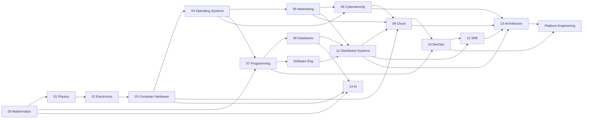

## Domain Dependency Graph

The backbone of the vault. Read an arrow as **"is a prerequisite for / is depended on by."** Reality is a mesh, not a line — several topics have multiple parents, shown explicitly below.

### The two great chains and their convergence



The hardware-up chain and the software-down chain both terminate at **Platform Engineering** (filed under [[13 Architecture#Overview|Architecture]]). The most valuable learning happens at the crossings — see [[Knowledge Graph#Bridge Topic Map]].

### Per-domain dependency chains

#### Systems / infrastructure chain
```text
Physics → Electronics → Computer Hardware → Operating Systems
        → Networking → Cloud → DevOps → SRE → Platform Engineering
```
Canonical: [[01 Physics#Dependencies]], [[03 Computer Hardware#Dependencies]], [[04 Operating Systems|Dependencies]].

#### Security chain
```text
Trust → Identity → Authentication → Authorization → Cryptography
      → Secure Communication (TLS/SSH/VPN) → System Security
      → Network Security → Application Security → Cloud Security → SOC Operations
```
Note the hidden multi-parents: **Cryptography** depends on [[00 Mathematics#Overview|Mathematics]]; **Secure Communication** depends on Cryptography **and** [[05 Networking|Networking]] (TCP/DNS). See [[06 Cybersecurity#Dependencies]].

#### Software chain
```text
Mathematics → Algorithms → Programming → Software Engineering
            → Applications → Databases → Distributed Systems → Cloud-Native Systems
```
See [[07 Programming|Dependencies]], [[12 Distributed Systems#Dependencies]].

#### Internet chain
```text
Electromagnetism → Ethernet → IP → Routing → ISP Infrastructure
                 → BGP → DNS → CDN → Cloud Platforms → Global Applications
```
See [[05 Networking|Dependencies]]. Cross-references [[Foundations (Source Docs)#3 - Networking Knowledge Map|3 - Networking Knowledge Map]].

#### Cloud chain
```text
Physical Servers → Virtualization → Hypervisors → Virtual Machines
                 → Cloud Infrastructure → Cloud Services → Automation (IaC)
                 → Containers → Orchestration → Multi-Account → Multi-Region → Global Platforms
```
See [[09 Cloud|Dependencies]].

#### DevOps chain
```text
Programming → Version Control → Build Automation → CI → CD
            → Infrastructure as Code → Containers → Kubernetes
            → Observability → SRE → Platform Engineering
```
See [[10 DevOps|Dependencies]].

#### Data / AI chain
```text
Mathematics (linear algebra, stats, probability) → Data Structures
  → Databases → Distributed Data → Machine Learning → Deep Learning → LLMs/Agents
GPU/CUDA hardware ⟶ feeds Deep Learning
```
See [[14 AI|Dependencies]].

### Multi-parent prerequisites (the mesh)

These are the joints the linear chains hide. Each is a [[Knowledge Graph#Bridge Topic Map|bridge topic]].

| Topic | Requires (all of) | Lives at |
|---|---|---|
| TLS | Cryptography + PKI + TCP + DNS | [[06 Cybersecurity#Bridge Topics]] |
| Kubernetes | Containers + Networking + Consensus (etcd) + Linux namespaces | [[10 DevOps|Bridge Topics]] |
| BGP | IP routing + Autonomous Systems + TCP | [[05 Networking|Bridge Topics]] |
| Cloud IAM | Identity + Auth + Crypto (signed tokens) + Federation | [[09 Cloud|Bridge Topics]] |
| Containers | Linux namespaces + cgroups + filesystems + images | [[04 Operating Systems|Bridge Topics]] |
| Consensus | Distributed systems + networking + clocks/ordering | [[12 Distributed Systems#Bridge Topics]] |

### Reading order implied by the graph

A strict topological-ish order (safe to study front-to-back):

`00 Mathematics → 01 Physics → 02 Electronics → 03 Hardware → 04 OS → 07 Programming → 05 Networking → 08 Databases → 06 Security → 12 Distributed Systems → 09 Cloud → 10 DevOps → 11 SRE → 13 Architecture → 14 AI`

Track-specific orderings (you do **not** need all of this for any one role) are in [[Learning Paths & Projects#Learning Paths]].

## Bridge Topic Map

Bridge topics are the **connectors** between domains. They are the highest-value notes in the vault because understanding them means understanding how two systems meet. Each bridge has a single **canonical owner** (to prevent duplication — see the rule in [[Analysis & Gaps#Foundation Analysis]]); every other domain links to it.

### Why bridges matter

A topic studied inside one domain is a fact. The same topic understood as a *bridge* is systems knowledge:

> DNS is not "the thing that resolves names." DNS is the negotiated contract that lets the **application layer** name resources without knowing **network-layer** addresses, governed by **internet governance** (IANA/ICANN), secured by **cryptography** (DNSSEC). It touches four domains at once.

### Master bridge table

| Bridge | Connects | Why it exists | Canonical owner |
|---|---|---|---|
| **TCP/IP & sockets** | OS ↔ Networking ↔ Programming | Lets processes communicate across machines via a uniform API | [[05 Networking|Bridge Topics]] |
| **DNS** | Networking ↔ Applications ↔ Governance ↔ Security | Names that map to addresses so humans/services need not know IPs | [[05 Networking|Bridge Topics]] |
| **TLS** | Cryptography ↔ Networking ↔ Web | Confidentiality + integrity + authentication over an untrusted network | [[06 Cybersecurity#Bridge Topics]] |
| **PKI / certificates** | Cryptography ↔ Identity ↔ Web | Binds public keys to identities so strangers can trust each other | [[06 Cybersecurity#Bridge Topics]] |
| **IAM** | Security ↔ Cloud ↔ Architecture | Who may do what to which resource, at scale | [[09 Cloud|Bridge Topics]] |
| **Hypervisors / virtualization** | Hardware ↔ Cloud | Decouple workloads from physical machines; raise utilization | [[03 Computer Hardware#Bridge Topics]] |
| **Containers** | Linux/OS ↔ Cloud ↔ DevOps | Package an app with its userland; isolate with kernel primitives | [[04 Operating Systems|Bridge Topics]] |
| **Kubernetes** | Containers ↔ Distributed Systems ↔ Cloud | Declaratively run many containers reliably across many machines | [[10 DevOps|Bridge Topics]] |
| **Terraform / IaC** | DevOps ↔ Cloud | Make infrastructure reproducible, reviewable, versioned | [[10 DevOps|Bridge Topics]] |
| **Observability** | SRE ↔ Applications ↔ DevOps | See inside a running distributed system (metrics/logs/traces) | [[11 SRE#Bridge Topics]] |
| **BGP** | ISP Infrastructure ↔ Internet | Exchange reachability between autonomous systems | [[05 Networking|Bridge Topics]] |
| **The boot/trust chain** | Hardware ↔ OS ↔ Security | Bring a dead machine to a *trusted* running kernel | [[03 Computer Hardware#Bridge Topics]] |
| **Consensus (Raft/Paxos)** | Distributed Systems ↔ Databases ↔ Cloud | Agree on one value despite failures | [[12 Distributed Systems#Bridge Topics]] |
| **Message queues / streaming (Kafka)** | Software ↔ Distributed Systems ↔ Cloud | Decouple producers/consumers; absorb load; event sourcing | [[12 Distributed Systems#Bridge Topics]] |
| **API contracts (REST/gRPC/protobuf)** | Programming ↔ Distributed Systems ↔ Networking | Stable, serializable interfaces between services | [[07 Programming|Bridge Topics]] |
| **Time, clocks & ordering (NTP, logical clocks)** | Networking ↔ Distributed Systems | Agree on "before/after" without a global clock | [[12 Distributed Systems#Bridge Topics]] |
| **GPU / CUDA** | Hardware ↔ AI | Massively parallel math for training/inference | [[14 AI|Bridge Topics]] |
| **Load balancing** | Networking ↔ Cloud ↔ Distributed Systems | Spread traffic for scale and availability | [[09 Cloud|Bridge Topics]] |

### Bridge clusters (how they chain)

Bridges often depend on other bridges. Three important stacks:

**Secure web request:** `DNS → TCP → TLS → PKI → HTTP → Load balancer → Service` — touches Networking, Security, Cloud, Distributed Systems in a single page load.

**Container to production:** `Linux namespaces/cgroups → Container image → Kubernetes → IaC → Observability` — touches OS, DevOps, Distributed Systems, SRE.

**Trusted boot:** `UEFI → Secure Boot → TPM → Bootloader → Kernel → Init` — touches Hardware, OS, Security.

### How to use this map

When studying any bridge, write its canonical note to answer all five guiding questions, then add a one-line link from each connected domain's **Bridge Topics** note. Never re-explain a bridge in two places — link to the canonical owner.
