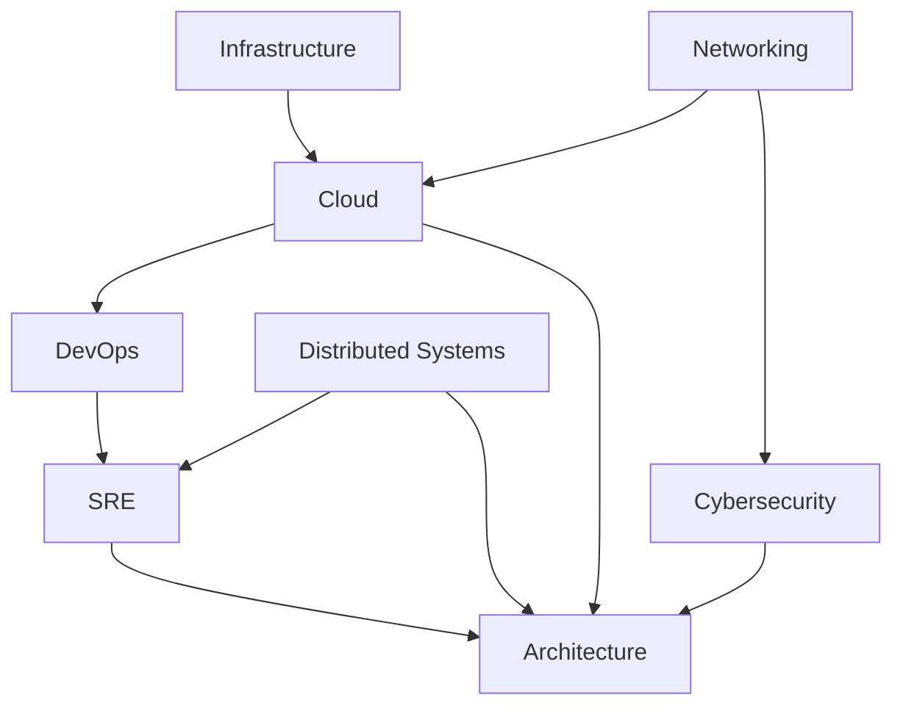
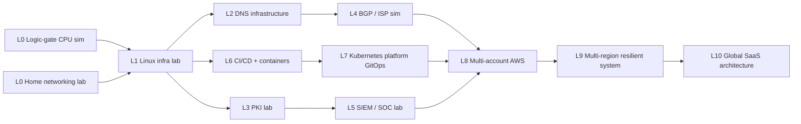

## Learning Paths

Seven role-based routes through the [[Knowledge Graph#Domain Dependency Graph]]. Each lists **prerequisites**, **recommended order**, and **project milestones** (from [[Learning Paths & Projects#Project Roadmap]]). You do not need every domain for any one role — paths overlap at the [[Knowledge Graph#Bridge Topic Map|bridges]].

> [!tip] Rule of sequencing
> A topic is only "ready" when all its parents in the dependency graph are done. Prefer breadth-first within a level, then descend.

### 1. Infrastructure Engineering

**Prereqs:** comfort with [[03 Computer Hardware#Overview|hardware]] basics and [[04 Operating Systems|Linux]].
**Order:** Hardware → OS internals (processes, memory, filesystems) → [[05 Networking|Networking]] (L1–L4) → Virtualization/[[03 Computer Hardware#Bridge Topics|hypervisors]] → [[09 Cloud|Cloud]] compute/storage/network → [[10 DevOps|IaC]].
**Milestones:** Home networking lab → Linux infrastructure lab → multi-VM virtualization lab.

### 2. Networking

**Prereqs:** [[01 Physics#Overview|signals/EM basics]], binary/hex from [[00 Mathematics#Overview|Mathematics]].
**Order:** OSI/TCP-IP model → Ethernet/switching → IP/subnetting → routing → [[05 Networking|BGP]] & autonomous systems → [[05 Networking|DNS]] → CDN → wireless → network security → automation.
**Milestones:** Home networking lab → DNS infrastructure → BGP-in-a-lab / ISP simulation.

### 3. Cybersecurity

**Prereqs:** [[04 Operating Systems|OS]] + [[05 Networking|Networking]] fundamentals, [[00 Mathematics#Overview|modular arithmetic]] for crypto.
**Order:** Trust/identity → authN/authZ → [[06 Cybersecurity#Overview|cryptography]] → [[06 Cybersecurity#Bridge Topics|PKI/TLS]] → system security → network security → app/web security → offensive security → detection → IR → SOC.
**Milestones:** PKI lab → SIEM/SOC lab → CTF / exploit lab.

### 4. Cloud Engineering

**Prereqs:** Linux, Networking L1–L4, [[06 Cybersecurity#Bridge Topics|identity/IAM]] basics.
**Order:** Virtualization → core cloud compute/storage/network → [[09 Cloud|IAM]] → IaC ([[10 DevOps|Terraform]]) → multi-account governance → multi-region HA/DR → FinOps.
**Milestones:** Single-VPC web app → multi-account AWS landing zone → multi-region active-active.

### 5. DevOps

**Prereqs:** [[07 Programming|Programming]], Git, Linux.
**Order:** Version control → CI → CD → [[04 Operating Systems|containers]] → [[10 DevOps|Kubernetes]] → IaC → GitOps → [[11 SRE#Bridge Topics|observability]].
**Milestones:** CI pipeline → containerized app → GitOps Kubernetes platform.

### 6. SRE

**Prereqs:** DevOps path + [[12 Distributed Systems#Overview|Distributed Systems]] basics.
**Order:** Reliability concepts (availability/durability) → SLIs/SLOs/error budgets → [[11 SRE#Bridge Topics|observability]] (metrics/logs/traces) → capacity planning → incident management → postmortems/RCA → chaos engineering.
**Milestones:** Instrument a service end-to-end → run a game-day → on-call + postmortem cycle.

### 7. Architecture

**Prereqs:** **all** core paths at intermediate depth — this is where everything converges.
**Order:** [[12 Distributed Systems#Overview|Distributed systems]] (CAP, consensus, consistency) → software architecture (monolith→microservices→event-driven) → [[13 Architecture#Overview|cloud architecture]] (multi-account/region/cloud) → security architecture (Zero Trust, defense in depth) → platform engineering (IDPs, golden paths).
**Milestones:** Design a global SaaS platform → internal developer platform → multi-region resilient system design doc.

### Cross-path dependency snapshot

Start anywhere on the left; Architecture is the convergence point on the right. Anchor every path with the projects in [[Learning Paths & Projects#Project Roadmap]].

## Project Roadmap

Projects are the proof of understanding ([[Foundations (Source Docs)#0 - My Learning Philosophy|0 - My Learning Philosophy]]). They are ordered by **increasing complexity** and chosen so each reuses and reinforces concepts from earlier ones — building the graph through practice, not just reading.

> [!tip] How to use this
> Don't skip ahead by tool. Skip ahead by *concept*. A project is "ready" when its prerequisites (earlier projects + linked domains) are understood well enough to explain *why* each piece exists.

### Progression at a glance

### Level 0 — Foundations

#### Logic-to-CPU simulator
- **Concepts:** transistors → gates → adders/registers → a tiny ALU & instruction cycle. Makes [[01 Physics#Overview]], [[02 Electronics|Overview]], [[03 Computer Hardware#Overview]] concrete.
- **Prerequisites:** binary/boolean algebra ([[00 Mathematics#Overview]]).
- **Domains:** Mathematics, Physics, Electronics, Computer Hardware.
- **Build:** Use a tool like nand2tetris or Logisim; implement NAND → up to a 4-bit ALU + register file.

#### Home networking lab
- **Concepts:** subnetting, switching vs routing, DHCP, NAT, VLANs, firewall basics.
- **Prerequisites:** binary/hex; OSI model.
- **Domains:** [[05 Networking|Networking]], [[06 Cybersecurity#Overview|Security]] (firewall).
- **Build:** VLANs + inter-VLAN routing + a firewall (pfSense/OPNsense) in VMs or cheap hardware.

### Level 1 — Operate a system

#### Linux infrastructure lab
- **Concepts:** boot/init, processes, memory, filesystems, users/permissions, systemd services, package mgmt, SSH.
- **Prerequisites:** Home networking lab; [[04 Operating Systems|OS]] basics.
- **Domains:** Operating Systems, Networking.
- **Build:** Provision 3 Linux VMs, configure SSH, a web service, logs, and a backup job — all documented.

### Level 2 — Name things

#### DNS infrastructure
- **Concepts:** resolution chain (root→TLD→authoritative→recursive), record types, zones, DNSSEC, caching.
- **Prerequisites:** Linux infra lab; [[05 Networking|DNS bridge]].
- **Domains:** Networking, Security.
- **Build:** Authoritative server (BIND/Knot) + a recursive resolver; sign a zone with DNSSEC.

### Level 3 — Establish trust

#### PKI lab
- **Concepts:** asymmetric crypto, certificates, CA hierarchy, CSR/issuance, revocation (CRL/OCSP), TLS handshake.
- **Prerequisites:** DNS (for names on certs); [[06 Cybersecurity#Bridge Topics|PKI/TLS]]; modular arithmetic ([[00 Mathematics#Overview]]).
- **Domains:** Cybersecurity, Networking, Mathematics.
- **Build:** Root + intermediate CA, issue a server cert, serve HTTPS, validate the chain, revoke and observe.

### Level 4 — Become the Internet

#### BGP / ISP simulation
- **Concepts:** autonomous systems, eBGP/iBGP, route advertisement, AS-path selection, peering vs transit, IXPs.
- **Prerequisites:** routing from networking lab; DNS lab.
- **Domains:** Networking.
- **Build:** Multi-AS topology in containerlab/GNS3 with FRR; advertise prefixes; simulate a route leak.

### Level 5 — Detect & respond

#### SIEM / SOC lab
- **Concepts:** log pipelines, parsing/normalization, detections, alerting, MITRE ATT&CK mapping, incident response.
- **Prerequisites:** Linux infra; some attack/defense familiarity.
- **Domains:** Cybersecurity, Operating Systems, Networking.
- **Build:** Ship logs (Wazuh/Elastic) from hosts, write 3 detections, run an attack, triage the alert, write a postmortem.

### Level 6 — Ship software

#### CI/CD + containers
- **Concepts:** version control workflow, build automation, automated tests, container images, registries, deployment.
- **Prerequisites:** [[07 Programming|Programming]]; Linux; [[04 Operating Systems|containers]].
- **Domains:** DevOps, Programming, OS.
- **Build:** A small app with a pipeline: lint→test→build image→push→deploy to a VM.

### Level 7 — Orchestrate

#### GitOps Kubernetes platform
- **Concepts:** K8s control plane, scheduling, services/ingress, config/secrets, declarative GitOps, observability.
- **Prerequisites:** CI/CD project; [[10 DevOps|Kubernetes]]; [[12 Distributed Systems#Overview|distributed]] basics.
- **Domains:** DevOps, Distributed Systems, Cloud, SRE.
- **Build:** K8s cluster + ArgoCD/Flux, deploy the L6 app via Git, add metrics/logs/traces dashboards.

### Level 8 — Govern at scale

#### Multi-account AWS landing zone
- **Concepts:** org structure, SCP guardrails, IAM, VPC/CIDR design, centralized logging, IaC.
- **Prerequisites:** BGP/networking understanding; K8s platform; [[09 Cloud|IAM]]; [[10 DevOps|Terraform]].
- **Domains:** Cloud, Security, DevOps, Networking.
- **Build:** Terraform a management + workload accounts, guardrails, a shared network, and a deployed workload.

### Level 9 — Survive failure

#### Multi-region resilient system
- **Concepts:** HA/DR, replication, failover, consistency trade-offs, health checks, global traffic routing, RTO/RPO.
- **Prerequisites:** landing zone; [[12 Distributed Systems#Bridge Topics|consensus/replication]]; [[11 SRE#Overview|SRE]].
- **Domains:** Cloud, Distributed Systems, SRE, Architecture.
- **Build:** Active-passive (then active-active) across two regions; run a region-failure game-day; measure RTO/RPO.

### Level 10 — Architect

#### Global SaaS architecture (design + partial build)
- **Concepts:** everything converges — CDN/edge, global DNS, multi-region data, IAM/Zero Trust, observability, cost, platform self-service.
- **Prerequisites:** all prior levels.
- **Domains:** [[13 Architecture#Overview|Architecture]] + every other domain.
- **Deliverable:** An architecture doc (C4 diagrams + ADRs + capacity/cost model) and a thin vertical slice deployed, defending each trade-off against quality attributes.

### Mapping projects to domains

| Project | Primary domains exercised |
|---|---|
| Logic-to-CPU | Math, Physics, Electronics, Hardware |
| Home networking | Networking, Security |
| Linux infra | OS, Networking |
| DNS | Networking, Security |
| PKI | Security, Networking, Math |
| BGP/ISP | Networking |
| SIEM/SOC | Security, OS, Networking |
| CI/CD + containers | DevOps, Programming, OS |
| K8s platform | DevOps, Distributed, Cloud, SRE |
| Multi-account AWS | Cloud, Security, DevOps, Networking |
| Multi-region | Cloud, Distributed, SRE, Architecture |
| Global SaaS | Architecture + all |
