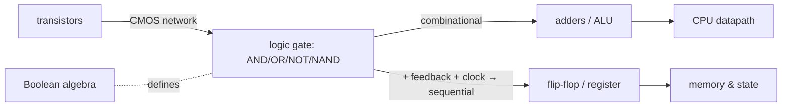

> [!abstract] A **logic gate** turns [[Transistors|transistors]] into **computation**: it takes binary inputs (0/1 = voltage low/high) and produces a binary output following a **Boolean function** (AND, OR, NOT, NAND…). Gates are the rung where *physics becomes logic* — wire enough together and you get arithmetic, memory, and eventually a [[CPU & Processing Units|CPU]]. `transistor → gate → digital logic → CPU`.

## Definition
A physical circuit implementing a **Boolean operation**: inputs and output are voltages interpreted as 0/1, and the output is a deterministic function of the inputs (AND, OR, NOT, NAND, NOR, XOR).

## Why it exists
[[Transistors]] switch, but a bare switch isn't yet *logic*. To compute, you need to combine signals by rules — "output 1 only if **both** inputs are 1" (AND), "output the opposite" (NOT). Gates package transistor networks into these reusable Boolean primitives, giving a clean **digital abstraction** (just 0/1) on top of messy analog voltages — so designers reason in logic, not electronics.

## How it works
- Each gate = a small transistor network. A **CMOS NAND** = 2 PMOS + 2 NMOS wired so the output is low only when both inputs are high.
- **NAND (and NOR) are universal** — *any* Boolean function can be built from NAND gates alone. This is profound: one gate type suffices to build all of computing.
- **Combinational logic** (output depends only on current inputs) → adders, multiplexers, decoders → the **ALU**.
- **Sequential logic** (output depends on inputs *and* stored state) → latches/flip-flops → registers, [[Memory|memory]], state machines. State is created by **feedback** (a gate's output fed back to its input).

## State — who owns/reads/writes
- **Combinational** gates hold no state (pure functions of inputs).
- **Sequential** elements (flip-flops) hold one bit, updated on a **clock** edge — the clock is what turns a mesh of gates into an orderly, step-by-step machine.

## Direct dependencies
- [[Transistors]] — **depends-on** · gates *are* transistor switching networks
- [[00 Mathematics|Boolean Algebra]] — **prereq** · the algebra of 0/1 (AND=×, OR=+, NOT) that gates implement
- clock signal — **prereq** · sequential logic needs a timing reference

## Direct effects
- [[Digital Logic & Microcontrollers]] — **composes** · gates build adders, ALUs, registers, FSMs
- [[CPU & Processing Units]] — **enables** · the CPU's datapath and control are gate networks
- [[Memory]] — **enables** · flip-flops (SRAM) and registers are sequential-logic gates

## Failure modes
- **Propagation delay** — gates aren't instant; signals must settle before the clock ticks → sets the **max clock speed**.
- **Glitches / race conditions** — signals arriving at slightly different times cause transient wrong outputs.
- **Metastability** — a flip-flop sampled mid-transition can hang between 0 and 1 (critical at clock-domain crossings).

## Security implications
- **security⚠ Timing** — data-dependent propagation delay is a side channel (constant-time hardware matters for crypto).
- **security⚠ Fault/glitch attacks** — violating timing (over-clocking, voltage glitch) forces wrong outputs to skip checks ([[Transistors]] §fault injection).
- **security⚠ Hardware description bugs** — logic errors baked into silicon can't be patched, only worked around.

## Mechanism graph

## Connections
- [[Transistors]] — **depends-on** · the switches gates are made of
- [[00 Mathematics]] — **prereq** · Boolean algebra
- [[Digital Logic & Microcontrollers]] — **composes** · gates → ALUs, FSMs, MCUs
- [[CPU & Processing Units]] — **enables** · the processor's logic
- [[Memory]] — **enables** · sequential storage cells

## Related
[[Master Index — Technology Vault]] · [[02 Electronics]] · [[Instruction Set Architecture]]
