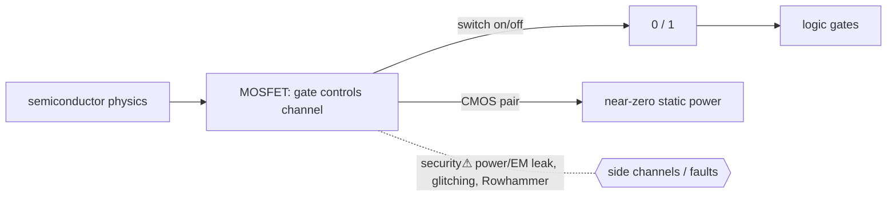

> [!abstract] A **transistor** is a voltage-controlled electrical **switch** — the physical atom of all digital computing. A small voltage on one terminal controls whether current flows between two others, letting one signal gate another. Stack billions and you get [[Logic Gates|logic]], [[CPU & Processing Units|CPUs]], and [[Memory|memory]]. The bottom rung of the [[Master Index — Technology Vault|abstraction ladder]]: `physics → transistor → gate → CPU → software`.

## Definition
A semiconductor device (dominantly the **MOSFET**) with three terminals: **gate**, **source**, **drain**. The gate voltage controls conductivity between source and drain — an electrically controlled switch (and, in analog use, an amplifier).

## Why it exists
Computation needs a device where **one signal controls another**, is **fast**, **tiny**, and **cheap to mass-produce**. Mechanical relays and vacuum tubes did this but were huge, slow, and unreliable. The transistor — solid-state, shrinkable, switchable billions of times per second — is what made digital electronics economically possible. Its shrinkability *is* [Moore's law].

## How it works — the MOSFET as a switch
- Apply gate voltage **above threshold** → a conductive **channel** forms between source and drain → current flows → logical **1**.
- Gate voltage **below threshold** → no channel → no current → logical **0**.
- **CMOS** pairs an n-type and p-type transistor so that only one conducts at a time → almost **zero static power** (power burned only when *switching*). This is why essentially all digital chips are CMOS.

## State — who owns/reads/writes
- The transistor holds **no persistent state** by itself — its output follows its input. *Persistent* state (memory) is built by wiring transistors into feedback loops (latches/flip-flops → [[Memory]] §SRAM).
- Physical state (charge, voltage, temperature) is real and *leaks* — the root of side channels (below).

## Direct dependencies
- [[01 Physics]] — **prereq** · semiconductor physics (doping, band gaps, the field effect) is why a gate voltage controls current
- [[Active Components & ICs]] — **composes** · the MOSFET is detailed there; this note is its role as *the computing switch*
- [[Passive Components]] — **depends-on** · resistors/capacitors set thresholds and timing around it

## Direct effects
- [[Logic Gates]] — **enables** · gates are transistors wired into switching networks (a NAND = 4 MOSFETs)
- [[Memory]] — **enables** · SRAM cells and DRAM (transistor + capacitor) store bits
- [[CPU & Processing Units]] — **composes** · a modern CPU is billions of these switching in concert

## Failure modes
- **Leakage** — as transistors shrink, they leak current even "off" → heat, power walls (the end of easy clock scaling).
- **Wear / electromigration** — physical degradation over time.
- **Thermal throttling** — switching billions of times generates heat that limits speed.

## Security implications
- **security⚠ Side channels** — switching draws power and emits EM proportional to the *data* being processed; **power/EM analysis** recovers cryptographic keys from a chip that is logically perfect ([[Cryptography]] §side-channel).
- **security⚠ Fault injection** — glitching voltage/clock/laser flips a transistor's output → skip a security check (used to bypass secure boot).
- **security⚠ Rowhammer** — repeatedly toggling DRAM rows leaks charge into neighbours, flipping bits in *other* processes' memory — an isolation break rooted in transistor physics, not software.
- **security⚠ Hardware trojans** — malicious transistors added at fabrication; a supply-chain trust problem below all software defence.

## Mechanism graph

## Connections
- [[01 Physics]] — **prereq** · the physics that makes the switch work
- [[Active Components & ICs]] — **composes** · MOSFET device detail
- [[Logic Gates]] — **enables** · the next rung up
- [[Memory]] — **enables** · storage cells
- [[CPU & Processing Units]] — **composes** · billions of transistors
- [[Cryptography]] — **security⚠** · side-channel key extraction

## Related
[[Master Index — Technology Vault]] · [[02 Electronics]] · [[Digital Logic & Microcontrollers]]
