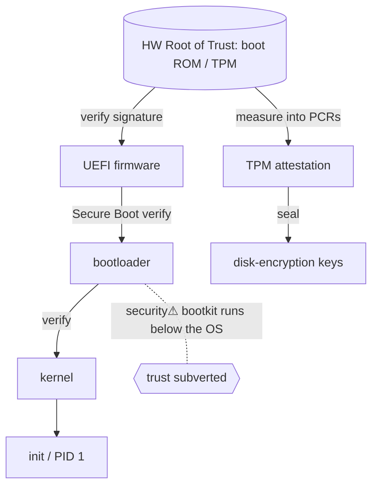

> [!abstract] The **boot chain** is how a dead machine becomes a *trusted* running kernel — a hand-off ladder from silicon → firmware → bootloader → kernel, where **each stage cryptographically verifies the next** before running it. It's the bridge [[03 Computer Hardware|Hardware]] ↔ [[04 Operating Systems|OS]] ↔ [[06 Cybersecurity|Security]], and the foundation everything above it *assumes* but rarely checks: if the boot chain is subverted, no OS-level defence can be trusted.

## What it is
The ordered sequence of components that execute from power-on to a usable OS, plus the **chain of trust** that lets each stage attest the integrity of the next: **CPU reset → firmware (UEFI) → bootloader → kernel → init/[[Processes|PID 1]]**.

## Why it exists
A CPU at power-on trusts *whatever code is at the reset vector* — it has no notion of "legitimate OS." That's a blank cheque: malware that runs *before* the OS (bootkits, rootkits) sits beneath every defence the OS could mount. The trust chain exists to **anchor trust in hardware** (a root that can't be rewritten) and verify each subsequent stage, so a tampered bootloader or kernel is detected before it runs. It turns "trust whatever boots" into "trust only what a hardware root vouches for."

## How it works — the ladder
```
Hardware Root of Trust (immutable boot ROM / TPM)
   │ measures & verifies
UEFI firmware  ──(Secure Boot: check signature)──►
   │
Bootloader (GRUB / Windows Boot Manager)
   │ verified
Kernel
   │ verified → hands off to
init / systemd (PID 1) → userspace
```
- **UEFI Secure Boot** — firmware refuses to run a bootloader/kernel not signed by a trusted key → blocks unsigned bootkits.
- **TPM (Trusted Platform Module)** — a hardware chip that **measures** each stage (hashes into PCRs); those measurements enable **remote attestation** ("prove you booted known-good code") and seal secrets (disk-encryption keys released only if the measurements match — BitLocker/LUKS+TPM).
- **Measured vs verified boot** — *verified* (Secure Boot) blocks bad code; *measured* (TPM) records what ran so you can detect tampering after the fact.

## State — who owns/reads/writes
- The **hardware root of trust** owns the anchor keys/measurements — immutable, the one thing that can't be rewritten by software.
- **TPM PCRs** accumulate measurements (extend-only); disk keys are **sealed** to specific PCR values.

## Direct dependencies
- [[Instruction Set Architecture]] — **depends-on** · the CPU reset vector and privilege modes define where/how boot starts
- [[03 Computer Hardware]] — **prereq** · firmware, TPM, and boot ROM are hardware
- [[Cryptography]] — **depends-on** · signatures (Secure Boot) and hashing/PCRs (TPM) are cryptographic

## Direct effects
- [[04 Operating Systems]] — **enables** · delivers a verified kernel to [[Processes|init]]; the OS trusts it booted clean
- [[Trust Boundaries & Privilege]] — **causes** · establishes the *lowest* trust boundary — everything above inherits it
- disk encryption — **enables** · TPM-sealed keys unlock storage only on a trusted boot

## Failure modes
- **Bootkit** — malware persisting *below* the OS (in firmware/bootloader) survives OS reinstall.
- **Evil-maid attack** — physical tampering with an unattended machine's boot path.
- **Firmware bugs** — UEFI is a large privileged attack surface; a firmware vuln undermines the whole chain.

## Security implications
- **security⚠ Trust must start in hardware** — a software-only root of trust is circular (malware could forge it). The TPM/boot-ROM is the un-rewritable anchor.
- **security⚠ Below-OS malware is the worst kind** — it defeats [[Digital Forensics & Anti-Forensics|forensics]] and EDR because it controls the environment they run in. This is why measured boot + attestation matter.
- **security⚠ Supply chain** — a backdoored firmware image (from vendor or interdiction) compromises the machine before any user control.
- **security⚠ Confidential computing** extends this: attest the boot state to a remote party before releasing workloads (cloud tenants verifying the host).

## Mechanism graph


## Connections
- [[Instruction Set Architecture]] — **depends-on** · the reset vector & privilege model boot uses
- [[04 Operating Systems]] — **enables** · hands off a trusted kernel
- [[Cryptography]] — **depends-on** · signatures & measurements
- [[Trust Boundaries & Privilege]] — **causes** · the lowest trust boundary
- [[Digital Forensics & Anti-Forensics]] — **security⚠** · below-OS malware defeats detection
- [[Endpoint Security]] — **security⚠** · Secure Boot / measured boot as endpoint defence

## Related
[[Master Index — Technology Vault]] · [[03 Computer Hardware]] · [[Linux_OS_and_Internals]]
