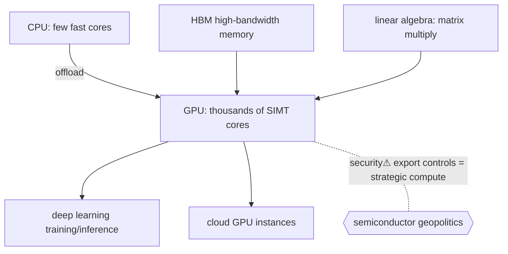

> [!abstract] A **GPU** trades the [[CPU & Processing Units|CPU's]] few fast, flexible cores for **thousands of simple cores** running the same instruction over massive data in parallel. That shape happens to be *exactly* what neural-network math (matrix multiply) needs — which is why the GPU is the **hardware substrate of modern AI** ([[Machine Learning & Deep Learning]]), and why advanced GPUs sit at the centre of [[US-China Tech War & Export Controls|semiconductor geopolitics]]. The rung connecting the hardware stack *up* to AI.

## What it is
A massively parallel processor. Where a CPU optimises **latency** (finish one task fast, complex control, big caches, branch prediction), a GPU optimises **throughput** (do a trillion simple identical operations, thousands of cores, huge memory bandwidth).

## Why it exists
Some problems are **embarrassingly parallel** — the same operation applied independently to millions of data points (pixels, then matrix elements). A CPU does these serially and wastes its cleverness; you'd rather have thousands of dumb ALUs all working at once. GPUs exist because that throughput-over-latency trade is worth a whole different chip — first for graphics, then (GPGPU) for any data-parallel workload, and now overwhelmingly for **[[Machine Learning & Deep Learning|deep learning]]**.

## How it works
- **SIMT** (Single Instruction, Multiple Threads) — thousands of threads run the same instruction on different data, grouped into warps; the hardware hides memory latency by swapping in ready warps.
- **Memory bandwidth** — training is **bandwidth-bound**; GPUs use **HBM** (high-bandwidth memory) stacked next to the die because feeding the cores matters more than raw clock.
- **The AI fit** — a neural network's forward/backward pass is dominated by **matrix multiplications** ([[00 Mathematics|linear algebra]]); that maps perfectly onto data-parallel cores (and dedicated **tensor cores**).
- **Programming model** — **CUDA** (NVIDIA) is the dominant framework; its software lock-in is a large part of NVIDIA's moat. **TPUs/NPUs** are even-more-specialized cousins.

## State — who owns/reads/writes
- The GPU has its **own memory** (VRAM/HBM); data must be copied from host [[Memory|RAM]] across PCIe/NVLink — the copy is often the bottleneck.
- Execution model differs enough from the CPU that it's effectively a **separate [[Instruction Set Architecture|ISA]]** and toolchain.

## Direct dependencies
- [[CPU & Processing Units]] — **depends-on** · the CPU orchestrates and feeds the GPU (offload model)
- [[Memory]] — **depends-on** · bandwidth to memory is the binding constraint on throughput
- [[00 Mathematics]] — **prereq** · linear algebra is the workload GPUs accelerate

## Direct effects
- [[Machine Learning & Deep Learning]] — **enables** · training/inference of large models is only feasible on parallel accelerators
- [[09 Cloud]] — **composes** · cloud GPU instances are how most AI compute is rented
- [[Consensus & Consistency|distributed training]] — **enables** · huge models are split across many GPUs/nodes
- [[Semiconductor Economics]] — **causes** · GPU demand drives the leading-edge chip economy

## Failure modes
- **Memory-bound stalls** — cores idle waiting on data (bandwidth, not FLOPs, is the wall).
- **PCIe/host-transfer bottleneck** — copying data to/from the GPU dominates small workloads.
- **Thermal/power** — dense GPU clusters are power- and cooling-limited (a datacenter constraint).

## Security & geopolitical implications
- **security⚠ Export controls** — advanced GPUs (and the [[US-China Tech War & Export Controls|tools to make them]]) are restricted for national-security reasons: compute is now strategic power. The hardware bottom of "who gets to build frontier AI."
- **security⚠ Side channels** — shared cloud GPUs can leak between tenants (timing/memory), and model weights in VRAM are a theft target.
- **security⚠ Supply-chain concentration** — a few firms (NVIDIA, TSMC, ASML) are single points of failure for the entire AI economy.

## Mechanism graph

## Connections
- [[CPU & Processing Units]] — **depends-on** · orchestration & offload
- [[Memory]] — **depends-on** · bandwidth-bound throughput
- [[Machine Learning & Deep Learning]] — **enables** · the AI workload it powers
- [[Instruction Set Architecture]] — **composes** · a distinct parallel execution model
- [[Semiconductor Economics]] · [[US-China Tech War & Export Controls]] — **causes** · compute as geopolitics
- [[09 Cloud]] — **composes** · rented GPU compute

## Related
[[Master Index — Technology Vault]] · [[03 Computer Hardware]] · [[14 AI]]
