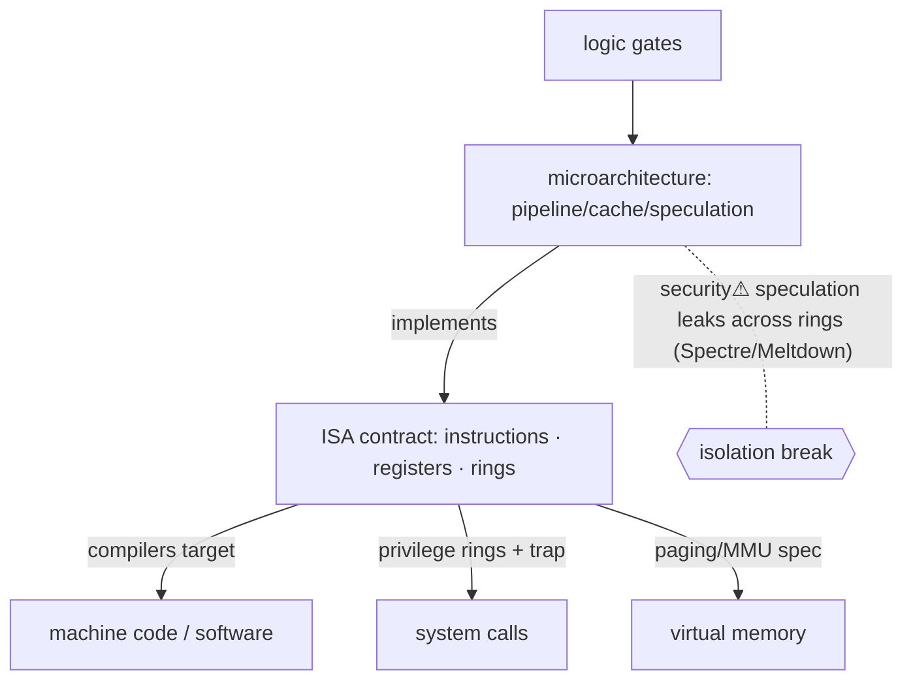

> [!abstract] The **Instruction Set Architecture (ISA)** is the **contract between hardware and software** — the exact set of instructions, registers, memory model, and privilege levels a [[CPU & Processing Units|CPU]] exposes, that *all* software (compilers, OS, programs) is written against. It is the keystone rung of the [[Master Index — Technology Vault|abstraction ladder]]: everything below (gates, transistors) *implements* it; everything above ([[System Calls|OS]], programs) *targets* it. x86-64, ARM, RISC-V are ISAs.

## Definition
The **abstract interface** a processor presents: its instructions (opcodes), **registers**, addressing/memory model, data types, interrupt/exception model, and **privilege levels** — everything a programmer (or compiler) must know, and nothing about *how* it's built internally.

## Why it exists
It is the great **decoupling**. Without a stable ISA, every program would have to be rewritten for every chip revision, and every chip would break all existing software. The ISA fixes a contract so that **hardware can change underneath** (new microarchitectures, faster silicon) while the **same binaries keep running**, and software can be written once for "x86-64" regardless of which Intel/AMD chip runs it. It's the interface that lets hardware and software evolve independently — the single most important boundary in computing.

## How it works — the contract's parts
- **Instructions** — machine-code operations (arithmetic, load/store, branch, call). A compiler translates [[07 Programming|source code]] into these.
- **Registers** — the CPU's tiny, fastest storage (general-purpose + special: program counter, stack pointer, flags).
- **Memory model** — how the CPU addresses [[Memory]] (and the ordering guarantees for concurrency).
- **Privilege levels (rings)** — the ISA defines modes like **ring 0 (kernel)** and **ring 3 (user)**; certain instructions are privileged. *This is the hardware root of the OS security boundary.*
- **Microarchitecture** implements the ISA (pipelines, caches, speculation) — invisible to software *by contract* (but see security).

**RISC vs CISC:** RISC (ARM, RISC-V) — few simple fixed-length instructions; CISC (x86) — many complex instructions. Modern x86 CPUs internally translate CISC into RISC-like micro-ops — the ISA is a *facade*.

## State — who owns/reads/writes
- **Registers** are the CPU's own state (per-core; saved/restored on [[Processes|context switch]]).
- The **privilege bit/ring** is CPU state that gates which instructions execute — owned by hardware, changed only through controlled transitions ([[System Calls|traps/syscalls]]).

## Direct dependencies
- [[Logic Gates]] — **depends-on** · the datapath/control that executes instructions is gate networks
- [[CPU & Processing Units]] — **composes** · the CPU is the physical thing implementing an ISA
- [[00 Mathematics]] — **prereq** · binary/two's-complement arithmetic the ALU performs

## Direct effects
- [[07 Programming]] — **enables** · compilers target the ISA; machine code *is* ISA instructions
- [[System Calls]] — **bridges** · the ISA's **privilege rings + trap instruction** are the hardware mechanism syscalls use to cross user→kernel
- [[Virtual Memory]] — **enables** · the ISA defines the MMU/paging the OS programs for isolation
- [[04 Operating Systems]] — **constrains** · the OS is written *to* a specific ISA's privilege and memory model

## Failure modes
- **Undefined behaviour** — executing an illegal/undefined instruction → CPU exception/trap.
- **ISA fragmentation** — extensions (AVX, SVE) mean not every chip runs every binary.
- **Legacy baggage** — x86's decades of backward compatibility carry complexity and attack surface.

## Security implications
- **security⚠ Privilege rings are the hardware root of isolation.** Ring 0 vs ring 3 is *why* user code can't run privileged instructions — the foundation the whole OS security model ([[System Calls]], [[Trust Boundaries & Privilege]]) rests on. Break it in hardware and no software fix fully helps.
- **security⚠ Speculative execution (Spectre/Meltdown, 2018)** — microarchitectural optimizations *invisible to the ISA contract* leaked data across privilege boundaries via cache side channels. A landmark: the *implementation* violated the isolation the *architecture* promised — proof that the ISA abstraction is leaky.
- **security⚠ NX bit / control-flow features** — the ISA provides the primitives (non-executable pages, CET/PAC) that OS/compiler defenses build on; missing ISA support = weaker software defense.
- **security⚠ Trusted execution (SGX, TrustZone)** — ISA-level enclaves create hardware trust boundaries — and their own exotic attacks.

## Mechanism graph

## Connections
- [[Logic Gates]] — **depends-on** · the logic that executes instructions
- [[CPU & Processing Units]] — **composes** · the physical implementation
- [[System Calls]] — **bridges** · privilege rings + trap = the user↔kernel crossing
- [[Virtual Memory]] — **enables** · the MMU/paging the ISA defines
- [[07 Programming]] — **enables** · the target of every compiler
- [[Trust Boundaries & Privilege]] — **security⚠** · rings are the hardware root of privilege

## Related
[[Master Index — Technology Vault]] · [[03 Computer Hardware]] · [[15 Quantum Computing & Technology]]
