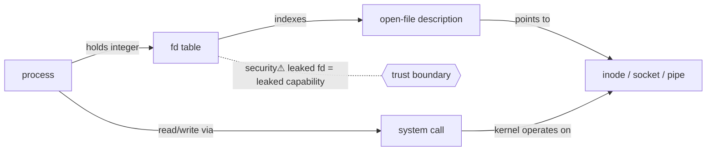

> [!abstract] A **file descriptor (fd)** is a small non-negative integer a process uses as a handle to a kernel-managed I/O object — a file, pipe, device, or **[[Sockets|socket]]**. It is the OS's universal "everything is a file" interface, and the first rung of the [[Master Index — Technology Vault|socket chain]]: `process → fd → socket`.

## Definition
An fd is an **index into the process's file-descriptor table** — a per-process kernel array where each entry points to an open-file description in the system-wide open-file table, which in turn points to the underlying inode/socket/pipe object.

## Why it exists
Processes must not touch kernel memory or hardware directly (that would destroy [[Virtual Memory|isolation]] and privilege boundaries). The fd is an **opaque capability**: the process holds only an integer; the kernel holds the real object and enforces every access. This indirection is what lets one uniform API (`read`/`write`/`close`) work over files, sockets, pipes and devices alike.

## Internal mechanism
Three tables, chained:

```
process fd table   →   system-wide open-file table   →   inode / socket / pipe
[0]=stdin              (offset, status flags, refcount)     (the real object)
[1]=stdout
[2]=stderr
[3]=socket ...
```

`open()`/`socket()`/`accept()` allocate the **lowest free** fd number and wire up the chain. `read(fd,…)` indexes the table, follows the pointers, and the kernel performs the I/O on the process's behalf via a **[[System Calls|system call]]** (the privilege-boundary crossing).

## State — who owns/reads/writes
- **Owner:** the kernel. The process holds only the *integer*, never the object.
- **Per-process:** the fd *table* is private to the process (in kernel memory).
- **Shared:** the *open-file description* it points to can be shared (across `fork()`, `dup()`) — so two fds can share one file offset. This sharing is the source of subtle bugs and leaks.

## Interfaces
`open, socket, pipe, accept` (create) · `read, write, recv, send` (use) · `dup, dup2, fcntl` (manipulate) · `close` (destroy) · `select/poll/epoll` (multiplex many fds).

## Direct dependencies
- [[Virtual Memory]] — **depends-on** · the fd table lives in per-process kernel memory, isolated by the MMU
- [[System Calls]] — **depends-on** · every fd operation crosses the user→kernel boundary via a syscall
- [[04 Operating Systems]] — **prereq** · process abstraction that owns the table

## Direct effects
- [[Sockets]] — **enables** · a socket *is* an fd pointing at a kernel socket object; no fd, no socket API
- [[OS Internals: Processes, I-O, Sockets & Networking|Pipes & redirection]] — **enables** · pipes/redirection (`>`, `|`) are pure fd remapping via `dup2`
- fork/exec inheritance — **causes** · child processes inherit the parent's fd table by default

## Failure modes
- **fd exhaustion** — hitting `ulimit -n` → `EMFILE`; a leak (opening without closing) slowly kills a long-running server.
- **Use-after-close / double-close** — reusing a closed fd number that's been reassigned → operating on the *wrong* object.
- **fd leak across `exec`** — an fd not marked close-on-exec (`O_CLOEXEC`) stays open in the new program.

## Security implications
- **security⚠ Descriptor leak = capability leak.** An fd is an *unforgeable capability*: if a privileged process passes/leaks an fd (via `fork`, `exec`, or SCM_RIGHTS over a unix socket) to a lower-privileged one, the receiver gains that access **without any permission recheck** — the kernel already authorised the fd at open time. Classic privilege-escalation and container-escape primitive.
- **security⚠** This is why `O_CLOEXEC` exists and why sandboxes scrub inherited fds.

## Mechanism graph


## Connections
- [[System Calls]] — **bridges** · the boundary every fd operation crosses
- [[Sockets]] — **enables** · the network endpoint built on an fd
- [[Virtual Memory]] — **depends-on** · isolates the table
- [[Ports, Interfaces & Sockets]] — **composes** · listening/connected sockets are fds
- [[Linux]] · [[04 Operating Systems]] — the OS that implements this
- [[Linux_OS_and_Internals]] §24 · [[Windows_OS_and_Internals]] §11–12 (Handles / Object Manager) — **composes** · OS-specific fd/handle model (impl layer)
- [[Filesystems]] — **bridges** · the `fd → file` branch (parallel to `fd → socket`)

## Related
[[Master Index — Technology Vault]] · [[07 Programming]]
