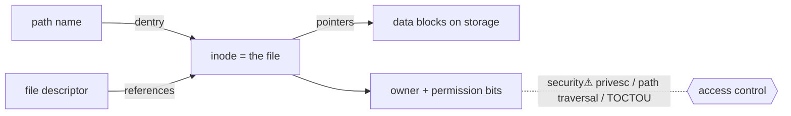

> [!abstract] A **filesystem** is the abstraction that turns raw block [[Storage|storage]] into named, permissioned, hierarchical objects (files & directories). It is the *other branch* of the [[File Descriptors|fd]] tree (`fd → file`, parallel to `fd → socket`), and where the OS's **naming, permission, and metadata** model lives. This is the **OS-agnostic concept**; concrete implementations (Linux VFS/inodes/ext4, Windows NTFS/MFT) live in the impl notes below.

## What it is
A filesystem maps **human names (paths)** and **access rules** onto blocks on a device. It provides: a namespace (the directory tree), per-object metadata (owner, permissions, timestamps, size), and the read/write/seek operations exposed through [[File Descriptors|fds]].

## Why it exists
Raw storage is just numbered blocks — no names, no owners, no structure. Programs need to *name* data, *share* it under rules, and survive reboots. The filesystem supplies persistence + naming + a permission model, all behind the same `open/read/write/close` [[System Calls|syscalls]] as everything else ("everything is a file").

## How it works — the core objects
- **inode (index node)** — the real file: metadata + pointers to data blocks. *The name is not the file* — a directory entry (dentry) maps a name → inode number.
- **directory** — a special file mapping names → inode numbers. This is why one file can have many names (**hard links** = multiple dentries → one inode).
- **path resolution** — the kernel walks the tree component by component, checking permission at each directory (`x` = may traverse).
- **mounting** — grafting one filesystem's tree onto a directory of another → the single unified namespace (`/`).
- **VFS** — the kernel's abstraction layer letting many filesystem types (ext4, NTFS, network FS) present one uniform interface.

## State — who owns/reads/writes
- **Owner:** the kernel + on-disk structures. The inode holds the authoritative metadata (owner UID/GID, permission bits, timestamps).
- A file's **identity is its inode**, not its path — deleting the last name frees the inode; an open [[File Descriptors|fd]] keeps a deleted file alive until closed.

## Interfaces
`open/openat, read/write/pread/pwrite, lseek, stat, mkdir, unlink, rename, chmod/chown, mount` — all [[System Calls|syscalls]].

## Direct dependencies
- [[Storage]] — **depends-on** · the block device the filesystem lays structure over
- [[File Descriptors]] — **bridges** · open files are reached through fds (the `fd → inode` branch)
- [[System Calls]] — **depends-on** · all file operations cross the user↔kernel boundary

## Direct effects
- [[Trust Boundaries & Privilege]] — **causes** · permission bits + ownership are a primary access-control mechanism
- [[Processes]] — **enables** · executables are loaded from files; a process's binary + libraries are filesystem objects
- [[Digital Forensics & Anti-Forensics]] — **security⚠** · filesystem metadata (MFT, timestamps, journal) is the core of disk forensics

## Failure modes
- **Corruption** — power loss mid-write → inconsistent metadata (journaling/CoW mitigate).
- **Race (TOCTOU)** — check path then use it; an attacker swaps the target in between → classic privilege bug.
- **Full inode table** — out of inodes even with free space → "No space left" with `df` showing room.

## Security implications
- **security⚠ Permissions are enforced here** — owner/group/other × read/write/execute, plus SUID/SGID (run as file owner), ACLs. Misconfigured bits = the most common local privesc.
- **security⚠ Path traversal** (`../../etc/passwd`) — abusing path resolution to escape an intended directory; a top web vuln.
- **security⚠ Symlink attacks / TOCTOU** — the name↔inode indirection is exploitable when a privileged process trusts a path.
- **security⚠ Metadata = evidence** — timestamps, journals and deleted-inode remnants are what [[Digital Forensics & Anti-Forensics|forensics]] reconstructs; anti-forensics attacks exactly this.

## OS implementations (impl refs — the hybrid model)
- **Linux:** [[Linux_OS_and_Internals]] §12–16 (Filesystem architecture, VFS, inodes/dentries, mounting) · §17–22 (permissions, UID/GID, SUID/SGID, capabilities, ACLs)
- **Windows:** [[Windows_OS_and_Internals]] §22–25 (I/O architecture, NTFS/MFT, Alternate Data Streams)

## Mechanism graph

## Connections
- [[File Descriptors]] — **bridges** · the `fd → file` branch
- [[Storage]] — **depends-on** · the physical medium
- [[Trust Boundaries & Privilege]] — **causes** · permissions are an access-control primitive
- [[System Calls]] — **depends-on** · the interface to files
- [[Linux_OS_and_Internals]] · [[Windows_OS_and_Internals]] — **composes** · concrete implementations
- [[Digital Forensics & Anti-Forensics]] — **security⚠** · disk forensics

## Related
[[Master Index — Technology Vault]] · [[04 Operating Systems]] · [[03 Computer Hardware]]
