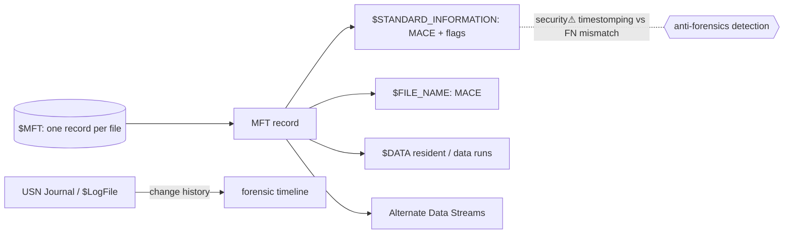

> [!abstract] **NTFS** is Windows' journaling filesystem; the **Master File Table (MFT)** is its heart — a record for *every* file, holding all metadata and (for small files) the data itself. This is the Windows *implementation* of the [[Filesystems]] concept, and the **single richest artifact source in disk forensics** ([[Digital Forensics & Anti-Forensics]]). Understanding the MFT is what lets an analyst reconstruct a timeline and catch anti-forensics.

## What it is
A filesystem where **everything is a file, including the metadata**: the MFT is itself a file (`$MFT`) containing one ~1 KB **record per file/directory**, each built from **attributes** (name, timestamps, permissions, data).

## Why it exists
FAT (its predecessor) had no journaling, no permissions, no scalability. NTFS adds **recoverability** (journaling), **security** (ACLs/owners), **large volumes**, and rich metadata — at the cost of complexity. That complexity is exactly what makes it forensically valuable: it records far more than it strictly needs to.

## How it works — the MFT record
Each MFT record is a set of **attributes**:
- **`$STANDARD_INFORMATION` (SI)** — the timestamps Windows shows (MACE: Modified, Accessed, Changed, Born) + flags.
- **`$FILE_NAME` (FN)** — name + a *second* set of MACE timestamps.
- **`$DATA`** — the file content. Small files are **resident** (stored *inside* the MFT record); larger ones are **non-resident** (the record points to data runs on disk).
- **Alternate Data Streams (ADS)** — a file can have *extra* named `$DATA` streams (`file.txt:hidden`) — invisible in Explorer.

Journaling: **`$LogFile`** (metadata transactions, for crash recovery) and the **USN Journal (`$UsnJrnl`)** (a change log — created/deleted/renamed).

## State — who owns/reads/writes
- The **kernel/NTFS driver** owns the on-disk structures; the MFT is the authoritative index.
- A file's identity is its **MFT record number**, not its path (like an [[Filesystems|inode]]).
- Timestamps exist in **two places** (SI and FN) updated by different code paths — the key to detecting tampering.

## Direct dependencies
- [[Filesystems]] — **composes** · NTFS is a concrete instance of the filesystem concept
- [[Storage]] — **depends-on** · the block device NTFS structures overlay
- [[Windows_OS_and_Internals]] — **depends-on** · the NTFS driver + I/O manager

## Direct effects
- [[Digital Forensics & Anti-Forensics]] — **enables** · the MFT + journals are the primary disk-forensic source
- [[File Descriptors]] — **bridges** · Windows opens NTFS files as Handles
- timeline reconstruction — **causes** · dual timestamps + USN journal reconstruct *what happened when*

## Failure modes
- **Corruption** — recovered via `$LogFile` replay (journaling's purpose).
- **MFT fragmentation / exhaustion** — a full volume of tiny files can exhaust MFT space.

## Security implications
- **security⚠ Timestomping detection** — malware fakes `$STANDARD_INFORMATION` timestamps to blend in, but usually **not** the `$FILE_NAME` ones (different code path); an SI-vs-FN mismatch flags tampering. Core anti-anti-forensics.
- **security⚠ Alternate Data Streams** — attackers hide payloads in ADS (`type evil.exe > report.txt:evil.exe`); invisible to casual inspection, a classic evasion.
- **security⚠ Deleted-file recovery** — an unlinked MFT record often survives until overwritten → "deleted" evidence is recoverable.
- **security⚠ USN/$LogFile** — reconstruct creation/deletion/rename history even after files are gone; anti-forensics targets these journals.

## OS implementation (impl ref)
- **Windows:** [[Windows_OS_and_Internals]] §23–25 (Windows file systems, NTFS/MFT, Alternate Data Streams), §22 (I/O architecture). Forensic tooling: Eric Zimmerman's MFTECmd → see [[Digital Forensics & Anti-Forensics]].

## Mechanism graph

## Connections
- [[Filesystems]] — **composes** · the general concept NTFS implements
- [[Digital Forensics & Anti-Forensics]] — **enables** · the MFT is the disk-forensics backbone
- [[Storage]] — **depends-on** · the medium
- [[Windows_OS_and_Internals]] — **depends-on** · the NTFS driver
- [[File Descriptors]] — **bridges** · files opened as Handles
- [[Endpoint Security]] — **security⚠** · ADS/timestomp detection

## Related
[[Master Index — Technology Vault]] · [[04 Operating Systems]] · [[03 Computer Hardware]]
