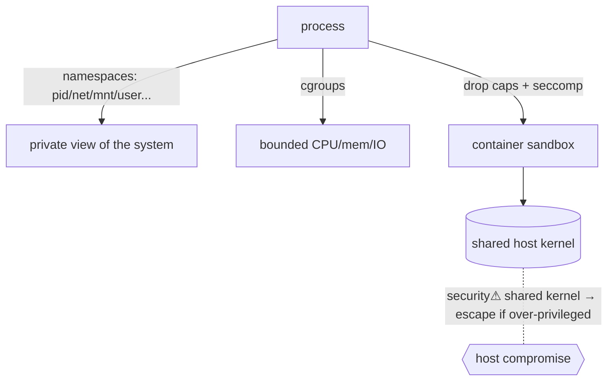

> [!abstract] **Containers** are processes that *think* they have their own machine, built from two Linux kernel features: **namespaces** (isolate *what a process can see*) and **cgroups** (limit *what it can use*), hardened by [[Linux Capabilities|capabilities]] and seccomp. Unlike a VM, a container **shares the host kernel** — lighter, but a weaker [[Trust Boundaries & Privilege|trust boundary]]. The foundation of [[09 Cloud|cloud-native]] infrastructure and a distinct attack surface (escape).

## What it is
A container is a normal [[Processes|process]] (or group) that the kernel has placed in a set of **namespaces** (giving it a private view of PIDs, filesystem mounts, network, users, etc.) and constrained by **cgroups** (CPU/memory/IO limits). There is no "container object" in the kernel — it's an assembly of these primitives.

## Why it exists
VMs isolate by emulating whole machines (a full guest kernel) — strong but heavy. Most workloads just need to *not see or affect each other* while sharing one kernel. Namespaces+cgroups deliver that isolation at process weight: fast startup, high density, reproducible packaging. This trade — **isolation strength for efficiency** — is the whole reason containers won cloud-native.

## How it works — the primitives
**Namespaces** (each isolates one kind of resource):
- **mnt** — private filesystem mounts · **pid** — its own PID 1, can't see host processes · **net** — own interfaces/ports · **uts** — own hostname · **ipc** — own IPC · **user** — map container root to an unprivileged host UID · **cgroup** — own cgroup view.
- **cgroups** — bound CPU, memory, IO, PIDs (prevents one container starving the host).
- The container image is an overlay filesystem ([[Filesystems]]); `runc` sets up namespaces + cgroups + drops [[Linux Capabilities|capabilities]] + applies seccomp, then `execve`s the entrypoint.

## State — who owns/reads/writes
- The **host kernel** owns everything — it's shared. A container's "isolation" is just restricted *views* the same kernel enforces.
- This shared-kernel fact is the crux: a kernel vulnerability, or an over-privileged container, breaks the boundary.

## Direct dependencies
- [[Processes]] — **depends-on** · a container *is* namespaced processes
- [[Virtual Memory]] — **depends-on** · memory isolation still comes from the MMU per process
- [[Linux Capabilities]] — **depends-on** · runtimes drop most caps to shrink container privilege
- [[Filesystems]] — **depends-on** · overlay/union filesystems provide the image + writable layer

## Direct effects
- [[09 Cloud]] · [[10 DevOps]] — **enables** · containers are the unit of cloud-native deploy (Docker, Kubernetes)
- [[Trust Boundaries & Privilege]] — **composes** · a container is a trust boundary — weaker than a VM
- container escape — **security⚠** · shared kernel means the boundary can be crossed

## Failure modes
- **Noisy neighbour** — missing cgroup limits → one container starves others.
- **Shared-kernel bug** — a kernel exploit ignores namespace boundaries entirely.
- **Image bloat / drift** — unpinned base images pull in vulnerabilities.

## Security implications
- **security⚠ Escape via over-privilege** — `--privileged`, added [[Linux Capabilities|caps]] (`CAP_SYS_ADMIN`), mounted host paths, or the Docker socket inside a container = trivial host takeover. The #1 container finding.
- **security⚠ Weaker than a VM** — one shared kernel; for hostile multi-tenancy, add a sandbox (gVisor, Kata, Firecracker microVMs).
- **security⚠ User namespaces** — mapping container-root to unprivileged host-UID (rootless) contains damage; not always enabled.
- **security⚠ Defence in depth** — namespaces + dropped caps + seccomp + read-only rootfs + no-new-privileges together make the sandbox; any one alone is weak.

## OS implementation (impl ref)
- **Linux:** [[Linux_OS_and_Internals]] §31 (Network namespaces), §33 (Containers), §21 (capabilities), §34 (SELinux/AppArmor). Cloud orchestration: [[09 Cloud]].

## Mechanism graph

## Connections
- [[Processes]] — **depends-on** · containers are namespaced processes
- [[Linux Capabilities]] — **depends-on** · dropping caps is core container hardening
- [[Virtual Memory]] — **depends-on** · per-process memory isolation
- [[Trust Boundaries & Privilege]] — **composes** · the container boundary (vs a VM's)
- [[09 Cloud]] · [[10 DevOps]] — **enables** · cloud-native deployment
- [[Credential Playbook]] · [[Technique Catalog]] — **security⚠** · container escape techniques

## Related
[[Master Index — Technology Vault]] · [[04 Operating Systems]] · [[12 Distributed Systems]]
