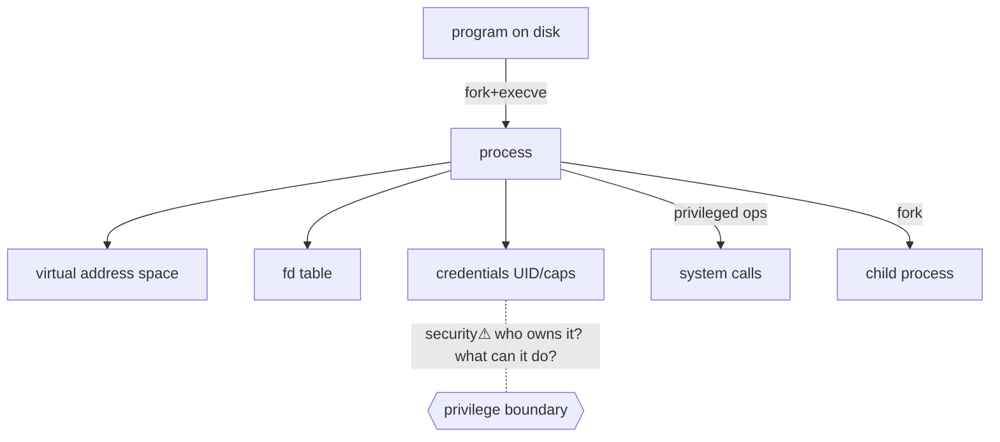

> [!abstract] A **process** is a running instance of a program — the execution context the OS creates and manages. It is the unit the kernel schedules, isolates ([[Virtual Memory]]), and grants resources to, and the thing a [[File Descriptors|fd table]] and [[System Calls|syscalls]] belong to. First rung of the [[Master Index — Technology Vault|socket chain]]: `program → process → syscall → fd → socket`. *(Depth moved here from the OS-Internals narrative during the monolith split.)*

## What it is
The **program** is passive executable code on disk. The **process** is the *running execution context* the OS builds from it: code loaded into an address space, plus all the live state needed to run it.

## Why it exists
The CPU runs instructions; it has no concept of "a program with an identity, an owner, permissions, and isolation." The process is the OS's abstraction that wraps execution in **identity (PID/user), isolation (its own address space), and accountability (what it may do)** — so many programs can run concurrently without corrupting each other, and so the kernel can enforce security per running thing.

## How it works — creation
The classic Unix model is **`fork()` + `execve()`**:
```
Shell (or any process)
   │ fork()      → duplicate: a child process (copy-on-write address space)
   ▼
Child process
   │ execve(prog) → replace the child's image with a new program
   ▼
New program running
   │ (parent may) wait() → reap the child's exit status
```
`fork` creates the *context*; `execve` loads the *program* into it. This separation is why the shell can set up a child's [[File Descriptors|fds]] (redirection, pipes) *between* the fork and the exec.

## State — who owns/reads/writes
The kernel owns a **process control block** per process, holding:
- **PID** (identity) and parent PID
- **virtual address space** ([[Virtual Memory]]) — code, heap, stack, mappings
- **CPU context** — registers, program counter, saved on every context switch
- **security credentials** — UID/GID, capabilities (what it's allowed to do)
- **environment variables** and arguments
- **[[File Descriptors|file-descriptor table]]** — its open I/O objects
```
PID    USER   PROCESS
1      root   systemd
500    root   sshd
1234   ivan   bash
1500   ivan   firefox
```

## Interfaces
`fork/clone` (create), `execve` (load program), `exit/wait` (terminate/reap), `kill`/signals (control), `/proc/<pid>` (inspect), `setuid/capset` (change privilege) — all [[System Calls|syscalls]].

## Direct dependencies
- [[Virtual Memory]] — **depends-on** · a process *is* an isolated address space; the MMU enforces the boundary
- [[System Calls]] — **depends-on** · every privileged thing a process does crosses this boundary
- [[CPU & Processing Units]] — **prereq** · the CPU context (registers, PC) a process saves/restores

## Direct effects
- [[File Descriptors]] — **composes** · the fd table is per-process state; no process, no fds
- [[Sockets]] — **enables** · a socket is owned by a process (via its fd)
- fork/exec — **causes** · child processes inherit the parent's fds, environment and (dropped or kept) privileges
- [[Shells, Terminals & the CLI]] — **enables** · a shell runs commands *by* forking/execing child processes

## Failure modes
- **Zombie** — a child exited but the parent never `wait()`ed → PID entry lingers.
- **Orphan** — parent died first → child reparented to `init`/systemd.
- **Fork bomb** — unbounded `fork()` exhausts the process table (a resource-exhaustion DoS).
- **Runaway** — a process consuming all CPU/memory; the scheduler/OOM-killer intervene.

## Security implications
- **security⚠ Identity & privilege live here.** "Which *user* owns this process, with which capabilities?" is the first question in any incident — a `www-data` web process spawning a child shell is the classic compromise signal.
- **security⚠ Inheritance across fork/exec** — a child inherits fds, env, and privileges unless explicitly dropped; leaked fds or un-dropped root = escalation ([[File Descriptors]]).
- **security⚠ Process trees are evidence** — parent→child lineage (a Word process spawning PowerShell) is exactly what EDR and [[Digital Forensics & Anti-Forensics|forensics]] hunt.

## Mechanism graph


## Connections
- [[Virtual Memory]] — **depends-on** · the isolation a process is defined by
- [[System Calls]] — **depends-on** · the boundary its privileged actions cross
- [[File Descriptors]] — **composes** · its per-process I/O handles
- [[Shells, Terminals & the CLI]] — **enables** · shells create processes
- [[Digital Forensics & Anti-Forensics]] — **security⚠** · process trees as evidence
- [[Linux]] · [[Windows]] — concrete process models
- [[Linux_OS_and_Internals]] §5–8 · [[Windows_OS_and_Internals]] §8–10 — **composes** · OS-specific implementation (impl layer of the hybrid model)

## Related
[[Master Index — Technology Vault]] · [[OS Internals: Processes, I-O, Sockets & Networking]] · [[04 Operating Systems]]
