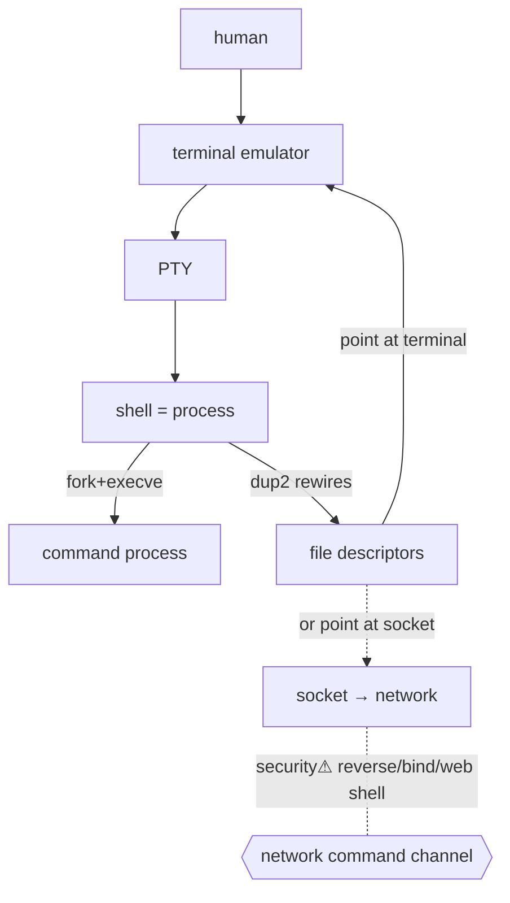

> [!abstract] The **terminal / shell / CLI** layer — the interactive interface between a human and the OS. A **terminal** is an I/O interface, a **shell** is a command interpreter (a user-space [[Processes|process]]), and neither is the kernel. Understanding this cleanly is what turns "reverse shells, bind shells, web shells, SSH" from memorised tricks into obvious consequences of [[File Descriptors|fd]] + [[Sockets|socket]] plumbing. *(Depth moved here from the OS-Internals narrative; replaces the former "Shells & Command Line" note.)*

## What it is — three distinct things people conflate

| Layer | What it is | It is **not** |
|---|---|---|
| **Terminal** (emulator) | An input/output interface — renders output, sends keystrokes. GNOME Terminal, iTerm, Windows Terminal, xterm | not a command interpreter |
| **Shell** | A command interpreter — parses commands, launches [[Processes|processes]], wires up I/O. Bash, Zsh, PowerShell, `cmd.exe` | not the kernel |
| **Kernel** | The privileged core managing CPU, memory, files, [[Sockets|networking]], security | not a program you "type into" |

```text
GUI Desktop → Terminal Emulator → Shell → Operating System
```
The terminal receives keystrokes, passes them to whatever program runs inside it, and renders that program's output. The shell is *just one* such program.

## Why it exists
Humans need to drive the OS interactively and scriptably. The shell provides a **REPL** (Read → Evaluate → Print → Loop): read a line, parse it, decide if it's a builtin or an external program, launch/connect it, show output, repeat. It exists so you can *compose* the OS's thousands of small programs without writing C against syscalls.

```text
User types: ls
 → shell parses "ls"
 → builtin? no → search $PATH → /usr/bin/ls
 → fork() + execve() a process
 → kernel/filesystem does the work
 → stdout → terminal → screen
```

## How it works — the shell is a process that wires up I/O
The shell's power is that it manipulates a child's [[File Descriptors|file descriptors]] *before* running it:

**Pipes** — `ls | grep txt`: the shell creates a pipe and connects `ls`'s stdout (fd 1) to the pipe's write end, and `grep`'s stdin (fd 0) to the read end.
```text
ls  FD1 ──► pipe ──► FD0  grep
```
**Redirection** — pure fd remapping via `dup2`:
```text
command > file      stdout(1) → file
command < input     stdin(0)  ← file
command 2> errors   stderr(2) → errors
```
This is the whole trick behind Unix's composability — and, later, behind network shells (§networked shells).

**Builtins vs external programs:** some commands (`cd`, `export`, `alias`) run *inside* the shell (they must — `cd` changes the shell's own state); others (`ls`, `grep`, `curl`) are separate executables the shell `fork()`+`execve()`s.

## TTY and PTY
Historically **TTY** = teletype (a physical terminal); a modern emulator talks to an interactive shell through a **PTY** (pseudo-terminal) that provides terminal semantics — line editing, job control, signals (Ctrl-C).

```text
Keyboard → Terminal Emulator → PTY → Shell
```

**Why it matters for security:** a raw command channel (a basic reverse shell) gives only `stdin/stdout/stderr` — **no PTY** — so line editing, job control, `sudo`, and full-screen programs misbehave. "Upgrading" a shell to a PTY (`python -c 'pty.spawn…'`, `script`) is a standard post-exploitation step precisely because of this distinction.

## Networked shells — the security payoff
A shell doesn't care where its `stdin/stdout/stderr` point. Normally they point at a terminal; connect them to a [[Sockets|socket]] instead and you have a network shell. **The shell is unchanged — only the I/O wiring differs.**

- **Reverse shell** — the *target* opens an **outbound** connection to the attacker, then wires a shell's I/O to that socket. Beats inbound firewall rules (outbound is usually allowed) — but egress filtering / allowed-protocol abuse still matters; direction alone isn't a security boundary.
- **Bind shell** — the *target* opens a **listening** socket (`socket→bind→listen`) and waits; the attacker connects **inbound**. Needs the port reachable through the firewall.
- **Web shell** — a command-execution interface *through a web app* (HTTP request → server-side code → OS interaction → HTTP response). Doesn't necessarily spawn `bash` at all — "web shell" = the web-accessible execution interface.

> The offensive *catalog* (one-liners, payloads, upgrades) lives in [[Shells & Payloads]]; this note is the *why it works*. Key insight: reverse vs bind differ only in **connection direction**, not in the shell — and **a shell isn't required for compromise** (SQLi→DB, API→cloud, SMB→file server all grant access without one).

## Shell types (reference)
**Unix:** **Bash** (ubiquitous, scripting), **Zsh** (rich interactive, macOS default), **sh/dash** (minimal POSIX, system scripts), **Fish** (friendly, non-POSIX).
**Windows:** **`cmd.exe`** (legacy), **PowerShell** (modern — pipes **structured .NET objects**, not text: `Get-Process | Where-Object CPU -gt 100 | Stop-Process`), **Windows Terminal** (emulator hosting cmd/PowerShell/WSL), **WSL** (Linux under Windows).
**Execution context:** login vs non-login (different init files), interactive vs non-interactive (matters for scripts, automation, and incident analysis).
**Rule of thumb:** Bash → Linux glue · PowerShell → Windows/AD admin · Python → complex logic/APIs.

## State — who owns/reads/writes
The shell process owns its own environment, working directory, and fd wiring; it *sets up* children's fds but the kernel owns the actual objects. A terminal/PTY owns line-discipline state (echo, canonical mode).

## Direct dependencies
- [[Processes]] — **depends-on** · a shell *is* a process, and runs commands by creating processes
- [[File Descriptors]] — **depends-on** · pipes/redirection/network-shells are all fd manipulation
- [[System Calls]] — **depends-on** · `fork/execve/dup2/pipe` are syscalls

## Direct effects
- [[Sockets]] — **bridges** · wiring a shell's fds to a socket = a network shell
- [[Shells & Payloads]] — **enables** · the offensive catalog built on these mechanics
- [[Ethical Hacking]] — **security⚠** · reverse/bind/web shells are core initial-access/command-execution technique

## Failure modes
- **No PTY** → broken interactivity (the "dumb shell" problem).
- **Orphaned pipe** → a process blocks on read/write when the other end closes (SIGPIPE).
- **Quoting/parsing bugs** → the shell's own parsing is a security hazard (command injection).

## Security implications
- **security⚠ Command injection** — untrusted input reaching a shell interpreter → arbitrary execution. The reason to avoid `system()`-style calls with user data.
- **security⚠ A shell spawned by an unexpected parent** (web server → `sh`) is a top compromise indicator — hunt the [[Processes|process tree]].
- **security⚠ The real question isn't "is there a shell?"** but "what process, as which user, with which fds/sockets/privileges?" ([[File Descriptors]] §cyber view).

## Mechanism graph


## Connections
- [[Processes]] — **depends-on** · a shell is a process that spawns processes
- [[File Descriptors]] — **depends-on** · the I/O wiring it manipulates
- [[Sockets]] — **bridges** · network shells = shell I/O on a socket
- [[Shells & Payloads]] — **enables** · the offensive payload catalog
- [[Ports, Interfaces & Sockets]] — **security⚠** · bind shells create listening ports a scan finds
- [[Linux]] · [[Windows]] — concrete shells

## Related
[[Master Index — Technology Vault]] · [[OS Internals: Processes, I-O, Sockets & Networking]] · [[07 Programming]]
