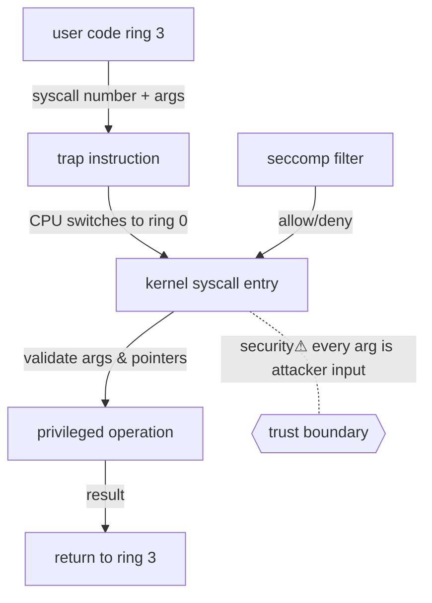

> [!abstract] A **system call (syscall)** is the controlled boundary crossing by which an unprivileged process requests a privileged service from the kernel. It is *the* trust/privilege boundary of the machine — and an **abstraction transition** (§15) from user code to kernel authority. Everything a process does to the outside world (files, [[Sockets|network]], memory, other processes) passes through here.

## Definition
A syscall is a **hardware-assisted transition** from user mode (ring 3) to kernel mode (ring 0) that transfers control to a fixed, kernel-defined entry point with a validated argument set.

## Why it exists
User code cannot be trusted with direct hardware or kernel-memory access — that would collapse [[Virtual Memory|isolation]] and privilege. Yet processes *need* those services. The syscall solves this: a **single, narrow, mediated doorway** where the CPU switches privilege level and the kernel validates every request before acting. It is the reason "a process" can be simultaneously powerful (can send packets) and contained (can't touch another process's memory).

## Internal mechanism
1. Process places a **syscall number** + arguments in registers (e.g. `rax`, `rdi…` on x86-64).
2. Executes a **trap instruction** (`syscall`/`sysenter`, formerly `int 0x80`). The CPU **switches to ring 0**, saves user state, and jumps to the kernel's fixed syscall entry.
3. The kernel **validates** arguments (are pointers in the process's own address space? is the fd valid? is the operation permitted?), performs the work, and returns a result in a register.
4. The CPU **switches back to ring 3**; execution resumes in user space.

The privilege switch is **hardware-enforced** by the CPU's ring mechanism — software cannot fake ring 0.

## State — who owns/reads/writes
- **Owns:** the kernel owns the entry table and all privileged state.
- **Crosses:** arguments cross the boundary *by value* (registers) or *by reference* (pointers the kernel must re-validate — never trust a user pointer).
- The boundary is where **user-controlled input meets kernel authority** — the highest-value attack surface on the machine.

## Interfaces
The syscall ABI (numbers + calling convention) — usually wrapped by libc (`read()` → `SYS_read`). Categories: process (`fork/execve/exit`), memory (`mmap/brk`), files/fds (`open/read/write/close`), [[Sockets|network]] (`socket/bind/connect/sendto`), IPC (`pipe/shmget`), privilege (`setuid/capset`).

## Direct dependencies
- Privilege rings (CPU) — **depends-on** · the hardware mode switch that makes mediation possible
- [[Virtual Memory]] — **depends-on** · the kernel must translate/validate user pointers against the process's page tables
- [[CPU & Processing Units]] — **prereq** · the trap instruction and mode bits live in the ISA

## Direct effects
- [[File Descriptors]] — **causes** · fd operations are syscalls; the kernel mutates the fd table only here
- [[Sockets]] — **enables** · `socket/bind/listen/accept/connect` are all syscalls — no network without this boundary
- [[04 Operating Systems]] — **bridges** · this *is* the user↔kernel interface the whole OS is built around

## Failure modes
- **Invalid pointer / EFAULT** — kernel rejects a user pointer outside the process's space (a validation *success*, not a crash — this is isolation working).
- **Interrupted syscall (EINTR)** — a signal arrives mid-call; must be retried.
- **Blocking** — a syscall (e.g. `read` on an empty socket) can block the thread until data arrives → why async/`epoll` exists.

## Security implications
- **security⚠ The syscall boundary is the primary trust boundary.** Every argument is attacker-influenced input; a missing validation (e.g. a TOCTOU race on a user pointer, or an unchecked length) is a kernel vulnerability → full compromise.
- **security⚠ Sandboxing = shrinking this surface.** `seccomp-bpf` filters *which* syscalls a process may make; containers restrict the set. Reducing reachable syscalls directly reduces kernel attack surface.
- **security⚠** Syscall tracing (`strace`, eBPF, EDR hooks) is how defenders *observe* what a process actually does — and how [[Digital Forensics & Anti-Forensics|forensics]] reconstructs behaviour.

## Mechanism graph

## Connections
- [[File Descriptors]] — **causes** · fd table mutated only via syscalls
- [[Sockets]] — **enables** · the socket API is a syscall family
- [[Virtual Memory]] — **depends-on** · pointer validation relies on page tables
- [[Digital Forensics & Anti-Forensics]] — **security⚠** · syscall tracing = behavioural evidence
- [[Linux]] · [[Windows]] — concrete syscall ABIs
- [[Linux_OS_and_Internals]] §3 · [[Windows_OS_and_Internals]] §3 — **composes** · OS-specific user↔kernel boundary (impl layer)

## Related
[[Master Index — Technology Vault]] · [[CPU & Processing Units]] · [[07 Programming]]
