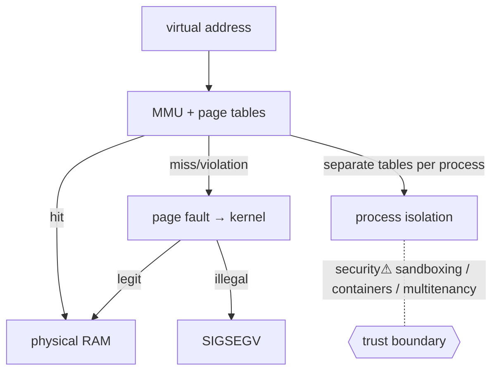

> [!abstract] **Virtual memory** gives every process the illusion of its own private, contiguous address space, while the kernel + **MMU** transparently map those virtual addresses to scattered physical [[Memory|RAM]] (or disk). It is the mechanism that **enables process isolation** — the foundation nearly all OS security rests on, and the rung the [[Master Index — Technology Vault|socket chain]] hangs off (a process's [[File Descriptors|fd table]] and [[System Calls|syscall]] argument validation both live here).

## Definition
A memory-management scheme where each process addresses a **virtual address space**; the hardware **MMU** translates virtual → physical addresses using **page tables** the kernel maintains, at page granularity (typically 4 KB).

## Why it exists
Physical RAM is one shared, finite resource. Without indirection, processes would see each other's memory (no [[System Calls|isolation]]), programs would need to know their physical load address (no relocation), and you couldn't run programs larger than RAM. Virtual memory solves all three: **isolation, relocation, and over-commitment** (paging to disk).

## Internal mechanism
```
virtual address ──▶ [MMU + page table walk] ──▶ physical address
                         │ (miss)
                         ▼
                    page fault ──▶ kernel handler (load page / grow stack / SIGSEGV)
```
- Each process has its **own page tables**; a context switch reloads the page-table base register (CR3 on x86) → instantly a different address space.
- The **TLB** caches recent translations (translation is on every memory access — it must be fast).
- A **page fault** traps to the kernel: legitimate (demand-paging, copy-on-write, stack growth) or illegal (→ SIGSEGV).

## State — who owns/reads/writes
- **Owner:** the kernel owns the page tables; the **MMU** (hardware) reads them on every access.
- **Per-process:** each address space is private — process A literally *cannot name* process B's physical memory (there's no virtual address that maps to it).
- Page-table entries carry **permission bits** (read/write/execute, user/supervisor) — enforced by hardware.

## Interfaces
`mmap/munmap` (map regions), `brk` (heap), page-fault handler (implicit), CR3/TLB (hardware). All region changes go through [[System Calls|syscalls]].

## Direct dependencies
- MMU + page tables (hardware) — **depends-on** · translation and permission enforcement are hardware features of the [[CPU & Processing Units|CPU]]
- [[Memory]] — **depends-on** · virtual pages ultimately back onto physical RAM (or swap)
- Privilege rings — **prereq** · user/supervisor bit in PTEs relies on CPU privilege levels

## Direct effects
- [[System Calls]] — **enables** · the kernel validates user pointers by walking *this* process's page tables (rejects out-of-space pointers → EFAULT)
- [[File Descriptors]] — **enables** · the per-process fd table is isolated because it lives in this address space
- Process isolation — **causes** · separate page tables = processes can't read each other's memory
- Copy-on-write `fork` — **enables** · child shares parent pages read-only until a write faults and copies

## Failure modes
- **Page fault storm / thrashing** — working set > RAM → constant paging to disk → throughput collapses.
- **SIGSEGV** — dereferencing an unmapped/permission-violating address (a null deref, buffer overrun past a page).
- **TLB pressure** — too many mappings → translation misses → slowdown.

## Security implications
- **security⚠ Isolation is *the* payoff.** Process A can't touch B's memory because no valid translation exists — this single mechanism underpins sandboxing, containers, and multi-tenant cloud.
- **security⚠ NX bit (W^X):** marking pages non-executable stops classic shellcode (data can't run) → attackers pivot to **ROP** (reuse existing code).
- **security⚠ ASLR:** randomising where regions map makes exploit addresses unpredictable — defeated by info-leaks.
- **security⚠ Hardware side-channels:** Meltdown/Spectre broke the isolation *below* the page-table level by leaking through speculative execution + caches — a reminder that isolation is only as strong as the hardware enforcing it.

## Mechanism graph


## Connections
- [[System Calls]] — **enables** · pointer validation walks these page tables
- [[File Descriptors]] — **enables** · isolates the per-process table
- [[Memory]] — **depends-on** · the physical RAM virtual pages map to
- [[CPU & Processing Units]] — **depends-on** · MMU/TLB/privilege are CPU features
- [[Digital Forensics & Anti-Forensics]] — **security⚠** · memory forensics (Volatility) reconstructs process address spaces from RAM
- [[Linux_OS_and_Internals]] §9–11 · [[Windows_OS_and_Internals]] §18–21 — **composes** · OS-specific address-space layout (impl layer)

## Related
[[Master Index — Technology Vault]] · [[04 Operating Systems]] · [[03 Computer Hardware]]
