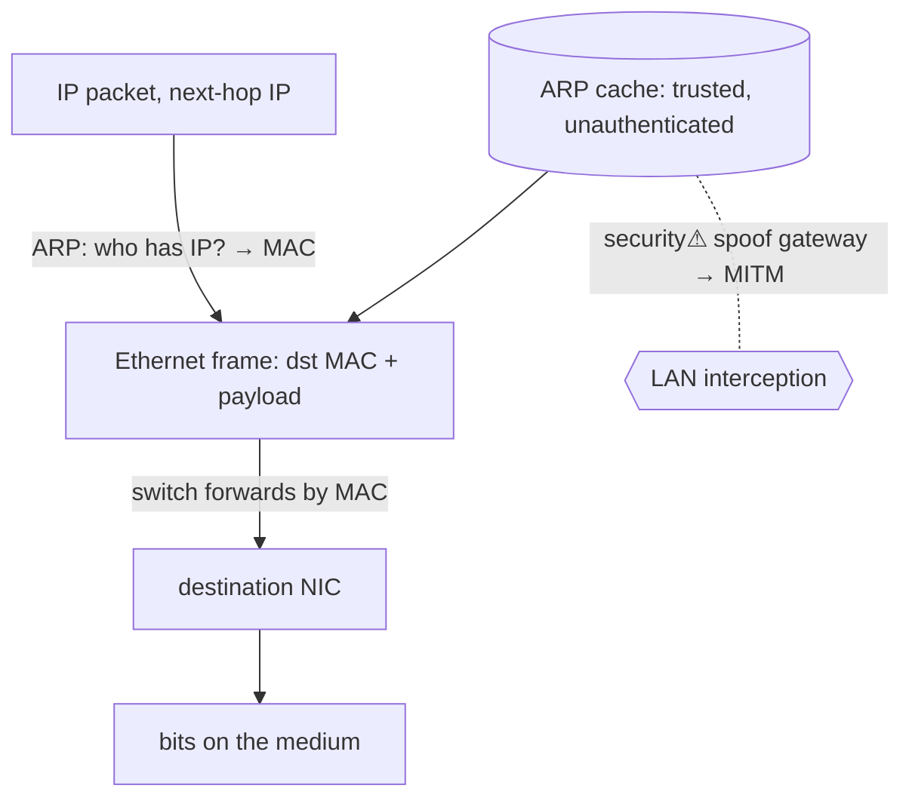

> [!abstract] **Ethernet** is the dominant **link layer (L2)** — it moves **frames** between devices on a *local* network using hardware **MAC addresses**. **ARP (Address Resolution Protocol)** is the glue that lets [[IP|IP]] use it: it maps a next-hop **IP address → MAC address** on the LAN. This is the bottom of the [[Master Index — Technology Vault|socket chain]] before the wire (`IP → Ethernet/ARP → NIC`), and — because ARP has *no authentication* — the foundation of LAN-based MITM attacks central to [[Ethical Hacking|CPTS]].

## What it is
- **Ethernet** — a link-layer standard: hosts send **frames** (with source/destination **MAC** addresses) over a shared or switched medium; [[Switching & Routing|switches]] forward frames by MAC.
- **ARP** — a discovery protocol: "who has IP `10.0.0.1`? tell `10.0.0.5`" broadcast on the LAN; the owner replies with its MAC, which the sender caches.

## Why it exists
[[IP]] addresses are *logical* and network-wide, but the actual delivery on a local segment happens by *hardware* MAC address. Something must **bridge the two**: given the next-hop IP (from routing), find the MAC to put in the frame. ARP exists to resolve that mapping; Ethernet exists to actually carry the bits between adjacent devices. Together they're how an IP packet takes its **final physical hop** to a real network card.

## How it works
- **MAC address** — a 48-bit hardware identifier burned into a [[Network Devices|NIC]]; unique per interface, local-scope only.
- **Switching** — a switch learns which MAC is on which port (its **CAM table**) and forwards frames only to the right port.
- **ARP flow** — need to send to IP X on the LAN → broadcast ARP request → host X replies with its MAC → cache it → build the Ethernet frame → send. (Routers do this for each hop; the destination MAC is the *next hop*, not the final host.)
- **Encapsulation** — an [[IP]] packet is wrapped in an Ethernet frame (MAC header + IP payload + checksum) for the local hop, then unwrapped/rewrapped at each router.

## State — who owns/reads/writes
- **Switch CAM table** — MAC → port mappings (learned, ages out).
- **ARP cache** — per-host IP → MAC mappings (cached, trusted **without verification** — the security hole).

## Direct dependencies
- [[Network Devices]] — **depends-on** · NICs (MAC addresses) and switches are the hardware
- [[Network Media & Links]] — **depends-on** · the physical medium frames travel over
- [[Network Foundations]] — **prereq** · LAN/topology concepts

## Direct effects
- [[IP]] — **enables** · IP's next-hop delivery *is* an Ethernet frame addressed by an ARP-resolved MAC
- [[Switching & Routing]] — **composes** · switch forwarding by MAC; the L2/L3 boundary
- physical transmission — **causes** · frames → bits on the wire → the NIC → the network

## Failure modes
- **Broadcast storm** — a switching loop floods the LAN (mitigated by Spanning Tree, [[Switching & Routing]]).
- **Stale ARP cache** — a moved/changed IP→MAC mapping breaks connectivity until it ages out.
- **MTU mismatch** — frame too large for the link → drops/fragmentation.

## Security implications
- **security⚠ ARP spoofing/poisoning** — ARP replies are **unauthenticated and trusted**; an attacker forges "I am the gateway" → hosts send traffic through the attacker → **man-in-the-middle** on the LAN (Ettercap, `bettercap`). The canonical local-network attack; enables sniffing, session hijacking, and [[NTLM]] relay setups.
- **security⚠ MAC flooding** — overflow the switch CAM table → some switches **fail open** and broadcast all frames → the attacker sniffs everything.
- **security⚠ No confidentiality at L2** — anything unencrypted above ([[TLS & SSL]] is why it matters) is readable once you're MITM.
- **Defence:** **Dynamic ARP Inspection**, DHCP snooping, port security (limit MACs/port), 802.1X ([[OSI Layers & Protocols]]), and segmentation to shrink the broadcast domain.

## Mechanism graph

## Connections
- [[IP]] — **enables** · the local-hop delivery IP relies on
- [[Switching & Routing]] — **composes** · MAC forwarding and the L2/L3 boundary
- [[Network Devices]] — **depends-on** · NICs and switches
- [[Network Media & Links]] — **depends-on** · the physical carrier
- [[NTLM]] · [[Ethical Hacking]] — **security⚠** · ARP-spoof MITM enables relay/sniffing
- [[Network Security]] — **security⚠** · DAI, port security, segmentation

## Related
[[Master Index — Technology Vault]] · [[05 Networking]] · [[OSI Layers & Protocols]]
