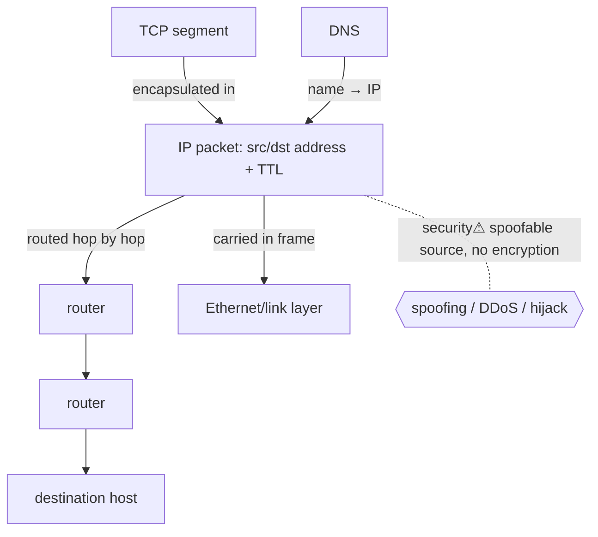

> [!abstract] **IP (Internet Protocol)** is the **network layer** — it gives every host a logical **address** and delivers **packets** across interconnected networks, **hop by hop**, on a **best-effort** basis. It's the rung below [[TCP]] in the [[Master Index — Technology Vault|socket chain]] (`TCP → IP → link → NIC`): [[TCP]] adds reliability *on top of* IP's unreliable delivery. The layer-3 detail (subnetting, NAT, the full header) lives in [[OSI Layers & Protocols]]; this note is the *mechanism and its place in the chain*.

## What it is
A connectionless, best-effort protocol that **addresses** and **routes** datagrams between hosts across network boundaries. IPv4 (32-bit addresses) and IPv6 (128-bit) are its two versions.

## Why it exists
Link-layer tech ([[Ethernet & ARP|Ethernet]], Wi-Fi) only moves frames *within one local network* using hardware (MAC) addresses. To connect *many* networks into one Internet, you need a **layer above** that: a uniform logical address independent of the physical medium, and a way to forward packets across intermediate networks toward any destination. IP is that unifying layer — the "narrow waist" every application and every link tech agrees on.

## How it works
- **Addressing** — each interface gets an IP address; the address encodes *where* on the network topology it is (routable).
- **Routing** — **routers** forward each packet one hop at a time toward the destination, choosing the next hop by **longest-prefix match** on the destination address ([[Switching & Routing]]).
- **Best-effort** — IP makes **no guarantees**: packets may be lost, duplicated, reordered, or corrupted. Reliability is *someone else's job* ([[TCP]]).
- **TTL** — a hop counter decremented each router; hits zero → dropped (prevents infinite loops; enables `traceroute`).
- **Fragmentation** — oversized packets split to fit a link's MTU, reassembled at the destination.

## State — who owns/reads/writes
- IP itself is **stateless** per packet — each is routed independently (no connection).
- The routing *fabric* holds state (routing tables), but the endpoints don't; this statelessness is what makes IP scale to the whole Internet.

## Direct dependencies
- [[Ethernet & ARP]] — **depends-on** · IP packets ride *inside* link-layer frames; ARP maps the next-hop IP to a MAC
- [[Switching & Routing]] — **depends-on** · routers move packets between networks
- [[Network Foundations]] — **prereq** · addressing/topology concepts

## Direct effects
- [[TCP]] — **enables** · TCP segments travel inside IP packets; TCP manufactures reliability over IP's best-effort
- [[Sockets]] — **composes** · a socket endpoint = (protocol, **IP address**, port)
- [[DNS]] — **bridges** · DNS resolves names → IP addresses so you can route to them
- routing across networks — **causes** · the "inter-network" that *is* the Internet

## Failure modes
- **Routing loops / blackholes** — misconfigured routes drop or circle packets (TTL bounds the damage).
- **MTU / fragmentation issues** — path-MTU problems silently drop large packets.
- **Address exhaustion** — IPv4 ran out (→ NAT, → IPv6).

## Security implications
- **security⚠ IP has no built-in authentication or encryption** — the source address is **trivially spoofable**, enabling reflection/amplification DDoS and spoofed-source attacks. [[Cryptography|IPsec]] and higher-layer [[TLS & SSL|TLS]] add the security IP lacks.
- **security⚠ Fragmentation attacks** — crafted overlapping fragments evade IDS or crash stacks (teardrop, historically).
- **security⚠ Routing attacks** — BGP hijacking reroutes traffic through an attacker (the control plane, [[Switching & Routing]]).
- **security⚠ TTL/recon** — attackers fingerprint OS and map topology from TTL and IP-header quirks.

## Mechanism graph

## Connections
- [[TCP]] — **enables** · reliable transport built on IP's best-effort delivery
- [[Ethernet & ARP]] — **depends-on** · the link layer that actually carries IP packets
- [[Switching & Routing]] — **depends-on** · routers forwarding packets between networks
- [[Sockets]] — **composes** · the IP-address half of an endpoint
- [[DNS]] — **bridges** · names to addresses
- [[OSI Layers & Protocols]] — **composes** · the full L3 detail (subnetting, NAT, header)
- [[Network Security]] — **security⚠** · spoofing, DDoS, IPsec

## Related
[[Master Index — Technology Vault]] · [[05 Networking]] · [[Network Infrastructure]]
