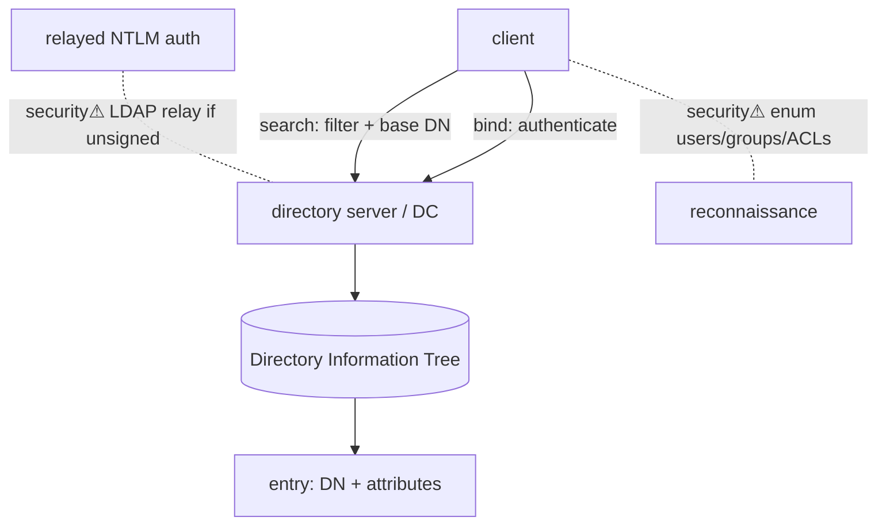

> [!abstract] **LDAP (Lightweight Directory Access Protocol)** is the query/update protocol for **directory services** — hierarchical databases of people, computers, groups and their attributes. It is how clients read and modify [[Active Directory]] (and OpenLDAP, etc.): the wire protocol beneath "look up this user / check this group." A bridge between [[05 Networking|networking]], [[Active Directory|identity]], and [[Trust Boundaries & Privilege|authorization]].

## What it is
A protocol for accessing a **directory** — a tree of **entries**, each identified by a **Distinguished Name (DN)** (e.g. `CN=ivan,OU=Users,DC=corp,DC=local`) and holding typed **attributes**. Optimised for **read-heavy** lookups (unlike a general SQL database).

## Why it exists
Organisations need one queryable source of "who/what exists and what may they access." A directory is read far more than written (every logon, every permission check), so it needs a lightweight, fast, standardised access protocol — LDAP — rather than a full relational database interface. It's the *access layer* over the directory data.

## How it works
- **Ports:** 389 (LDAP), 636 (LDAPS/TLS), 3268/3269 (AD **Global Catalog**).
- **Operations:** **bind** (authenticate — anonymous, simple/password, or SASL/Kerberos), **search** (filter + base DN + scope), **add/modify/delete**, **unbind**.
- **Search filters:** `(&(objectClass=user)(memberOf=CN=Admins,...))` — the query language.
- Entries form a **DIT** (Directory Information Tree); the **schema** defines allowed objectClasses/attributes.

## State — who owns/reads/writes
- The **directory server** (a [[Active Directory|Domain Controller]] for AD) owns the data; LDAP is the access path.
- **bind** establishes the authenticated identity → determines what the session may read/write ([[Trust Boundaries & Privilege|authorization]]).

## Direct dependencies
- [[05 Networking]] — **depends-on** · a TCP protocol over [[Ports, Interfaces & Sockets|389/636/3268]]
- [[Cryptography]] — **depends-on** · LDAPS wraps it in [[TLS & SSL|TLS]]; SASL binds can use [[Kerberos]]
- [[DNS]] — **depends-on** · clients locate LDAP servers (in AD, via SRV records)

## Direct effects
- [[Active Directory]] — **enables** · the protocol every AD read/write flows through
- authorization decisions — **causes** · group/attribute lookups drive access control

## Failure modes
- **Anonymous/weak bind** — server allows unauthenticated reads → information disclosure.
- **Unsigned LDAP** — susceptible to MITM/relay (see security).
- **Referral chasing / large searches** — unbounded queries strain DCs.

## Security implications
- **security⚠ LDAP is a reconnaissance goldmine** — an authenticated (even low-priv) bind can enumerate *all* users, groups, computers, SPNs and ACLs. [[Active Directory|BloodHound]] collects largely via LDAP.
- **security⚠ LDAP injection** — unsanitised input in a search filter (`*)(uid=*))(|(uid=*`) bypasses auth or leaks data, analogous to SQL injection.
- **security⚠ LDAP relay** — [[NTLM]] auth relayed to LDAP (unsigned) lets an attacker act in the directory (e.g. grant themselves rights) — mitigated by **LDAP signing + channel binding**.
- **security⚠ Anonymous bind / null enumeration** — legacy misconfig exposing the directory unauthenticated.

## OS implementation (impl ref)
- **Windows/AD:** [[Windows_OS_and_Internals]] §34 (Active Directory), §29 (authentication). Offensive: [[Credential Playbook]] · [[Technique Catalog]].

## Mechanism graph

## Connections
- [[Active Directory]] — **enables** · the directory LDAP queries
- [[Kerberos]] · [[NTLM]] — **depends-on** · bind authentication methods
- [[DNS]] — **depends-on** · server location
- [[TLS & SSL]] — **depends-on** · LDAPS transport security
- [[Ports, Interfaces & Sockets]] — **composes** · 389/636/3268
- [[Credential Playbook]] · [[Technique Catalog]] — **security⚠** · enumeration, injection, relay

## Related
[[Master Index — Technology Vault]] · [[05 Networking]] · [[06 Cybersecurity]]
