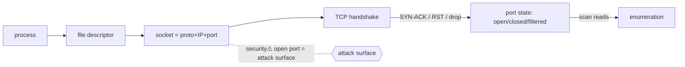

> [!info] Causal layer added (pilot). Original content **fully preserved** below; typed relationships + mechanism graph added at the end. Mechanism detail now lives in dedicated bridge notes: [[Sockets]] (the OS↔net object), [[TCP]] (the transport state machine), [[File Descriptors]] & [[System Calls]] (how a process reaches a socket). This note remains the **addressing/ports/states reference**.

The word **"port"** means three unrelated things that share one idea — **a defined connection point (an endpoint) where something plugs in or connects**. This note is the single reference that untangles all three, then goes deep on the networking sense (ports, sockets, states) that matters most for [[06 Cybersecurity|security]] and pentesting. The OSI spine ([[OSI Layers & Protocols]]) points here for the detail.

## 1. The three meanings of "port" (disambiguation)

| Sense | What it is | Lives at | Example |
|---|---|---|---|
| **Physical port / interface** | a hardware connector | L1 / hardware | USB-C, RJ-45, HDMI, COM |
| **Logical (network) port** | a 16-bit number identifying a process/service | L4 (transport) | TCP **443** |
| **Virtual port** | a software switch port for VMs/containers | hypervisor / SDN | vSwitch port, Docker `-p` |

They're only called the same thing because each is *"a point where a connection is made."* Keep them separate in your head.

---

## 2. Physical ports & interfaces (hardware connectors)
The physical sockets on a device. Cabling/media (copper, fiber, RF) is in [[Network Media & Links]]; board-level buses (UART/SPI/I²C) in [[Digital Logic & Microcontrollers]]. This is the **connector catalogue**:

**Networking**
- **RJ-45** — Ethernet (8P8C, twisted-pair). **RJ-11** — phone/DSL.
- **Fiber connectors** — **LC** (small, dominant), **SC**, **ST**, **MPO/MTP** (multi-fiber). Plug into **SFP/SFP+/QSFP** transceiver cages.
- **Console** — RJ-45 rollover or mini/micro-USB for CLI management of switches/routers.

**Data / peripheral**
- **USB** — Type-**A**, Type-**B**, **Mini**, **Micro**, **Type-C** (reversible). Speeds: USB 2.0 (480 Mbps) → 3.x (5–20 Gbps) → USB4. **Thunderbolt 3/4** runs over USB-C (adds PCIe + DisplayPort).
- **eSATA** (external storage, legacy), **FireWire/IEEE-1394** (legacy).

**Display**
- **HDMI** (video+audio, consumer), **DisplayPort / mini-DP** (PC, higher bandwidth, daisy-chain), **USB-C DP-alt mode**, **DVI** (legacy digital), **VGA** (legacy analog).

**Audio**
- **3.5 mm TRS/TRRS** (headphone/mic), **6.35 mm** (instruments), **XLR** (balanced pro), **RCA** (line), **TOSLINK** (optical S/PDIF).

**Legacy / industrial (still alive in IT & hardware hacking)**
- **Serial / COM** — **DB-9 / DB-25**, standards **RS-232** (point-to-point), **RS-485/RS-422** (multidrop, industrial). The logical-layer bus is **UART**. *Console access to routers, PLCs and embedded gear is over serial → a UART shell often = instant root ([[16 Home Lab Projects|Home Lab]] Phase 7).*
- **Parallel / LPT** — **DB-25 / Centronics**, **IEEE-1284**; old printers, some industrial I/O.
- **PS/2** — legacy keyboard/mouse (mini-DIN).

**Power**
- Barrel jack, **USB-PD** (power delivery over USB-C), **PoE** (power *and* data over one RJ-45 — cameras, APs, phones).

> **Physical ports are attack surface too.** USB drop attacks / **BadUSB** (HID injection), **DMA attacks** over Thunderbolt/FireWire, **juice-jacking** on public USB, and console/**UART** access to embedded devices. Controls: disable unused ports (BIOS/OS device control), USB allowlists, port blockers/epoxy, screen-lock, and physical security ([[OpSec & Physical]]).

---

## 3. Logical (network) ports — the transport layer
A **logical port is a 16-bit number (0–65535)** that identifies *which process/service* a segment is for. It's what lets **one IP address run many services at once** (multiplexing/demultiplexing). **TCP and UDP each have their own separate 65 536-port space** — TCP 80 and UDP 80 are different things.

**The three ranges (IANA):**

| Range | Name | Who uses it |
|---|---|---|
| **0–1023** | **Well-known / system** | standard services; needs root/admin to bind (HTTP 80, HTTPS 443, SSH 22) |
| **1024–49151** | **Registered / user** | vendor-assigned application ports (MySQL 3306, RDP 3389) |
| **49152–65535** | **Dynamic / private / ephemeral** | temporary **client-side source ports**, auto-assigned per connection |

*(Actual ephemeral range varies by OS: Linux commonly 32768–60999, Windows 49152–65535 — check `sysctl net.ipv4.ip_local_port_range`.)*

**Well-known ports worth memorising (enumeration cheat-sheet):**

| Port | Service | Proto | Note |
|---|---|---|---|
| 20/21 | **FTP** | TCP | data/control — cleartext ⚠️ |
| 22 | **SSH / SFTP / SCP** | TCP | secure remote shell |
| 23 | **Telnet** | TCP | cleartext ⚠️ (replace with SSH) |
| 25 / 465 / 587 | **SMTP / SMTPS / submission** | TCP | mail send |
| 53 | **DNS** | UDP+TCP | names→IPs ([[DNS]]) |
| 67/68 | **DHCP** | UDP | address leasing |
| 69 | **TFTP** | UDP | trivial FTP (PXE) |
| 80 / 443 | **HTTP / HTTPS** | TCP | web ([[HTTP]], [[TLS & SSL]]) |
| 88 | **Kerberos** | TCP/UDP | AD auth |
| 110 / 995 | **POP3 / POP3S** | TCP | mail fetch |
| 111 | **RPC portmapper** | TCP/UDP | *nix RPC |
| 123 | **NTP** | UDP | time (amplification risk) |
| 135 / 139 / 445 | **MS RPC / NetBIOS / SMB** | TCP | Windows/AD — key CPTS surface |
| 143 / 993 | **IMAP / IMAPS** | TCP | mail |
| 161/162 | **SNMP** | UDP | device mgmt (v1/2c cleartext ⚠️) |
| 389 / 636 | **LDAP / LDAPS** | TCP | directory |
| 1433 / 1521 / 3306 / 5432 | **MSSQL / Oracle / MySQL / PostgreSQL** | TCP | databases ([[08 Databases]]) |
| 2049 | **NFS** | TCP | *nix file share |
| 3389 | **RDP** | TCP | Windows remote desktop |
| 5900 | **VNC** | TCP | remote GUI |
| 6379 / 27017 | **Redis / MongoDB** | TCP | often exposed & unauth ⚠️ |
| 8080 / 8443 | **HTTP(S)-alt** | TCP | proxies, app servers |

---

## 4. The socket = IP + port + protocol
A **socket is one endpoint of a connection**: the combination **(protocol, IP address, port)**. It's the addressable "plug" the OS gives a process to talk over the network.

- A **connection/flow is uniquely identified by the 5-tuple (the "socket pair")**: `{ protocol, source IP, source port, destination IP, destination port }`. This is how a server holds thousands of simultaneous connections on the *same* port 443 — each client differs in source IP/port.
- **IP addresses** — **public** (globally routable) vs **private** ([RFC 1918]: `10.0.0.0/8`, `172.16.0.0/12`, `192.168.0.0/16`; plus CGNAT `100.64.0.0/10`, loopback `127.0.0.0/8`, link-local `169.254.0.0/16`). Detail in [[Network Devices]].
- **Listening socket vs connected socket** — a server `bind()`s to a port and `listen()`s; each accepted client becomes a distinct connected socket (OS socket API: `bind → listen → accept` server-side, `connect` client-side — the OS↔programming bridge, [[Linux]], [[07 Programming]]).

**Why "IP + port + protocol" matters — NAT in one example:**
```
Your laptop  192.168.1.20 : 51000  ──TCP──▶  google  142.250.x.x : 443
        (private IP, ephemeral src port)              (public IP, well-known dst port)
   router NAT/PAT rewrites source →  203.0.113.5 : 51000   (your one public IP)
```
The router demultiplexes replies back to the right internal host using the **ephemeral source port** — which is exactly why many private clients can share a single public IP. See **NAT/PAT** in [[OSI Layers & Protocols]] §L3.

---

## 5. Virtual ports (SDN / VMs / containers)
In virtualised networks, a "port" is a **software switch port**, not hardware:
- **vSwitch ports** — a VM's virtual NIC (**vNIC**) plugs into a port on a virtual switch (**Open vSwitch**, VMware vSwitch, Hyper-V vSwitch); each port carries its own VLAN tag and policy. Foundation of [[Switching & Routing|SDN]].
- **veth pairs / TAP interfaces** — the virtual "cables" connecting containers/VMs to the host bridge.
- **Port mapping / publishing** — expose a container service to the host: Docker `-p hostPort:containerPort` (a NAT rule); hypervisor **port groups**.
- **Overlay tunnels** — **VXLAN** (UDP **4789**) and GENEVE carry L2 over L3 between hypervisors (the logical port here rides a UDP port). Relevant to your [[16 Home Lab Projects|Home Lab]] (Docker/k3s) — and every published container port is real attack surface.

---

## 6. Port states — what they imply (networking · security · offensive)
When you scan a host (e.g. **Nmap**), each port reports a **state** inferred from how it answers a probe. TCP uses the **3-way handshake** (SYN → SYN-ACK → ACK); scanners send crafted packets and read the reply.

| State | What the scanner saw | Meaning |
|---|---|---|
| **open** | SYN-ACK (TCP) / app reply (UDP) | a service is **listening** — actionable |
| **closed** | RST | host is **up**, but nothing on that port |
| **filtered** | no reply, or ICMP unreachable | a **firewall/ACL** is dropping the probe — can't tell open/closed |
| **unfiltered** | reachable but state unclear (ACK scan) | firewall present but rule ambiguous |
| **open\|filtered** | no reply (UDP, FIN/NULL/Xmas) | can't distinguish — common on UDP |
| **closed\|filtered** | rare (idle scan) | can't distinguish closed vs filtered |

**What each state means from three angles:**

- **Networking (troubleshooting):** *open* = service running & reachable; *closed* = host alive but service down/not installed; *filtered* = something in the path (firewall, ACL, security group) is blocking — the problem is the network, not the host.
- **Security (defensive):** every **open port is attack surface**. *filtered* means your firewall is doing its job. Goal = **minimise open ports** (default-deny inbound), so a scan of your box shows almost nothing.
- **Offensive (pentest / CPTS):** *open* → **enumerate** the service and **version** (`-sV`, banner grab) → look up known vulns → exploit. *filtered* → the firewall is in the way → try **evasion** (fragmentation, timing, decoys, trusted **source ports** like 53/80) or find another path. *closed but host-up* → host discovery confirmed; pivot to other ports/hosts.

**Scan types (know what each does):**

| Nmap | Name | Use |
|---|---|---|
| `-sS` | SYN / half-open | fast, stealthy default (never completes handshake) |
| `-sT` | TCP connect | full handshake; no raw-socket privilege needed |
| `-sU` | UDP | slow, essential (DNS/SNMP/DHCP hide here) |
| `-sA` | ACK | **map firewall rules** (filtered vs unfiltered) |
| `-sN`/`-sF`/`-sX` | Null / FIN / Xmas | evade simple stateless filters |
| `-sV` / `-O` | version / OS | fingerprint the service & OS |

> ⚠️ **Only scan systems you own or are authorised to test** — scanning is reconnaissance and can be illegal otherwise. Practise in your isolated [[16 Home Lab Projects|Home Lab]].

---

## 7. Hardening — bringing it together
- **Shrink the surface:** disable unused **physical** ports (BIOS/device control) and close unused **logical** ports (stop the service, don't just firewall it).
- **Firewall default-deny inbound** on host and network; **segment** with VLANs so a compromised box can't reach everything ([[Network Security]], [[System Hardening]]).
- **Port-based NAC — 802.1X** controls who can even use a physical switch port ([[OSI Layers & Protocols]] §L2).
- **Kill insecure services:** Telnet 23 → SSH 22; FTP 21 → SFTP; SMBv1 off; SNMPv2c → v3.
- **Baseline & monitor listening ports** — an unexpected new open port can be a **backdoor / C2** ([[Threats & Malware]]).

## 8. Command cheat-sheet
```bash
# What is MY machine listening on?
ss -tulpn                 # Linux (tcp/udp/listening/process/numeric)
netstat -ano              # Windows
lsof -i                   # macOS/Linux (per-process sockets)

# Is a remote port open? (authorised targets only)
nc -zv host 443           # quick single-port check
nmap -sS -sV -p- 10.0.0.5 # full TCP scan + service versions
nmap -sU --top-ports 50 10.0.0.5   # common UDP
```

---

## 9. Causal layer (added — mechanism & typed relationships)

*Everything above is the addressing/ports/states reference. This section wires it into the [[Master Index — Technology Vault|causal graph]] with typed, mechanism-named edges.*

### Direct dependencies
- [[Sockets]] — **composes** · a socket = (protocol, IP, port); this note's "socket = IP+port+protocol" (§4) *is* the Sockets object's addressing
- [[TCP]] — **depends-on** · port *states* (§6: open/closed/filtered) are inferred from TCP handshake behaviour (SYN→SYN-ACK→RST)
- [[File Descriptors]] — **depends-on** · a listening/connected socket (§4) is an fd in the process's table
- 16-bit port field — **constrains** · ports are 0–65535 because the field is 16 bits (§3) — a hard structural limit

### Direct effects
- [[Ethical Hacking]] — **enables** · port states drive enumeration (§6 offensive column): open → version → exploit
- [[Network Security]] · [[System Hardening]] — **security⚠** · every open port = attack surface; hardening (§7) = shrinking it
- [[Threats & Malware]] — **security⚠** · an unexpected listening port = possible backdoor/C2 (§7)
- [[Switching & Routing]] — **enables** · NAT/PAT (§4) demultiplexes via the ephemeral source port

### Mechanism graph


## Related
[[Sockets]] · [[TCP]] · [[File Descriptors]] · [[System Calls]] · [[Master Index — Technology Vault]] · [[OSI Layers & Protocols]] · [[Network Media & Links]] · [[Network Devices]] · [[Switching & Routing]] · [[Digital Logic & Microcontrollers]] · [[Network Security]] · [[System Hardening]] · [[Ethical Hacking]] · [[16 Home Lab Projects|Home Lab]] · [[05 Networking|domain overview]]
