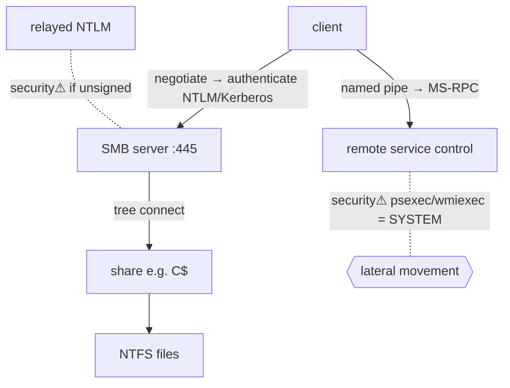

> [!abstract] **SMB (Server Message Block)** is the protocol behind Windows **file and printer sharing**, named pipes, and much of intra-domain communication. It runs on **port 445**, authenticates with [[NTLM]]/[[Kerberos]], and is one of the most consequential [[06 Cybersecurity|attack surfaces]] in enterprise networks — home of EternalBlue, NTLM relay, and the lateral movement that defines [[Active Directory]] compromise.

## What it is
A client-server, request-response protocol for accessing remote resources — files, printers, named pipes (IPC) — as if local. A client connects, authenticates, opens a **tree** (a share like `\\host\C$`), and reads/writes files or pipes over it.

## Why it exists
Users and services need to share files and talk between machines transparently. SMB provides remote file semantics (open/read/write/lock) plus **named pipes** that carry higher-level protocols (RPC, and thus much of AD administration). It's the connective tissue of a Windows network — which is exactly why attackers love it.

## How it works
- **Port 445** (direct over TCP); legacy 139 (over NetBIOS).
- **Dialects:** SMBv1 (obsolete, dangerous), SMBv2, **SMBv3** (encryption, better performance).
- **Flow:** negotiate dialect → **authenticate** ([[NTLM]] or [[Kerberos]]) → tree connect (share) → open/read/write/close.
- **Signing** — cryptographic message integrity that prevents tampering/relay; on by default to DCs, often off elsewhere.
- Carries **named pipes** → **MS-RPC**, which drives remote service control, task scheduling, and AD ops (the machinery `psexec`, `impacket` abuse).

## State — who owns/reads/writes
- The **server** owns the shares and enforces per-share + filesystem ([[NTFS & the MFT|NTFS]]) permissions.
- The authenticated session identity ([[Trust Boundaries & Privilege|token]]) determines access.

## Direct dependencies
- [[05 Networking]] — **depends-on** · TCP protocol over [[Ports, Interfaces & Sockets|445/139]]
- [[NTLM]] · [[Kerberos]] — **depends-on** · authentication
- [[NTFS & the MFT]] — **depends-on** · the filesystem whose objects it shares

## Direct effects
- lateral movement — **security⚠** · SMB + valid creds/hash = remote code execution across hosts
- [[Active Directory]] — **enables** · SYSVOL/NETLOGON shares, GPO distribution, admin tooling ride SMB

## Failure modes
- **SMBv1 enabled** — obsolete, wormable; disable everywhere.
- **Unsigned SMB** — enables relay/MITM.
- **Open shares** — misconfigured share ACLs leak data.

## Security implications
- **security⚠ EternalBlue (MS17-010)** — an SMBv1 memory-corruption bug → unauthenticated RCE; powered **WannaCry/NotPetya**. The canonical "patch or die" vulnerability.
- **security⚠ SMB relay** — [[NTLM]] auth captured (via coercion/poisoning) and **relayed** to another SMB host you don't sign → run as the victim. Defeated by **SMB signing**.
- **security⚠ Lateral movement** — with a valid hash ([[NTLM|Pass-the-Hash]]) or ticket, tools (`psexec`, `smbexec`, `wmiexec`) get SYSTEM on remote hosts over SMB named pipes → the core CPTS pivot.
- **security⚠ Null sessions / share enumeration** — anonymous access to enumerate shares/users on misconfigured hosts.
- **Defence:** disable SMBv1, enforce signing + SMBv3 encryption, restrict 445 at the network edge and between workstations (east-west segmentation), least-privilege shares.

## OS implementation (impl ref)
- **Windows:** [[Windows_OS_and_Internals]] §39 (SMB), §37–38 (networking, Windows Filtering Platform). Offensive: [[Credential Playbook]] · [[Technique Catalog]] · [[Threats & Malware]] (WannaCry).

## Mechanism graph

## Connections
- [[NTLM]] · [[Kerberos]] — **depends-on** · SMB authentication (and its relay weakness)
- [[NTFS & the MFT]] — **depends-on** · the shared filesystem
- [[Active Directory]] — **enables** · SYSVOL/GPO/admin tooling over SMB
- [[Ports, Interfaces & Sockets]] — **composes** · 445/139
- [[Threats & Malware]] — **security⚠** · EternalBlue/WannaCry
- [[Credential Playbook]] · [[Technique Catalog]] — **security⚠** · relay, PtH lateral movement

## Related
[[Master Index — Technology Vault]] · [[05 Networking]] · [[06 Cybersecurity]]
