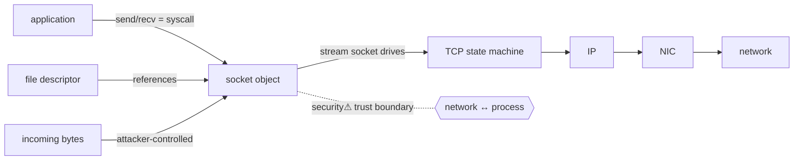

> [!abstract] A **socket** is the bridge object that connects **[[07 Programming|application code]] ↔ [[04 Operating Systems|OS/kernel]] ↔ [[05 Networking|network]]**. It is a kernel object, referenced by a **[[File Descriptors|file descriptor]]**, that gives a process an endpoint to send/receive data over a [[TCP|transport protocol]]. The keystone of the [[Master Index — Technology Vault|socket chain]] — *this note exists precisely to be a bridge, not an isolated networking term* (§9).

## Definition
A socket is **one endpoint of a communication channel**, identified by the tuple **(protocol, IP address, port)**. The kernel owns the socket object; the process holds an fd that points to it. (The addressing/port detail lives in [[Ports, Interfaces & Sockets]]; this note is the *mechanism and the bridge*.)

## Why it exists
Applications need to talk over a network without implementing TCP/IP, driving the NIC, or touching kernel memory. The socket is the **abstraction that hides all of that** behind the same `read/write` interface as a file — so a programmer calls `send()` and the kernel handles segmentation, retransmission, routing and the wire. It is the single point where three domains meet.

## Internal mechanism — the lifecycle
```
SERVER                          CLIENT
socket()   → fd, kernel obj     socket()   → fd
bind(port) → claim endpoint
listen()   → mark passive
accept()   → new fd per client  connect()  → SYN → 3-way handshake
recv()/send() ⇄ kernel TCP buffers ⇄ recv()/send()
close()    → teardown           close()
```
Each call is a **[[System Calls|system call]]**. `accept()` returns a *new* connected socket (new fd) per client, while the listening socket keeps accepting — which is how one server on port 443 holds thousands of connections (each a distinct [[Ports, Interfaces & Sockets|5-tuple]]).

## State — who owns/reads/writes
- **Owner:** kernel (the socket object + send/receive buffers + protocol state).
- **Process view:** just an fd + the data it reads/writes.
- **Protocol state:** for TCP, the socket embeds a whole [[TCP|TCP state machine]] (ESTABLISHED, TIME_WAIT…) and byte-stream buffers — this is where OS meets network.

## Interfaces
Berkeley sockets API: `socket, bind, listen, accept, connect, send, recv, sendto, recvfrom, setsockopt, shutdown, close` — all syscalls, wrapped by every language's networking library.

## Direct dependencies
- [[File Descriptors]] — **depends-on** · a socket *is* an fd → a kernel socket object; the fd is the handle
- [[System Calls]] — **depends-on** · every socket operation crosses the user↔kernel boundary
- [[TCP]] — **depends-on** · a stream socket embeds and drives the TCP state machine (UDP sockets use datagrams instead)

## Direct effects
- [[Ports, Interfaces & Sockets]] — **composes** · a socket = (protocol, IP, port); connections = the 5-tuple
- [[HTTP]] · [[TLS & SSL]] — **enables** · every application protocol runs *over* a socket; TLS wraps the socket's byte stream
- [[12 Distributed Systems]] — **enables** · RPC, message queues and every networked service are sockets underneath
- [[07 Programming]] — **bridges** · the concrete point where a program touches the network

## Failure modes
- **`EADDRINUSE`** — binding a port already held (or stuck in TIME_WAIT) → server won't start.
- **Blocking on `recv`** — no data → thread stalls (→ non-blocking sockets + `epoll`).
- **Half-open connections** — peer vanished without FIN; socket lingers until keepalive/timeout.
- **Buffer exhaustion** — slow reader → kernel receive buffer fills → TCP back-pressure (a [[TCP|feedback loop]]).

## Security implications
- **security⚠ A listening socket is attack surface** — the exact thing a port scan finds ([[Ports, Interfaces & Sockets]] §6). Every bound port is a doorway; default-deny and bind to `127.0.0.1` when only local.
- **security⚠ The socket is a trust boundary** — all received bytes are attacker-controlled input crossing from network into process memory. Unvalidated parsing here = the classic remote vulnerability (buffer overflow, deserialization).
- **security⚠ fd-passing** — a socket fd can be handed to another process (SCM_RIGHTS), transferring network capability without re-authorisation ([[File Descriptors]]).

## Mechanism graph


## Connections
- [[File Descriptors]] — **depends-on** · the handle a socket is reached through
- [[System Calls]] — **depends-on** · the API is a syscall family
- [[TCP]] — **depends-on** · the transport a stream socket embeds
- [[Ports, Interfaces & Sockets]] — **composes** · addressing, port states, the 5-tuple
- [[HTTP]] · [[TLS & SSL]] · [[DNS]] — **enables** · application protocols over sockets
- [[07 Programming]] · [[04 Operating Systems]] · [[05 Networking]] — the three domains this bridges

## Related
[[Master Index — Technology Vault]] · [[OSI Layers & Protocols]] · [[12 Distributed Systems]]
