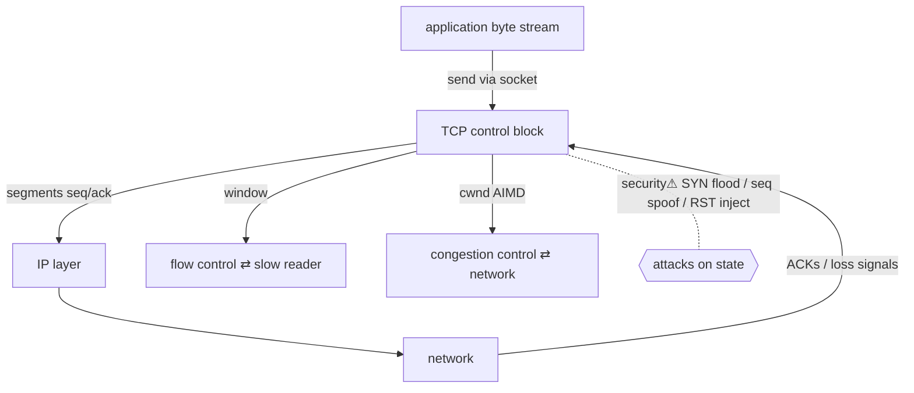

> [!abstract] **TCP (Transmission Control Protocol)** turns the unreliable, packet-losing, reordering [[OSI Layers & Protocols|IP layer]] into a **reliable, ordered, bidirectional byte stream**. It is a **state machine + buffers** living inside the kernel, driven by a [[Sockets|socket]], sitting between the [[04 Operating Systems|OS]] and [[05 Networking|network]] on the [[Master Index — Technology Vault|socket chain]]. (Port numbering / the 5-tuple: [[Ports, Interfaces & Sockets]]; layer context: [[OSI Layers & Protocols]] — this note is the *mechanism*.)

## Definition
A connection-oriented transport protocol providing **reliability** (retransmission), **ordering** (sequence numbers), **flow control** (receiver window) and **congestion control** (network-fairness), over the best-effort IP datagram service.

## Why it exists
IP makes *no promises* — packets can be lost, duplicated, reordered, corrupted. Most applications need a clean stream ("send these bytes, they arrive in order, intact"). TCP **manufactures that guarantee** on top of IP so applications don't each reimplement reliability. It is the canonical example of `transforms`: **datagrams ↔ byte stream**.

## Internal mechanism
**Connection setup — 3-way handshake:**
```
client → SYN(seq=x)      → server
client ← SYN-ACK(seq=y,ack=x+1) ← server
client → ACK(ack=y+1)    → server   → ESTABLISHED
```
**Reliability:** every byte has a **sequence number**; the receiver returns **ACKs**; unacknowledged data is **retransmitted** after a timeout (RTO) or fast-retransmit (3 dup-ACKs).
**Ordering:** receiver buffers out-of-order segments and delivers them in sequence.
**Teardown:** `FIN`/`ACK` each way; the closer sits in **TIME_WAIT** (~2×MSL) to absorb stragglers.

## State — who owns/reads/writes
- **Owner:** the kernel, one **TCP Control Block (TCB)** per connection, embedded in the [[Sockets|socket]].
- **Holds:** connection state (the 11-state machine: LISTEN, SYN_SENT, ESTABLISHED, FIN_WAIT, TIME_WAIT…), sequence/ack numbers, send/receive **buffers**, window sizes, RTT estimates, congestion window.
- **Two endpoints, mirrored state** — kept consistent *only* by exchanged segments (no shared memory). Divergence = a broken connection.

## Interfaces
Exposed to processes purely through the [[Sockets|socket]] API (`connect/accept/send/recv`). Below, it hands segments to [[OSI Layers & Protocols|IP]]. The app sees a stream; it never sees segments, seq numbers, or retransmits.

## Direct dependencies
- [[IP]] (layer 3) — **depends-on** · TCP segments travel *inside* IP packets; IP provides addressing/routing
- [[Sockets]] — **bridges** · the socket is how a process drives a TCP connection
- Sequence numbers / clocks — **prereq** · ordering and RTO depend on counting bytes and measuring time

## Direct effects
- [[Sockets]] — **enables** · stream sockets *are* TCP; `SOCK_STREAM` = this state machine
- [[HTTP]] · [[TLS & SSL]] — **enables** · both assume a reliable ordered stream — they'd be impossible on raw IP
- Flow ⇄ congestion — **feedback** · receiver window and congestion window continuously adjust send rate to receiver *and* network capacity (a genuine feedback loop, not a chain)

## Transformations & feedback
- **transforms:** unreliable datagrams → reliable ordered stream (the defining function).
- **feedback (flow control):** receiver advertises a **window**; sender must not exceed it → back-pressure to a slow reader.
- **feedback (congestion control):** loss/delay signals shrink the **congestion window** (AIMD: additive-increase, multiplicative-decrease) → TCP backs off so the network doesn't collapse. These two loops are why "TCP is fair."

## Failure modes
- **SYN flood** — attacker sends SYNs, never ACKs → half-open connections exhaust the backlog (see security).
- **Head-of-line blocking** — one lost segment stalls *all* later in-order delivery (a reason HTTP/3 moved to QUIC/UDP).
- **TIME_WAIT exhaustion** — a busy client burns through ephemeral ports held in TIME_WAIT.
- **Silly window / Nagle interactions** — small-packet inefficiencies.

## Security implications
- **security⚠ SYN flood (DoS):** the handshake's asymmetry (server allocates state on SYN) is abused to exhaust the backlog. Mitigation: **SYN cookies** (encode state in the sequence number, allocate nothing until the ACK returns).
- **security⚠ Sequence-number prediction / spoofing:** if an attacker guesses seq numbers they can **inject or reset** (RST) a connection — historically a hijack primitive; mitigated by randomised ISNs.
- **security⚠ RST injection / off-path attacks:** forging a RST tears down a connection (censorship, hijacking).
- **security⚠ It's a plaintext transport** — TCP gives reliability, *not* confidentiality or integrity against a MITM. That's why [[TLS & SSL|TLS]] is layered on top. Knowing TCP's guarantees (and non-guarantees) is exactly the first-principles reasoning the vault trains.

## Mechanism graph


## Connections
- [[Sockets]] — **bridges** · a stream socket embeds this state machine
- [[OSI Layers & Protocols]] — **composes** · TCP is layer 4 over IP layer 3
- [[Ports, Interfaces & Sockets]] — **composes** · the port half of the 5-tuple; port states reflect TCP handshake behaviour
- [[TLS & SSL]] · [[HTTP]] — **enables** · reliable stream they build on
- [[System Calls]] — **depends-on** · the socket calls that drive it

## Related
[[Master Index — Technology Vault]] · [[Network Performance & Resilience]] · [[Threats & Malware]]
