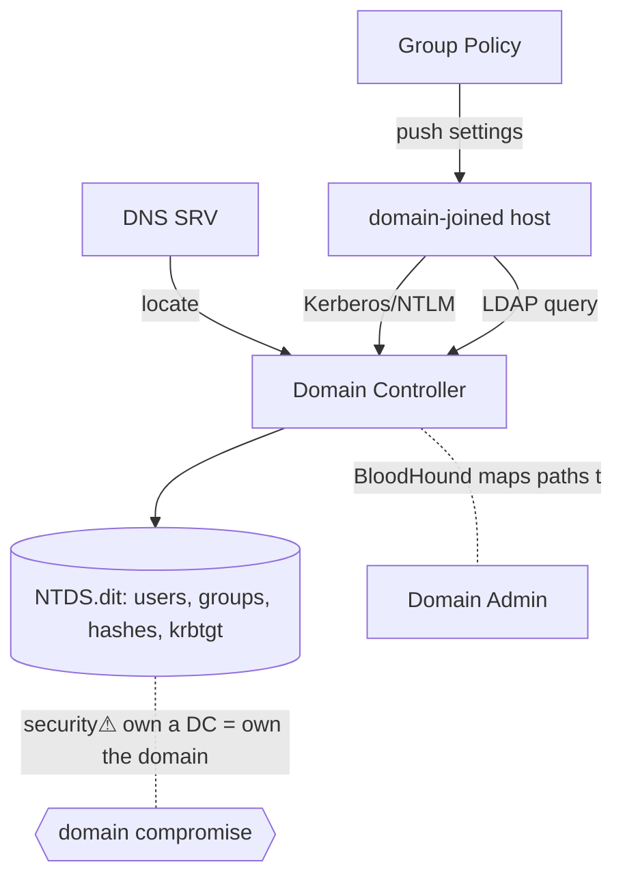

> [!abstract] **Active Directory (AD)** is Microsoft's **directory + identity + policy** system: the central database of an enterprise's users, computers, groups and permissions, plus the authentication and policy machinery that governs them. It is a bridge concept fusing [[Trust Boundaries & Privilege|identity/authority]], [[Kerberos]]/[[Cryptography|crypto]], [[05 Networking|networking]] ([[DNS]]/LDAP) and [[Windows_OS_and_Internals|Windows]]. For a pentester it is **the** enterprise battlefield — most CPTS/OSCP engagements are won or lost in AD.

## What it is
A hierarchical **directory service**: a replicated database (**NTDS.dit**) of *objects* (users, computers, groups, OUs) with attributes and permissions, served by **Domain Controllers (DCs)**, queried over **LDAP**, and located via **DNS**. It provides single sign-on ([[Kerberos]]), centralised policy (**GPO**), and delegated administration.

## Why it exists
Managing thousands of machines and users individually is impossible. AD centralises **identity** (one account, many resources), **authentication** (log on once), **authorisation** (group membership → access), and **policy** (push settings to every machine). One place to grant, revoke, and audit authority across an organisation.

## How it works — structure & mechanism
- **Objects** live in **Organisational Units (OUs)**, inside **domains**, grouped into **trees** and **forests** (the security/trust boundary is the *forest*).
- **Domain Controllers** hold a replicated copy of the domain database and answer authentication.
- **LDAP** (389/636) is the query protocol; the **Global Catalog** (3268) indexes the whole forest.
- **DNS is mandatory** — clients find DCs and services via **SRV records**; break DNS and AD stops.
- **Authentication** is [[Kerberos]] (primary) with **NTLM** fallback (legacy, weaker).
- **Group Policy (GPO)** pushes configuration/security settings to machines and users.
- **Trusts** link domains/forests so identities in one can access another.

## State — who owns/reads/writes
- **DCs own the authoritative state** (NTDS.dit — including all password hashes and the **krbtgt** key).
- Every domain-joined machine trusts the DCs; the DC is the ultimate authority → **compromising a DC = owning the domain**.
- Replication keeps DCs consistent (and is itself an attack vector — DCSync).

## Direct dependencies
- [[DNS]] — **depends-on** · DC/service location via SRV records; AD is unusable without correct DNS
- [[Kerberos]] — **depends-on** · the primary authentication protocol
- LDAP — **depends-on** · the directory query/update protocol (over [[Ports, Interfaces & Sockets|389/636/3268]])
- [[Trust Boundaries & Privilege]] — **prereq** · AD *is* an authority/trust model at enterprise scale
- [[Windows_OS_and_Internals]] — **depends-on** · DCs, tokens/SIDs, LSASS are the OS substrate

## Direct effects
- Enterprise access control — **causes** · group membership → resource authorisation everywhere
- [[Network Security]] — **constrains** · segmentation, tiering and DC isolation are the core defence
- Lateral movement — **security⚠** · AD's interconnectedness is exactly what attackers traverse

## Failure modes
- **DNS failure** → authentication collapses domain-wide.
- **Replication break / DC time skew** → inconsistent state, [[Kerberos]] failures.
- **Over-permissioned objects** → privilege sprawl (the seed of most attack paths).

## Security implications
AD is a **graph of trust relationships**, and attackers think in paths through it.
- **security⚠ BloodHound** maps "who can reach Domain Admin" by walking ACLs, sessions, group nesting — turning a messy AD into an attack path.
- **security⚠ DCSync** — abusing replication rights to pull password hashes (incl. **krbtgt**) from a DC without touching it.
- **security⚠ Kerberos attacks** — Kerberoasting, Golden/Silver tickets ([[Kerberos]]) all target AD auth.
- **security⚠ ACL abuse / delegation** — misconfigured object permissions grant escalation paths.
- **security⚠ Tiered defence** — isolate DCs (Tier 0), limit where privileged creds are used, monitor replication and ticket anomalies. The whole [[Trust Boundaries & Privilege|least-privilege]] doctrine applies at forest scale.

## OS implementation (impl ref)
- **Windows:** [[Windows_OS_and_Internals]] §34 (Active Directory), §35 (Domain Controllers), §36 (Group Policy), §29–33 (auth, SAM, LSASS, NTLM, Kerberos). Offensive: [[Credential Playbook]] · [[Technique Catalog]] · [[Hacking Engagement & Methodology]].

## Mechanism graph

## Connections
- [[Kerberos]] — **depends-on** · AD's authentication engine
- [[DNS]] — **depends-on** · the location service AD can't run without
- [[Trust Boundaries & Privilege]] — **prereq** · enterprise-scale authority model
- [[Windows_OS_and_Internals]] — **depends-on** · DCs/tokens/LSASS substrate
- [[Credential Playbook]] · [[Technique Catalog]] · [[Ethical Hacking]] — **security⚠** · the AD attack craft (CPTS core)
- [[Network Security]] · [[System Hardening]] — **constrains** · tiering & isolation defences
- [[Digital Forensics & Anti-Forensics]] — **security⚠** · DC logs, replication & ticket anomalies as evidence

## Related
[[Master Index — Technology Vault]] · [[06 Cybersecurity]] · [[Information Security & Access]] · [[IT & Cyber Job Market — Skills Employers Want]]
