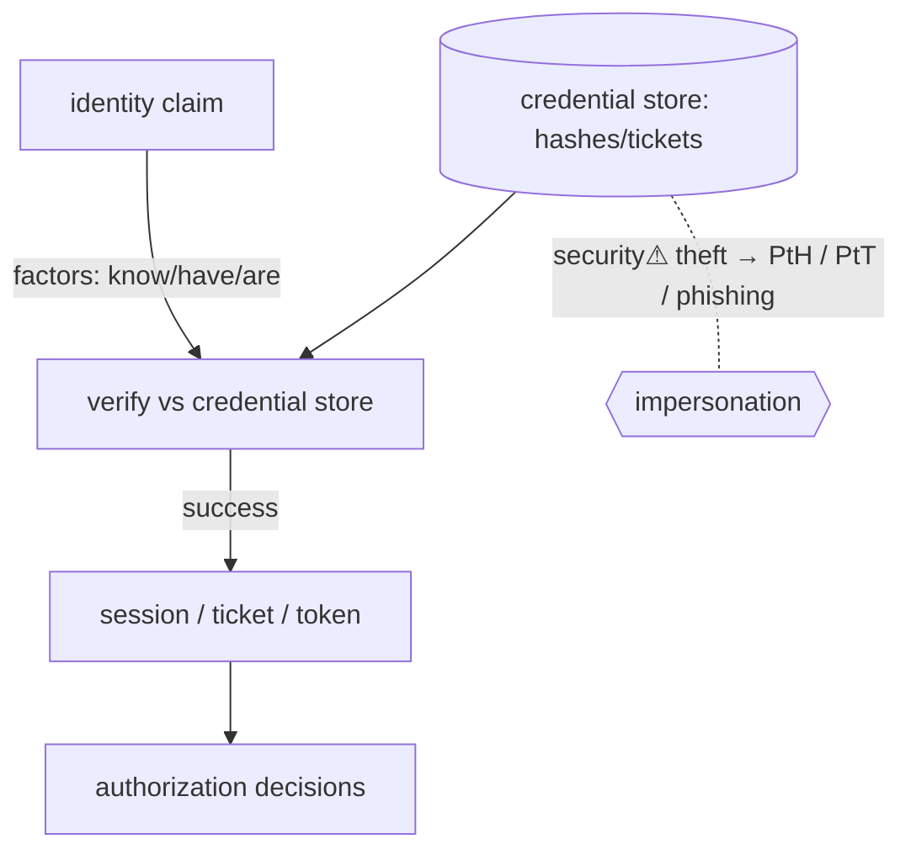

> [!abstract] **Authentication (AuthN)** is proving an entity *is who it claims to be* — the gate that establishes **identity** before any [[Authorization|authorization]] decision. It answers "**who are you?**" It is the first enforced crossing of a [[Trust Boundaries & Privilege|trust boundary]], and the target of a huge share of attacks (phishing, credential theft, [[NTLM|Pass-the-Hash]]).

## What it is
The process of verifying a claimed **identity** against evidence, producing an authenticated session/token that later [[Authorization|authorization]] relies on. Identity (the claim) + authentication (the proof) + authorization (the permissions) = the **AAA** backbone.

## Why it exists
Every access-control decision assumes you know *who* is asking. If identity can be forged, all downstream permissions are meaningless. Authentication exists to make the identity claim **trustworthy enough** to build authority on — the linchpin the entire security model hangs from.

## How it works — the factors
Evidence falls into **factors**:
- **Something you know** — password, PIN (weakest; phishable, guessable, reusable).
- **Something you have** — phone/TOTP, security key, smartcard, [[Kerberos|ticket]].
- **Something you are** — biometric (fingerprint, face).
**MFA** combines factors so stealing one isn't enough. **Phishing-resistant** MFA (FIDO2/WebAuthn, smartcards) binds the credential to the origin so it can't be relayed.

**Protocols** (how the proof travels):
- **[[Kerberos]]** / **[[NTLM]]** — Windows/AD network auth.
- **RADIUS / 802.1X** — network access.
- **[[LDAP]] bind** — directory auth.
- **OAuth 2.0 / OIDC** — delegated/federated (log in with Google); tokens, not passwords.
- **SAML** — enterprise SSO (assertions between IdP and service).
- **FIDO2 / WebAuthn** — passwordless, public-key, phishing-resistant.

Passwords are never stored raw — they're **hashed** with a slow KDF (bcrypt/scrypt/**Argon2**, see [[Cryptography]]).

## State — who owns/reads/writes
- The **identity provider** (DC, IdP, OS) owns the credential store ([[LSASS & SAM]], directory, hashed DB).
- A successful AuthN yields a **token/ticket/session** — itself a theft target (session hijacking, [[Kerberos|Pass-the-Ticket]]).

## Direct dependencies
- [[Cryptography]] — **depends-on** · password hashing, challenge-response, token signing
- [[PKI]] — **depends-on** · certificate/smartcard authentication
- [[Trust Boundaries & Privilege]] — **prereq** · AuthN establishes *who* crosses the boundary

## Direct effects
- [[Authorization]] — **enables** · you can't authorize an identity you haven't authenticated
- [[Kerberos]] · [[NTLM]] · [[LDAP]] — **composes** · concrete AuthN protocols
- session/token issuance — **causes** · the artifact carrying identity forward

## Failure modes
- **Credential reuse** — one breached password unlocks many services.
- **MFA fatigue / bypass** — push-spamming or SIM-swap defeats weak second factors.
- **Broken auth logic** — flawed session handling, predictable tokens.

## Security implications
- **security⚠ Credential theft is the dominant initial-access vector** — phishing, infostealers, [[LSASS & SAM|LSASS dumps]]. Verizon DBIR consistently ranks stolen creds #1.
- **security⚠ Pass-the-Hash / Pass-the-Ticket** — because possessing the *authenticator* (hash/ticket) equals the password, theft = impersonation without cracking ([[NTLM]], [[Kerberos]]).
- **security⚠ Phishing-resistant MFA** (FIDO2) is the single highest-impact defense — it removes the phishable shared secret.
- **security⚠ Authentication ≠ authorization** — proving identity is not granting access; conflating them is a classic logic flaw.

## OS implementation (impl ref)
- **Windows:** [[Windows_OS_and_Internals]] §29–33 (authentication, SAM, LSASS, NTLM, Kerberos). **Linux:** PAM. Offensive: [[Credential Playbook]] · [[Technique Catalog]].

## Mechanism graph

## Connections
- [[Authorization]] — **enables** · the decision that follows identity
- [[Cryptography]] · [[PKI]] — **depends-on** · hashing, tokens, certificates
- [[Kerberos]] · [[NTLM]] · [[LDAP]] — **composes** · AuthN protocols
- [[LSASS & SAM]] — **security⚠** · where credentials are stolen
- [[Trust Boundaries & Privilege]] — **prereq** · establishes who crosses
- [[Information Security & Access]] — **composes** · the access-control picture

## Related
[[Master Index — Technology Vault]] · [[06 Cybersecurity]]
