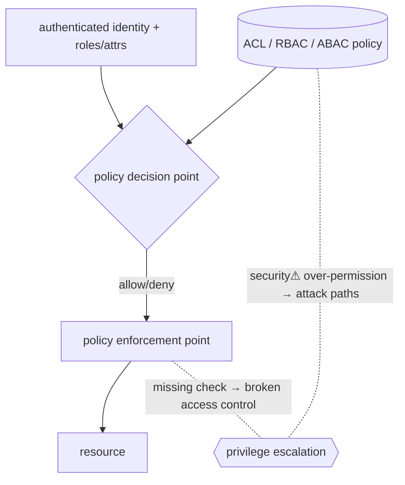

> [!abstract] **Authorization (AuthZ)** decides *what an authenticated identity is allowed to do*. It answers "**what may you do?**" — the enforcement of [[Trust Boundaries & Privilege|least privilege]] via access-control models (DAC, MAC, RBAC, ABAC). It comes *after* [[Authentication|authentication]] and is where most access mistakes (over-permissioning, broken access control) actually live.

## What it is
The mechanism that maps an authenticated **identity** (+ its attributes/roles) to a set of permitted operations on resources, and **enforces** it at each access. The third A of **AAA**: identify → authenticate → authorize.

## Why it exists
Knowing *who* you are ([[Authentication]]) says nothing about *what you should reach*. Systems hold data and capabilities of differing sensitivity; authorization exists to enforce that each identity touches **only what its role requires** — containing damage when an account is compromised (the practical form of [[Trust Boundaries & Privilege|least privilege]]).

## How it works — the access-control models
| Model | Who decides | Example |
|---|---|---|
| **DAC** (Discretionary) | the resource **owner** sets permissions | Unix rwx bits ([[Filesystems]]), file ACLs |
| **MAC** (Mandatory) | the **system** enforces labels; users can't override | SELinux, military classifications |
| **RBAC** (Role-Based) | permissions attach to **roles**, users get roles | [[Active Directory]] groups, k8s RBAC |
| **ABAC** (Attribute-Based) | **policy** over attributes (user, resource, context) | cloud IAM conditions, XACML |
| **Capabilities** | holding an unforgeable **token** = the right | [[File Descriptors|fds]], [[Linux Capabilities]] |

Enforcement happens at a **policy decision point** (evaluate the rule) + **policy enforcement point** (allow/deny the operation). Good design centralises the decision and mediates *every* access ([[Trust Boundaries & Privilege|complete mediation]]).

## State — who owns/reads/writes
- **Policy** (ACLs, role assignments, IAM policies) is the authoritative state — owned by admins/resource owners.
- The **subject's context** (identity, group memberships, attributes) is evaluated per request; stale context (unrevoked roles) is a risk.

## Direct dependencies
- [[Authentication]] — **depends-on** · you can only authorize an identity you've verified
- [[Trust Boundaries & Privilege]] — **prereq** · authorization *is* the enforcement of least privilege at a boundary

## Direct effects
- [[Filesystems]] — **composes** · permission bits/ACLs are DAC authorization
- [[Active Directory]] — **composes** · group-based RBAC across the enterprise
- [[Linux Capabilities]] — **composes** · capability-based authorization for processes
- [[09 Cloud]] — **composes** · IAM policies (ABAC) are cloud authorization

## Failure modes
- **Over-permissioning** — roles/policies granting more than needed → large blast radius (the seed of attack paths, [[BloodHound & AD Attack Paths]]).
- **Privilege creep** — accumulated access over time, never revoked.
- **Missing enforcement point** — a path that reaches the resource without a check.

## Security implications
- **security⚠ Broken access control is #1** on the OWASP Top 10 — IDOR (change an ID, get someone else's data), missing function-level checks, path traversal ([[Filesystems]]).
- **security⚠ Confused deputy** — a privileged component tricked into using *its* authority for an attacker (SSRF, CSRF) — an authorization failure, not authentication.
- **security⚠ Vertical vs horizontal escalation** — gaining higher privilege (vertical) or another peer's data (horizontal); both are authorization breaks.
- **security⚠ Least privilege + complete mediation** are the two principles that prevent most of the above — check *every* access, grant the *minimum*.

## OS implementation (impl ref)
- **Linux:** [[Linux_OS_and_Internals]] §17–22 (permissions, capabilities, ACLs), §34 (SELinux/AppArmor). **Windows:** [[Windows_OS_and_Internals]] §13–17 (tokens, SIDs, ACLs, integrity, privileges). **Cloud:** [[09 Cloud]] IAM.

## Mechanism graph

## Connections
- [[Authentication]] — **depends-on** · identity must precede authorization
- [[Trust Boundaries & Privilege]] — **prereq** · least privilege is what AuthZ enforces
- [[Filesystems]] · [[Linux Capabilities]] · [[Active Directory]] — **composes** · DAC/capability/RBAC in practice
- [[09 Cloud]] — **composes** · IAM as ABAC
- [[BloodHound & AD Attack Paths]] — **security⚠** · over-permissioning as computable attack paths
- [[Information Security & Access]] — **composes** · the access-control model

## Related
[[Master Index — Technology Vault]] · [[06 Cybersecurity]]
