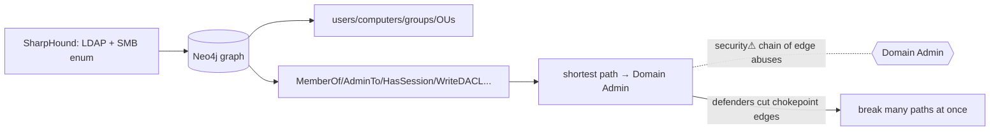

> [!abstract] **BloodHound** models [[Active Directory]] as a **graph** and finds the shortest **attack path** from where an attacker stands to **Domain Admin**. It's the tool that turned AD compromise from art into a solvable graph problem — and the clearest expression of the [[Trust Boundaries & Privilege|"think in paths of authority"]] principle. This note is the *method* (attack paths); the tool is one implementation.

## What it is
A methodology + tool: **collectors** gather AD relationships, load them into a **graph database** (Neo4j), and **queries** compute paths. Nodes = users, computers, groups, OUs, GPOs; **edges = privilege relationships** (MemberOf, AdminTo, HasSession, CanRDP, GenericAll, WriteDACL, Owns…).

## Why it exists
AD security is *emergent*: no single object is "insecure," but the *composition* of thousands of small rights creates paths to total control that no admin can see by eye. BloodHound exists to make that composition **computable** — to answer "from this foothold, what's the shortest chain of abuses to Domain Admin?" It reframes AD from a list of objects into a **reachability graph**.

## How it works
1. **Collection** — SharpHound/BloodHound collectors query [[LDAP]] and [[SMB]] (sessions via named pipes) to enumerate objects, group nesting, ACLs, sessions, trusts, GPO links.
2. **Graph load** — data → Neo4j as typed nodes/edges.
3. **Pathfinding** — Cypher queries (or built-in "shortest path to Domain Admins") compute chains: e.g. `you → MemberOf → HelpDesk → GenericAll → SvcAcct → HasSession → DA-box → ...`.
4. **Abuse** — each edge type has a known technique (WriteDACL → grant yourself rights; HasSession → dump creds via [[LSASS & SAM]]; GenericAll → reset password).

## State — who owns/reads/writes
- The data is a *snapshot* of AD state at collection time (sessions are volatile — HasSession edges decay).
- The graph is the attacker's map; defenders run the same tool to **find and cut** the paths first.

## Direct dependencies
- [[Active Directory]] — **depends-on** · the directory whose relationships it graphs
- [[LDAP]] — **depends-on** · the primary collection channel (object/ACL enumeration)
- [[SMB]] — **depends-on** · session enumeration (who's logged on where)
- [[Trust Boundaries & Privilege]] — **prereq** · edges *are* authority relationships between principals

## Direct effects
- privilege escalation to Domain Admin — **security⚠** · the path is the escalation plan
- [[LSASS & SAM]] — **causes** · HasSession edges point at boxes worth dumping creds from
- defensive remediation — **enables** · defenders cut high-value edges to break all paths through them

## Failure modes
- **Stale data** — sessions/ACLs change; a path found may no longer exist.
- **Detection** — heavy collection (especially session enum) is noisy → EDR/honeytoken alerts.
- **Incomplete collection** — low-priv context misses edges → false "no path."

## Security implications
- **security⚠ Attack-path thinking** — the whole point: security is not per-object, it's *reachability*. One over-permissioned service account can create a path from any user to DA.
- **security⚠ Chokepoints** — some edges/nodes lie on *many* paths; cutting them (fixing one ACL, removing one nested group) breaks disproportionate attack surface. This is graph-centrality defence — the same idea as the [[Master Index — Technology Vault|causal graph's]] high-leverage nodes.
- **security⚠ Both sides use it** — red teams to plan, blue teams (and Microsoft's own tooling) to audit and remediate. Running BloodHound against your *own* AD is standard hardening.

## OS implementation (impl ref)
- **Windows/AD:** [[Windows_OS_and_Internals]] §34–36 (AD, DCs, GPO). Collection: [[LDAP]] + [[SMB]]. Offensive craft: [[Credential Playbook]] · [[Technique Catalog]] · [[Hacking Engagement & Methodology]].

## Mechanism graph

## Connections
- [[Active Directory]] — **depends-on** · the graphed directory
- [[LDAP]] · [[SMB]] — **depends-on** · collection channels
- [[LSASS & SAM]] — **causes** · sessions to harvest creds from
- [[Kerberos]] · [[NTLM]] — **security⚠** · the auth abused along paths
- [[Trust Boundaries & Privilege]] — **prereq** · edges are authority relationships
- [[Credential Playbook]] · [[Technique Catalog]] — **security⚠** · per-edge abuse techniques

## Related
[[Master Index — Technology Vault]] · [[06 Cybersecurity]] · [[Ethical Hacking]]
