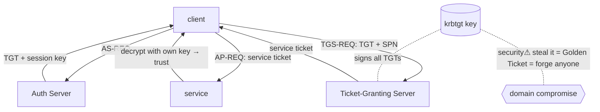

> [!abstract] **Kerberos** is a network **authentication protocol** that lets a client prove its identity to services over an untrusted network **without sending a password**, using time-limited encrypted **tickets** issued by a trusted third party (the **KDC**). It is a bridge concept — fusing [[Cryptography|symmetric cryptography]], [[Trust Boundaries & Privilege|identity/trust]], [[05 Networking|networking]] and [[Active Directory]] (which uses it as its primary auth). The single richest attack surface in enterprise pentesting.

## What it is
A ticket-based single-sign-on protocol. A central **Key Distribution Center (KDC)** — split into an **Authentication Server (AS)** and **Ticket-Granting Server (TGS)** — shares a secret key with every principal (user/service). Clients get a **Ticket-Granting Ticket (TGT)** once, then exchange it for per-service tickets.

## Why it exists
Passwords sent over the network can be sniffed or replayed; having every service verify passwords directly means every service holds password material. Kerberos solves both: authenticate **once** to the KDC, then prove identity to any service with a **ticket** the service can validate **without contacting the KDC** and **without ever seeing the password**. Mutual authentication and short lifetimes limit replay.

## How it works — the three exchanges
```
1. AS-REQ / AS-REP     client → AS:  "I'm alice" (timestamp encrypted with alice's key)
                       AS → client:  TGT (encrypted with krbtgt key) + session key
2. TGS-REQ / TGS-REP   client → TGS: TGT + "I want service HTTP/web01"
                       TGS → client: service ticket (encrypted with the service's key)
3. AP-REQ / AP-REP     client → service: service ticket
                       service decrypts it with its own key → trusts the client
```
Key properties: the **service validates the ticket offline** (it can decrypt with its own long-term key); **timestamps** prevent replay (hence Kerberos is *clock-sensitive* — >5 min skew breaks it); crypto is **symmetric** (each principal's key derives from its password hash).

## State — who owns/reads/writes
- **KDC** owns the master secret (**krbtgt** account's key signs all TGTs) and every principal's key.
- **Client** holds its TGT + session keys (in memory → LSASS on Windows — the theft target).
- **Service** holds only its own long-term key; it never sees the user's password.

## Direct dependencies
- [[Cryptography]] — **depends-on** · symmetric encryption + hashing derive keys and seal tickets
- [[DNS]] — **depends-on** · clients locate the KDC/services via DNS (SRV records); wrong DNS breaks auth
- Synchronised time — **prereq** · timestamps are the anti-replay mechanism; clock skew fails auth
- [[Trust Boundaries & Privilege]] — **prereq** · the KDC *is* the trusted third party the whole model rests on

## Direct effects
- [[Active Directory]] — **enables** · AD's primary authentication protocol; domain logon = Kerberos
- [[Ports, Interfaces & Sockets]] — **composes** · runs on port 88 (TCP/UDP)
- single sign-on — **causes** · one TGT → tickets for many services without re-auth

## Failure modes
- **Clock skew** — >5 min drift → tickets rejected (the classic "it worked yesterday" AD failure).
- **KDC unreachable** — no DC = no new tickets (existing ones work until expiry).
- **DNS misconfiguration** — client can't find the KDC/SPN → falls back to NTLM or fails.

## Security implications
The **krbtgt key is the crown jewel** — it signs every TGT, so whoever holds it can forge *any* identity.
- **security⚠ Kerberoasting** — any user can request a service ticket for any **SPN**; the ticket is encrypted with the *service account's* key → crack it **offline** to recover that account's password. Mitigated by long, random service-account passwords (gMSA).
- **security⚠ AS-REP roasting** — accounts with "pre-auth not required" leak an AS-REP crackable offline.
- **security⚠ Golden Ticket** — with the **krbtgt hash**, forge an arbitrary TGT → become any user, any group, for years. Total domain compromise; only a double krbtgt reset revokes it.
- **security⚠ Silver Ticket** — with a *service* account's hash, forge a service ticket → access that one service, stealthier (no KDC contact).
- **security⚠ Pass-the-Ticket / Overpass-the-Hash** — steal tickets from LSASS memory ([[Credential Playbook]]) and reuse them.

## OS implementation (impl ref)
- **Windows/AD:** [[Windows_OS_and_Internals]] §33 (Kerberos), §29–32 (authentication, SAM, LSASS, NTLM). Offensive: [[Credential Playbook]] · [[Technique Catalog]].

## Mechanism graph


## Connections
- [[Cryptography]] — **depends-on** · the symmetric crypto sealing tickets
- [[Active Directory]] — **enables** · Kerberos is AD's auth engine
- [[DNS]] — **depends-on** · service/KDC location
- [[Trust Boundaries & Privilege]] — **prereq** · the KDC as trusted third party
- [[Credential Playbook]] · [[Technique Catalog]] — **security⚠** · Kerberoast/Golden/Silver/PtT
- [[Windows_OS_and_Internals]] — **composes** · the concrete Windows implementation
- [[Digital Forensics & Anti-Forensics]] — **security⚠** · ticket anomalies as detection/evidence

## Related
[[Master Index — Technology Vault]] · [[06 Cybersecurity]] · [[Information Security & Access]]
