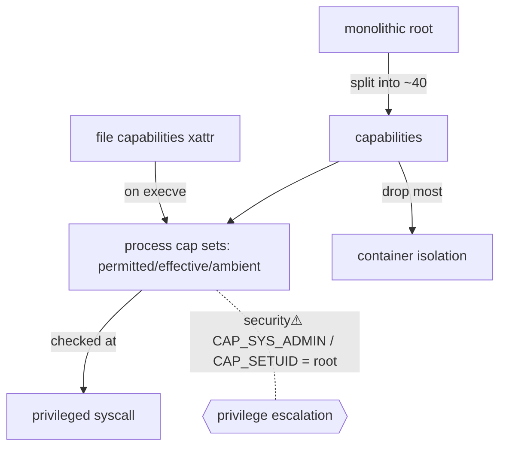

> [!abstract] **Linux capabilities** break the monolithic power of **root** into ~40 independent units, so a process can hold *just* the privilege it needs (e.g. bind a low port) instead of full root. They are a concrete instance of [[Trust Boundaries & Privilege|least privilege]], the modern alternative to [[Filesystems|SUID]], the backbone of **container** security — and, when misconfigured, a direct **privilege-escalation** path pentesters hunt.

## What it is
A partitioning of root's authority into distinct **capabilities** (e.g. `CAP_NET_RAW`, `CAP_SYS_ADMIN`, `CAP_SETUID`, `CAP_DAC_OVERRIDE`). A process/thread carries capability *sets*; a file can carry **file capabilities** that grant specific powers on execution.

## Why it exists
Traditionally, privileged operations required **UID 0 (root)** — all-or-nothing. A `ping` that needs raw sockets shouldn't need power over *everything*. Capabilities exist to grant **the minimum authority for the task**, shrinking the blast radius if the process is compromised. It's the kernel's answer to "root is too coarse."

## How it works — the sets
A thread has capability sets: **Permitted** (what it *may* use), **Effective** (what's *active now*), **Inheritable** + **Ambient** (what passes across `execve`), and a per-thread **Bounding** set (a ceiling).
- **File capabilities** (`setcap`/`getcap`) attach permitted/effective/inheritable caps to a binary — a **SUID replacement**: grant `cap_net_bind_service` to a web server instead of running it as root.
- On `execve`, the kernel computes the new process's caps from the file's caps + the thread's sets.

## State — who owns/reads/writes
- The **kernel** enforces capability checks at each privileged operation.
- Capability sets are per-thread state; file caps live in the file's extended attributes ([[Filesystems]]).

## Direct dependencies
- [[Trust Boundaries & Privilege]] — **prereq** · capabilities are the mechanism that *implements* least privilege
- [[Processes]] — **depends-on** · caps are per-process/thread state
- [[Filesystems]] — **depends-on** · file capabilities are stored as extended attributes; the SUID alternative

## Direct effects
- Namespaces/containers — **enables** · container runtimes **drop** most caps to isolate the container from the host
- [[System Calls]] — **constrains** · many privileged syscalls check a specific capability before proceeding
- privilege escalation — **security⚠** · an over-granted capability is a direct root path

## Failure modes
- **Over-grant** — giving a binary `CAP_SYS_ADMIN` (nicknamed "the new root" — it's nearly all-powerful) defeats the point.
- **Inheritance surprises** — misunderstanding ambient/inheritable sets leads to caps unexpectedly surviving (or not) across `execve`.

## Security implications
- **security⚠ Dangerous capabilities = root.** `CAP_SETUID` (become any user), `CAP_SYS_ADMIN` (mount, etc.), `CAP_DAC_OVERRIDE` (bypass file permissions), `CAP_SYS_PTRACE` (inspect other processes) — a binary with any of these is effectively a privesc primitive. Pentesters run `getcap -r /` to find them ([[Credential Playbook]]).
- **security⚠ Container escape** — containers rely on *dropping* caps; a container run with `--privileged` or extra caps (`CAP_SYS_ADMIN`) can often escape to the host. Auditing container caps is core cloud-native security.
- **security⚠ Better than SUID** — SUID binaries grant *full* owner privilege (all-or-nothing); file capabilities grant a slice — prefer them when hardening.
- **Defence:** drop all caps by default, add back only what's needed, and never run containers `--privileged` without cause.

## OS implementation (impl ref)
- **Linux:** [[Linux_OS_and_Internals]] §21 (Linux Capabilities), §17–20 (permissions, UID/GID, root, SUID/SGID), §33 (Containers). Offensive: [[Credential Playbook]] · [[Technique Catalog]].

## Mechanism graph

## Connections
- [[Trust Boundaries & Privilege]] — **prereq** · the least-privilege principle capabilities implement
- [[Processes]] — **depends-on** · per-process capability state
- [[Filesystems]] — **depends-on** · file caps as xattrs; the SUID alternative
- [[System Calls]] — **constrains** · privileged syscalls gate on capabilities
- [[Credential Playbook]] · [[Technique Catalog]] — **security⚠** · capability-based privesc & container escape
- [[Linux_OS_and_Internals]] — **composes** · concrete Linux implementation

## Related
[[Master Index — Technology Vault]] · [[06 Cybersecurity]] · [[09 Cloud]]
