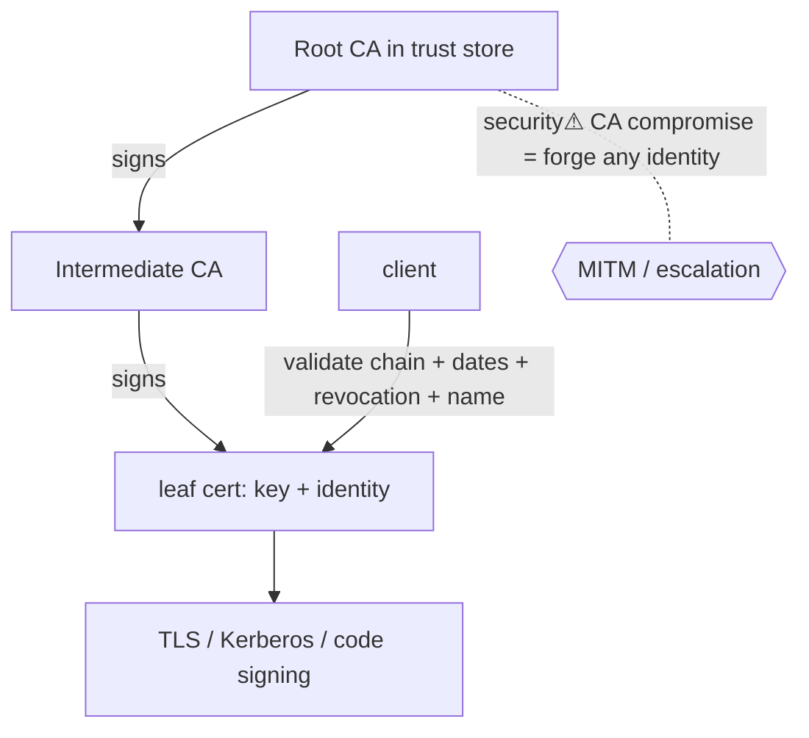

> [!abstract] **Public Key Infrastructure (PKI)** solves the missing piece of [[Cryptography|asymmetric cryptography]]: *whose* public key is this? It binds a **public key to an identity** via **certificates** signed by a trusted **Certificate Authority (CA)**, creating a **chain of trust**. Without PKI, [[TLS & SSL|TLS]], code signing, [[Kerberos]] PKINIT, and [[Active Directory|AD]] certificate auth couldn't establish *who* they're talking to.

## What it is
A system of **CAs**, **certificates** (X.509), **trust stores**, and **revocation** that lets parties who've never met verify each other's public keys. A certificate = {public key + identity + validity + CA's signature}.

## Why it exists
[[Cryptography|Asymmetric crypto]] lets you encrypt to a public key and verify a signature — but only if you *know the public key really belongs to who you think*. A MITM can hand you *their* key claiming to be the bank. PKI fixes this **binding problem** by having a trusted third party (the CA) vouch — cryptographically sign — that "this key belongs to bank.com." Trust is transferred from a few pre-trusted **root CAs** to everyone else.

## How it works — the chain of trust
```
Root CA (self-signed, in your OS/browser trust store)
   │ signs
Intermediate CA
   │ signs
Leaf certificate (bank.com's public key + identity)
```
**Validation** of a certificate checks: (1) the **signature chain** links up to a trusted root, (2) it's within **validity dates**, (3) it's **not revoked** (CRL / **OCSP** / OCSP stapling), and (4) the **name matches** (SAN = the domain you connected to). Any failure → reject.

## State — who owns/reads/writes
- **CAs** own the signing keys — the crown jewels (a compromised CA can forge *any* identity).
- **Trust stores** (OS/browser/AD) own the list of trusted roots — the ultimate trust anchors.
- Certificates are public; the corresponding **private keys** must never leave their owner.

## Direct dependencies
- [[Cryptography]] — **depends-on** · asymmetric signatures + hashing are the primitive PKI is built from
- [[Trust Boundaries & Privilege]] — **prereq** · PKI *is* a trust model — who vouches for whom
- accurate time — **prereq** · validity/revocation checks depend on it

## Direct effects
- [[TLS & SSL]] — **enables** · the server certificate that authenticates a website is PKI
- [[Kerberos]] — **enables** · PKINIT (smartcard/cert logon) and AD CS use PKI
- [[Active Directory]] — **enables** · AD Certificate Services issues internal certs (and its own attack surface)
- code signing / secure boot — **enables** · verifying software provenance

## Failure modes
- **Expired certificate** — the classic outage (validity elapsed).
- **Broken chain** — missing intermediate → clients can't build the path.
- **Revocation gaps** — CRLs stale, OCSP unreachable → clients "fail open" and trust a revoked cert.

## Security implications
- **security⚠ CA compromise = catastrophe** — a rogue/compromised CA (DigiNotar 2011) can mint valid certs for *any* site → undetectable MITM. Mitigations: **Certificate Transparency** logs, HPKP (deprecated), CAA records.
- **security⚠ AD CS misconfiguration (ESC1–ESC8)** — misconfigured certificate templates let a low-priv user enrol a cert *as* a privileged user → domain escalation. A dominant modern [[Active Directory]] attack path ([[Credential Playbook]]).
- **security⚠ Weak validation** — apps that skip name/chain/revocation checks (common in custom clients) silently accept MITM.
- **security⚠ Key theft** — steal a private key = impersonate the identity until revoked.

## OS implementation (impl ref)
- **Windows/AD:** [[Windows_OS_and_Internals]] §29 (authentication) + AD Certificate Services. **Web PKI:** browser/OS trust stores. Offensive: [[Credential Playbook]] · [[Technique Catalog]] (AD CS / Certipy).

## Mechanism graph


## Connections
- [[Cryptography]] — **depends-on** · the asymmetric signatures it's built on
- [[TLS & SSL]] — **enables** · web server authentication
- [[Kerberos]] · [[Active Directory]] — **enables** · PKINIT & AD CS
- [[Trust Boundaries & Privilege]] — **prereq** · the trust model PKI implements
- [[Authentication]] — **enables** · certificate-based auth
- [[Credential Playbook]] · [[Technique Catalog]] — **security⚠** · AD CS abuse

## Related
[[Master Index — Technology Vault]] · [[06 Cybersecurity]] · [[Information Security & Access]]
