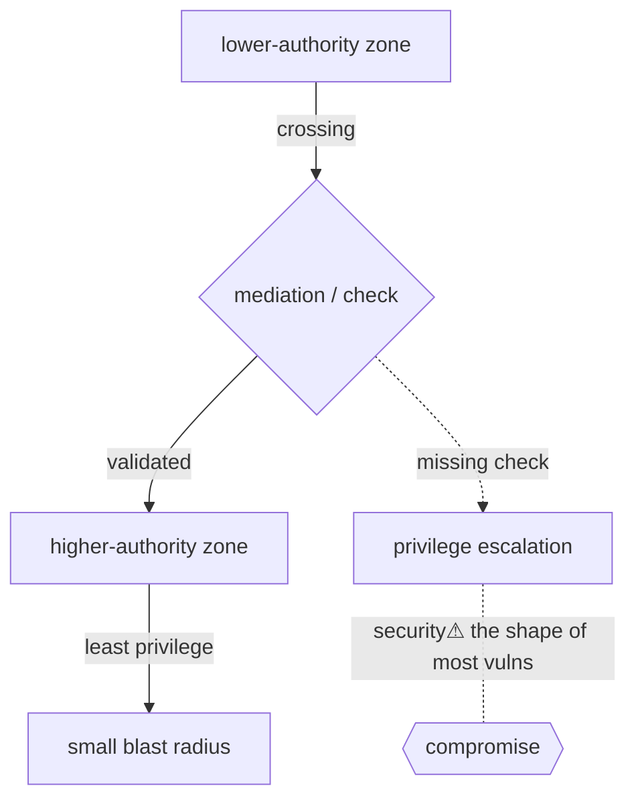

> [!abstract] A **cross-cutting concept** (per the [[Master Index — Technology Vault|causal model]] §7): a **trust boundary** is any interface where data or control crosses between zones of *different authority*, and **privilege** is the authority a component holds. Security is not a layer that sits "after networking" — it is *this pattern, recurring at every layer*. Learn to spot the boundary and ask "who is trusted, with what authority, and what crosses?" and most vulnerabilities become the same shape.

## What it is
- **Privilege** — the set of operations a principal (process, user, service, host) is permitted to perform.
- **Trust boundary** — the line between two privilege domains; every crossing is a point where authority is (or should be) re-checked.
- **Isolation** — the mechanism that *makes* a boundary real (it prevents one side reaching the other except through the sanctioned interface).

## Why it exists
Systems are built from components with *different* levels of authority (kernel vs app, root vs user, your VM vs the neighbour's). If any component could do anything, one bug = total compromise. Boundaries **contain** damage: a breach on one side should not automatically grant the other. The entire discipline of security is designing, enforcing, and reasoning about these boundaries.

## How it manifests at every layer (the cross-cutting view)
The *same* abstraction, re-instantiated up the stack:

| Layer | The boundary | Enforced by |
|---|---|---|
| **Hardware** | user ring 3 ↔ kernel ring 0 | CPU privilege rings ([[System Calls]]) |
| **Memory** | one process's space ↔ another's | MMU / page tables ([[Virtual Memory]]) |
| **Process** | this process's authority ↔ that one's | UID/GID, capabilities, tokens ([[Processes]]) |
| **Filesystem** | who may read/write an object | permission bits, ACLs ([[Filesystems]]) |
| **Container** | container ↔ host | namespaces + cgroups + seccomp |
| **VM** | guest ↔ hypervisor | virtualization extensions |
| **Network** | trusted zone ↔ untrusted | firewalls, segmentation ([[Network Security]]) |
| **Identity** | authenticated ↔ anonymous | authN/authZ, tokens, PKI ([[Cryptography]]) |
| **Cloud** | tenant ↔ tenant, role ↔ role | IAM policies |

> The unifying question at *any* boundary: **who is on each side, what authority does each hold, what crosses the line, and is it re-validated?**

## Key mechanisms
- **Least privilege** — grant the minimum authority needed; shrinks blast radius.
- **Privilege separation** — split a program so the high-authority part is tiny and auditable (e.g. a small setuid helper).
- **Mediation** — every crossing goes through a checkpoint that validates ([[System Calls|the syscall boundary]] is the archetype).
- **Capabilities** — unforgeable tokens of authority (a [[File Descriptors|file descriptor]] *is* a capability — hold it, you may act, no recheck).

## Direct dependencies
- [[System Calls]] — **depends-on** · the hardware-enforced user↔kernel boundary is the canonical example
- [[Virtual Memory]] — **depends-on** · memory isolation makes the process boundary real
- [[Cryptography]] — **depends-on** · authentication/integrity establish *who* is on each side

## Direct effects
- [[Processes]] — **constrains** · a process's UID/capabilities bound what it may do
- [[Filesystems]] — **constrains** · permissions gate object access
- [[Network Security]] — **composes** · segmentation/firewalls are network trust boundaries
- Privilege escalation — **security⚠** · *every* vulnerability is ultimately "crossed a boundary I shouldn't have, or gained authority I shouldn't have"

## Failure modes (how boundaries break)
- **Confused deputy** — a privileged component tricked into acting on an attacker's behalf (CSRF, SSRF, SUID abuse).
- **Missing/incomplete mediation** — a crossing that isn't validated (unchecked syscall arg, missing authz check).
- **Isolation escape** — container/VM/sandbox breakout: reaching across a boundary meant to be sealed.
- **Over-privilege** — a component holding more authority than its task needs → a small bug becomes large.

## Security implications
This note *is* the security overlay. For any mechanism elsewhere in the vault, ask the boundary questions:
- **security⚠** What authority does this component hold, and does it need all of it? (least privilege)
- **security⚠** What data crosses into it, and is that input validated at the boundary? (mediation)
- **security⚠** If it's compromised, what's on the other side of its boundaries? (blast radius)

## OS implementations (impl refs)
- **Linux:** [[Linux_OS_and_Internals]] §17–22 (permissions, UID/GID, root, SUID/SGID, capabilities, ACLs) · §31–34 (namespaces, netfilter, containers, SELinux/AppArmor)
- **Windows:** [[Windows_OS_and_Internals]] §13–17 (security tokens, SIDs, ACLs, integrity levels, privileges) · §29–36 (authentication, SAM/LSASS, NTLM/Kerberos, AD)

## Mechanism graph

## Connections
- [[System Calls]] — **depends-on** · the archetypal enforced boundary
- [[Virtual Memory]] · [[Processes]] · [[Filesystems]] — **constrains** · OS-layer boundaries
- [[Network Security]] · [[Cryptography]] — **composes** · network & identity boundaries
- [[Ethical Hacking]] · [[Credential Playbook]] — **security⚠** · attacking boundaries is the offensive craft
- [[Linux_OS_and_Internals]] · [[Windows_OS_and_Internals]] — **composes** · concrete privilege models

## Related
[[Master Index — Technology Vault]] · [[06 Cybersecurity]] · [[Information Security & Access]]
