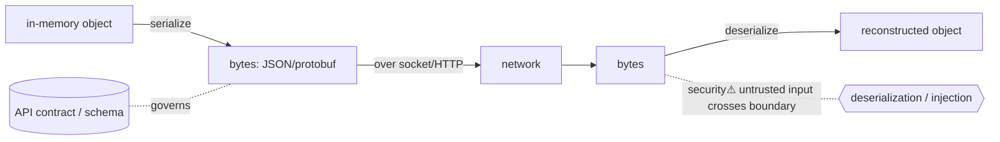

> [!abstract] An **API contract** is the agreed interface between two programs — *what* messages they exchange and in *what shape* — and **serialization** is turning in-memory objects into the bytes that cross the wire and back. Together they're the bridge [[07 Programming|Programming]] ↔ [[12 Distributed Systems|Distributed Systems]] ↔ [[05 Networking|Networking]]: the stable, versioned, machine-readable boundary that lets independently-built services talk. Also a top security surface — *every deserialized byte is attacker-influenced input crossing a [[Trust Boundaries & Privilege|trust boundary]]*.

## What it is
- **API contract** — the specification of an interface: endpoints/methods, message schemas, types, errors, versioning. REST (resources over HTTP), **gRPC** (typed RPC over HTTP/2), GraphQL (client-specified queries).
- **Serialization** — encoding a language object into a transportable format (JSON, **Protocol Buffers**, XML, MessagePack) and **deserialization** back into an object on the other side.

## Why it exists
Two services written by different teams, in different languages, on different machines must agree on *exactly* how to talk — or they silently corrupt each other. And an object in one process's memory ([[Virtual Memory|address space]]) means nothing to another process; it must be flattened to bytes ([[Sockets|sent over a socket]]) and rebuilt. Contracts + serialization exist to make this **explicit, stable, and language-neutral**, so services evolve independently without breaking their callers.

## How it works
- **Schema-first** (gRPC/protobuf) — define the message shape in a `.proto`; generate typed client/server code; the schema *is* the contract, enabling compile-time checking and efficient binary encoding.
- **Schema-optional** (REST/JSON) — human-readable, flexible, ubiquitous; correctness rests on documentation + validation (OpenAPI adds a schema).
- **Wire efficiency** — protobuf/gRPC are compact + fast (binary, HTTP/2 multiplexing); JSON is verbose but debuggable.
- **Versioning** — the hard part: add fields without breaking old clients (backward/forward compatibility). Protobuf's field numbers make this disciplined; REST uses versioned paths/media types.

## State — who owns/reads/writes
- The **contract** is shared state between producer and consumer; changing it unilaterally breaks callers — it's a coordination problem ([[Consensus & Consistency|distributed]] agreement, human-scale).
- Serialized bytes carry no types of their own — the **deserializer reconstructs structure by trusting the format**, which is exactly where injection lives.

## Direct dependencies
- [[Sockets]] — **depends-on** · serialized bytes travel over a socket/[[TCP]] connection
- [[07 Programming]] — **prereq** · types, objects, and the code that (de)serializes them
- [[HTTP]] — **depends-on** · REST/gRPC ride on HTTP/HTTP-2

## Direct effects
- [[12 Distributed Systems]] — **enables** · services/microservices communicate only through contracts
- [[Message Queues & Event Streaming]] — **composes** · queued messages are serialized payloads with an (often schema'd) contract
- [[09 Cloud]] — **enables** · every cloud API is a contract + serialization

## Failure modes
- **Contract drift** — producer changes the schema; stale consumers break (the microservices tax).
- **Version skew** — incompatible field changes → silent data loss or crashes.
- **Over-fetching / N+1** — poorly designed contracts force chatty or wasteful calls.

## Security implications
- **security⚠ Insecure deserialization** (OWASP Top 10) — deserializing untrusted data into objects can execute code (Java/Python `pickle`, PHP object injection) or corrupt state. *Never deserialize untrusted input into rich objects.*
- **security⚠ Injection & parser bugs** — the (de)serializer is a parser; malformed input hits a trust boundary — buffer issues, XXE (XML external entities), JSON parser quirks.
- **security⚠ Mass assignment** — binding request fields directly to internal objects lets attackers set fields they shouldn't (privilege fields).
- **security⚠ Schema validation is a control** — validate at the boundary (types, ranges, allow-lists) before anything downstream trusts the data.

## Mechanism graph

## Connections
- [[Sockets]] · [[TCP]] · [[HTTP]] — **depends-on** · the transport the bytes cross
- [[12 Distributed Systems]] — **enables** · inter-service communication
- [[Message Queues & Event Streaming]] — **composes** · serialized message payloads
- [[07 Programming]] · [[Software Engineering]] — **prereq** · the code and design
- [[Trust Boundaries & Privilege]] — **security⚠** · deserialization is a boundary crossing

## Related
[[Master Index — Technology Vault]] · [[07 Programming]] · [[09 Cloud]]
