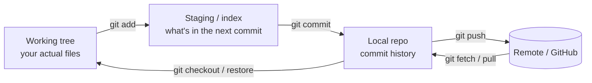

> [!abstract] **Git** is a distributed version-control system: it records **snapshots** of your files over time so you can inspect, undo, branch, and collaborate. This note is two things — a **command reference** grouped by what each command actually does, and a **security guide** for publishing repos publicly (the leak vectors most people miss and how to close them). Related: [[Software Engineering]] · [[Trust Boundaries & Privilege]] · [[PKI]].

## Mental model — where your changes live
Git has three local areas plus the remote. Almost every command just moves changes between them. Understanding this makes the commands obvious instead of memorised.



- **Working tree** — the files you edit.
- **Staging (index)** — a holding area; you choose exactly what goes into the next snapshot.
- **Local repo** — your commit history, entirely on your machine.
- **Remote** — the shared copy (GitHub). Nothing is public until `push`.

---

## 1. Setup & configuration
| Command | What it does |
|---|---|
| `git config --global user.name "handle"` | Sets the name stamped on your commits |
| `git config --global user.email "you@…"` | Sets the commit email (**see Security** — use a noreply address) |
| `git config --global init.defaultBranch main` | New repos start on `main` |
| `git config --list` | Shows the active config |
| `git config user.email "…"` | Same, but **for the current repo only** (overrides global) |

## 2. Starting a repository
| Command | What it does |
|---|---|
| `git init` | Turns the current folder into a repo (creates `.git/`) |
| `git clone <url>` | Copies a remote repo (history included) to your machine |
| `git remote add origin <url>` | Links a local repo to a remote named `origin` |
| `git remote -v` | Lists the configured remotes |

## 3. The daily loop — status, stage, commit
| Command | What it does |
|---|---|
| `git status` | Shows what changed and which area it's in — **run this constantly** |
| `git add <file>` | Stages a specific file (working tree → staging) |
| `git add -p` | Stages **hunk by hunk**, so you review each change (safest) |
| `git add -A` | Stages *everything* — new, modified, deleted (**footgun**, see Security) |
| `git restore --staged <file>` | Unstages a file (keeps your edits) |
| `git commit -m "message"` | Snapshots the staged changes into local history |
| `git commit --amend` | Rewrites the **last** commit (message or contents) |
| `git commit --no-verify` | Commits while **skipping hooks** — use sparingly |

Commit-message convention: imperative mood, short subject line (~50 chars), blank line, then a body explaining *what and why*. Example: `Restructure index into per-domain atlas`.

## 4. Inspecting & history
| Command | What it does |
|---|---|
| `git log --oneline --graph --all` | Compact, visual commit history |
| `git log -p` | History **with the full diffs** (reveals old file contents) |
| `git show <hash>` | Shows one commit's changes |
| `git diff` | Working-tree changes not yet staged |
| `git diff --cached` | Staged changes (what your next commit will contain) |
| `git blame <file>` | Who last changed each line |

## 5. Branching & merging
| Command | What it does |
|---|---|
| `git branch` | Lists branches |
| `git switch -c <name>` | Creates and switches to a new branch |
| `git switch <name>` | Moves to an existing branch |
| `git merge <name>` | Merges another branch into the current one |
| `git branch -d <name>` | Deletes a merged branch |

## 6. Rebasing (rewrite history cleanly)
| Command | What it does |
|---|---|
| `git rebase <branch>` | Replays your commits on top of another branch (linear history) |
| `git rebase -i <hash>` | **Interactive** — reorder, squash, edit, drop commits |
| `git pull --rebase` | Fetch + rebase your local commits on top of the remote (avoids merge commits) |

> [!warning] Only rebase commits you haven't shared. Rebasing rewrites hashes; doing it to pushed commits forces everyone else to reconcile.

## 7. Remotes & syncing
| Command | What it does |
|---|---|
| `git fetch` | Downloads remote changes **without** touching your working tree |
| `git pull` | `fetch` + merge (or rebase) — integrates remote work |
| `git push` | Uploads your local commits to the remote |
| `git push -u origin main` | First push; sets `origin/main` as the upstream |

> [!tip] **Always commit before you pull.** A pull can create a conflict but can never erase a *committed* change. Uncommitted work is what gets steamrolled by a merge. If `push` is rejected as "non-fast-forward," run `git pull --rebase` then `push` — never force-push a shared branch.

## 8. Undoing & fixing mistakes
| Command | What it does | Danger |
|---|---|---|
| `git restore <file>` | Discards working-tree edits to a file | loses uncommitted work |
| `git restore --staged <file>` | Unstages, keeps edits | safe |
| `git revert <hash>` | Makes a **new** commit that undoes an old one | safe, history-preserving |
| `git reset --soft <hash>` | Moves HEAD back, keeps changes staged | safe-ish |
| `git reset --hard <hash>` | Moves HEAD back and **deletes** changes | destructive |
| `git reflog` | Log of where HEAD has been — your **undo for resets** | lifesaver |

## 9. Stashing, tags, ignore, hooks
| Command | What it does |
|---|---|
| `git stash` / `git stash pop` | Shelve dirty changes, restore them later |
| `git tag -a v1.0 -m "…"` | Marks a release point |
| `.gitignore` | Lists path patterns Git should **not track** (never untracks already-committed files) |
| `git rm --cached <file>` | Stops tracking a file **but keeps it on disk** (the fix `.gitignore` alone can't do) |
| `.git/hooks/` | Scripts that run on events (e.g. pre-commit) — **local, never pushed** |

---

## Security concerns for public repos
A public repo leaks on **three layers**, not one. Most people only guard the first.

### Layer 1 — the current files
Hardcoded secrets are the headline risk: API keys, tokens, passwords, private keys (`id_rsa`, `*.pem`, `*.key`), `.env` files, cloud credentials, `kubeconfig`, and — easily forgotten — **Terraform state (`*.tfstate`)** and database dumps, which store secrets in plaintext. Config files also leak *infrastructure*: internal IPs, hostnames, network topology — reconnaissance material. Use RFC documentation ranges (`192.0.2.x`, `198.51.100.x`, `203.0.113.x`) in examples, never real addresses.

### Layer 2 — the history
Git is append-only. "Deleting" a file in a new commit leaves it in **every prior commit**, reachable via `git log -p` or by browsing an old commit. A secret committed Monday and removed Tuesday is still public. This is why deleting-and-recommitting is **not** a fix for a leaked secret.

### Layer 3 — metadata
Every commit embeds author **name, email, and timestamp**. Real name and email become public; timestamps in aggregate leak your **timezone and work schedule**. Commit *messages* can leak internal ticket IDs, client names, or employer details — none of which a scanner catches.

### Beyond the repo
- **Images carry EXIF** — including **GPS coordinates** (a photo can geolocate your home). Strip metadata before committing.
- **Office docs** (`.docx`, `.pptx`) embed author names, comments, tracked changes. Convert to Markdown or sanitised PDF for public repos.
- **`git add -A` / `git add .`** is the classic breach — it sweeps in files you never meant to share. Prefer named paths or `git add -p`, and read `git diff --cached` before committing.
- **Aggregation / OSINT** — even non-secret info (stack, tooling, home-lab design, identity, schedule) combines into a targeting profile for phishing. Keep genuinely sensitive material (e.g. home-lab topology) in a separate **private** repo.

### Prevention workflow
1. **Never hardcode secrets** — use `.env` (gitignored) or a secret manager, referenced via environment variables.
2. **Curate what you stage** — `git add -p`, then `git status` + `git diff --cached` before every commit.
3. **Automate detection** — a pre-commit secret scanner (`gitleaks`, `trufflehog`, `git-secrets`) blocks secrets *before* they commit. On GitHub, enable **Secret Scanning + Push Protection** (free on public repos) as the server-side net.

### If a secret leaks — do this in order
1. **Rotate / revoke it immediately.** Assume it was scraped the instant it was pushed. Regenerating the key is the *only* true fix.
2. **Then scrub history** with `git filter-repo` (or BFG), and force-push. Know the limit: existing clones, forks, and caches may retain it — which is why rotation comes first.

### Account & repo hardening
- **2FA** on your account — the single biggest win; protects everything regardless of code.
- **SSH key with a passphrase**; the private key never enters a repo.
- **Commit email privacy** — use GitHub's `…@users.noreply.github.com` and enable "Block command line pushes that expose my email."
- **Signed commits** (SSH/GPG) prove authenticity; **branch protection** on `main` prevents force-push accidents.
- Never expose a live `.git/` folder on a web server — it lets anyone reconstruct the full source and history.

### This repo's setup
- `.gitignore` — excludes OS junk, sync artifacts, binaries, and the private `16 Projects/` home-lab material.
- `.pre-commit-config.yaml` + `.gitleaks.toml` — run gitleaks on every commit; activate per-clone with `pre-commit install`. The config files are committed and shared; the generated hook in `.git/hooks/` stays local.
- Commit email set to a GitHub noreply address to keep the real one out of new history.

---

## Quick cheat sheet
```bash
git status                       # what changed
git add -p                       # stage, reviewing each hunk
git diff --cached                # verify what will be committed
git commit -m "Imperative summary"
git pull --rebase                # integrate remote safely (after committing)
git push                         # publish
git log --oneline --graph --all  # see history
git reflog                       # recover from a bad reset
```

## Related
[[Software Engineering]] · [[07 Programming]] · [[Trust Boundaries & Privilege]] · [[PKI]] · [[Cryptography]] · [[Master Index — Technology Vault]]
