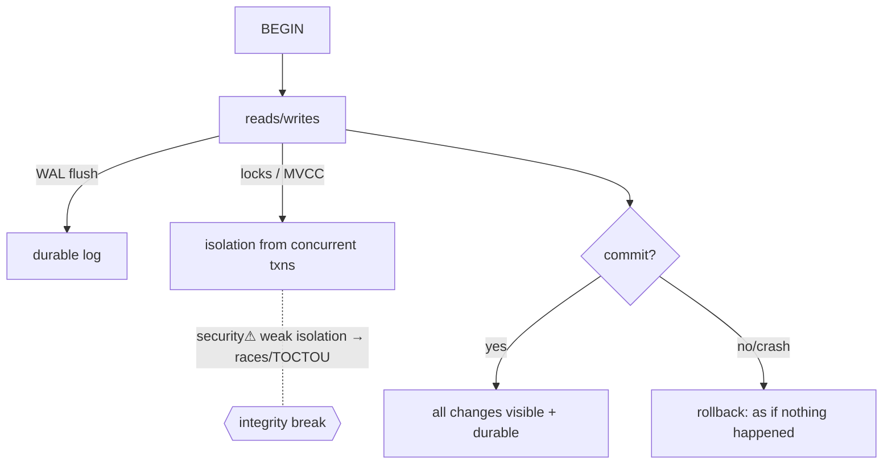

> [!abstract] A **transaction** is a unit of work that is **all-or-nothing** and behaves as if it ran **alone**, even under concurrency and crashes. **ACID** (Atomicity, Consistency, Isolation, Durability) is the contract that makes shared, mutable [[08 Databases|database]] state *trustworthy*. It's the single-node answer to the cross-cutting problem of **state**: who may change it, and what happens when many actors change it at once ([[Master Index — Technology Vault]] §7).

## What it is
A grouping of reads/writes treated as one indivisible operation with four guarantees (ACID), so applications reason about data as if no failures or concurrent users existed.

## Why it exists
Shared mutable state is treacherous: a crash mid-update leaves half-written data; two users editing the same balance can lose an update; an invariant (debits = credits) can break between two writes. Transactions exist to give a **clean abstraction over a messy reality** — commit and it's fully durable, or abort and it's as if nothing happened — so developers don't hand-code crash-recovery and concurrency into every operation.

## How it works — the four guarantees
- **Atomicity** — all operations commit or none do; a failure **rolls back** (undo log).
- **Consistency** — the transaction moves the DB from one valid state to another (invariants/constraints hold).
- **Isolation** — concurrent transactions don't see each other's partial work, as if serialized. Enforced by **locking (2PL)** or **MVCC** (each txn sees a consistent snapshot).
- **Durability** — once committed, it survives crashes — via a **write-ahead log (WAL)** flushed before acknowledging.

**Isolation levels** trade correctness for speed: *read uncommitted → read committed → repeatable read → serializable*, admitting fewer anomalies (dirty read, non-repeatable read, **phantom**) as they rise.

## State — who owns/reads/writes
- The **DB engine** owns the data + the log; the log is the source of truth for recovery.
- **Concurrency control** (locks or MVCC versions) mediates who may read/write which rows when — the mechanism preventing lost updates.

## Direct dependencies
- [[Storage]] — **depends-on** · durability requires the WAL to reach non-volatile storage (fsync)
- [[Programming Foundations]] — **prereq** · concurrency (threads, races, locks) is what isolation tames
- [[08 Databases]] — **composes** · transactions are the database's integrity mechanism

## Direct effects
- [[Consensus & Consistency]] — **enables** · distributed transactions generalize ACID across machines (much harder)
- application correctness — **causes** · invariants that would otherwise break under concurrency hold

## Failure modes
- **Deadlock** — two transactions each hold what the other needs → the DB aborts one.
- **Lost update / write skew** — too-weak isolation lets concurrent writes corrupt invariants.
- **Long transactions** — hold locks/versions → contention, bloat.

## Security implications
- **security⚠ Race conditions (TOCTOU)** — insufficient isolation lets an attacker exploit the gap between check and update (e.g. double-spend, balance races) — a *concurrency* vulnerability, not a code bug.
- **security⚠ Integrity** — ACID is the data-integrity leg of [[Information Security & Access|CIA]]; without it, corrupted/partial data undermines every decision built on it.
- **security⚠ Injection meets transactions** — [[07 Programming|SQL injection]] can wrap malicious writes in the app's own transaction, inheriting its authority.

## Mechanism graph

## Connections
- [[08 Databases]] — **composes** · the integrity mechanism of a DB
- [[Storage]] — **depends-on** · durable log
- [[Consensus & Consistency]] — **enables** · the distributed generalization
- [[Programming Foundations]] — **prereq** · concurrency it controls
- [[Information Security & Access]] — **security⚠** · the Integrity of CIA

## Related
[[Master Index — Technology Vault]] · [[12 Distributed Systems]] · [[06 Cybersecurity]]
