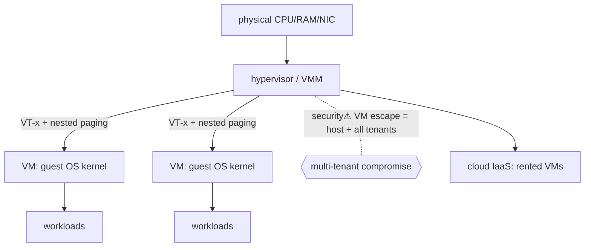

> [!abstract] **Virtualization** runs multiple isolated **virtual machines** — each with its own OS kernel — on one physical host, mediated by a **hypervisor**. It's the foundation of [[Cloud & Datacenters|cloud IaaS]] (multi-tenant compute) and a **stronger [[Trust Boundaries & Privilege|trust boundary]] than [[Namespaces & Containers|containers]]** (separate kernels, not a shared one). The rung where [[Instruction Set Architecture|CPU]] and [[Virtual Memory|memory]] virtualization make "a computer inside a computer" real.

## What it is
A **hypervisor (VMM)** presents each guest with virtual CPU, memory, and devices, and multiplexes the real hardware beneath. Each **VM** believes it owns a whole machine and runs a full guest OS.

## Why it exists
Physical servers sat idle most of the time, and one workload per box wasted capacity and isolation was coarse. Virtualization exists to **consolidate** many workloads onto one host **safely** (strong isolation), **flexibly** (VMs are files — snapshot, clone, live-migrate), and **on demand** — which is precisely what made **cloud** (rent a VM by the hour, multi-tenant) economically possible.

## How it works
- **Type 1 (bare-metal)** — hypervisor runs directly on hardware: **ESXi, Hyper-V, KVM, Xen**. Used in production/cloud.
- **Type 2 (hosted)** — runs as an app on a host OS: VirtualBox, VMware Workstation. Used on desktops.
- **Hardware assist** — the hypervisor needs to intercept privileged guest instructions. **Intel VT-x / AMD-V** add a hypervisor privilege level (below [[Instruction Set Architecture|ring 0]]) so guest kernels run "natively" but trap to the VMM on sensitive ops.
- **Memory virtualization** — **nested paging (EPT/NPT)** extends [[Virtual Memory|paging]] with a second translation (guest-virtual → guest-physical → host-physical), so each VM gets isolated memory at hardware speed.
- **I/O** — emulated, paravirtualized (virtio), or passthrough (**IOMMU** isolates DMA).

## State — who owns/reads/writes
- The **hypervisor** owns the real hardware and each VM's virtual state; it's the most privileged software on the box (a bigger prize than any guest).
- A VM's entire state (memory, disk, CPU) is capturable — enabling snapshots and **live migration** across hosts.

## Direct dependencies
- [[Instruction Set Architecture]] — **depends-on** · VT-x/AMD-V (hardware virtualization extensions) make it efficient
- [[Virtual Memory]] — **depends-on** · nested paging extends the MMU for guest isolation
- [[03 Computer Hardware]] — **prereq** · CPU/memory/IOMMU features

## Direct effects
- [[Cloud & Datacenters]] — **enables** · multi-tenant IaaS is rented VMs on shared hosts
- [[Trust Boundaries & Privilege]] — **composes** · the VM boundary (stronger than a container's)
- [[Namespaces & Containers]] — **constrains** · containers often run *inside* VMs for a real isolation layer

## Failure modes
- **Overcommit contention** — too many VMs over-subscribe CPU/RAM → noisy-neighbour slowdown.
- **Hypervisor bug** — a fault in the VMM affects *all* guests on the host.
- **VM sprawl** — snapshots/clones accumulate, unmanaged.

## Security implications
- **security⚠ Stronger isolation than containers** — separate guest kernels mean a guest kernel exploit stays in the guest; used for **hostile multi-tenancy** (public cloud) where containers alone are too weak.
- **security⚠ VM escape** — the catastrophic failure: breaking out of a guest into the hypervisor (via a device-emulation bug) → the host and *every co-tenant* fall. Rare but maximal impact.
- **security⚠ Side channels across tenants** — shared CPU caches leak between VMs (Spectre-class, [[Instruction Set Architecture]]); co-residency can be weaponized.
- **security⚠ The hypervisor is the trust root** — compromise it and guest isolation is meaningless; hence minimal, hardened VMMs and confidential-computing (encrypted VM memory: SEV/TDX).

## Mechanism graph

## Connections
- [[Instruction Set Architecture]] — **depends-on** · hardware virtualization extensions
- [[Virtual Memory]] — **depends-on** · nested paging for guest memory isolation
- [[Cloud & Datacenters]] — **enables** · the substrate of IaaS
- [[Namespaces & Containers]] — **constrains** · containers vs VMs (isolation strength trade-off)
- [[Trust Boundaries & Privilege]] — **composes** · the VM boundary
- [[06 Cybersecurity]] — **security⚠** · VM escape, cross-tenant side channels

## Related
[[Master Index — Technology Vault]] · [[09 Cloud]] · [[04 Operating Systems]]
