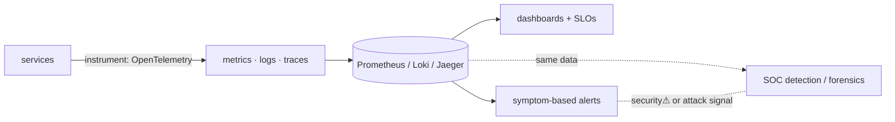

> [!abstract] **Observability** is the ability to understand a system's *internal* state from its *external* outputs — to ask "why is it doing that?" of a running distributed system you can't pause or step through. It's the bridge [[11 SRE|SRE]] ↔ Applications ↔ [[10 DevOps|DevOps]], built on **three pillars — metrics, logs, traces** — and it's the *same telemetry* a [[Digital Forensics & Anti-Forensics|SOC]] uses to detect attacks. The concrete tools live in [[Network Observability & Monitoring — Tool Catalog]]; this is the *why and how*.

## What it is
The property of a system that lets you answer **new questions about its behaviour without shipping new code**, from three data types: **metrics** (numeric time series — rates, errors, latency), **logs** (discrete timestamped events), and **traces** (the path of one request across services).

## Why it exists
A single program you can attach a debugger to. A **distributed system** of dozens of services across many machines you cannot — you can't set a breakpoint on production, and failures are often *emergent* (a slow dependency, a partial outage, a bad interaction). Monitoring answers *known* questions ("is CPU high?"); observability exists to answer *unknown* ones ("why are 2% of checkouts slow, only for EU users, since the last deploy?") by making the system's internal state legible from the outside.

## How it works — the three pillars
- **Metrics** — cheap, aggregatable numbers over time (request rate, error rate, p99 latency); great for dashboards and alerting, poor for "why this one request." (Prometheus.)
- **Logs** — rich detail per event; great for forensics, expensive at scale. (Loki/ELK.)
- **Traces** — a request gets a **trace ID** propagated across every service it touches → reconstruct the end-to-end path and find *where* time went. (Jaeger/Tempo, **OpenTelemetry** as the standard.)
- **The pipeline** (from the [[Network Observability & Monitoring — Tool Catalog|tool catalog]]): instrument → collect → store → visualise → **alert**. Alerts should fire on *symptoms users feel* (SLO burn), not every metric.

## State — who owns/reads/writes
- Telemetry is emitted by the running services (instrumentation) and owned by the observability backend; it's a *derived view* of system state, not the state itself.
- **SLIs/SLOs** (service level indicators/objectives) turn raw telemetry into an agreed reliability target and an **error budget** — the SRE control knob.

## Direct dependencies
- [[12 Distributed Systems]] — **prereq** · the multi-service systems that *need* observing
- [[API Contracts & Serialization]] — **depends-on** · trace context propagates across service calls
- [[Network Observability & Monitoring — Tool Catalog]] — **composes** · the concrete metrics/logs/traces stack

## Direct effects
- [[11 SRE]] — **enables** · SLOs, error budgets, incident response, capacity planning all run on telemetry
- [[10 DevOps]] — **enables** · feedback loop for deploys (detect regressions fast)
- [[Security Operations & IR]] — **security⚠** · the *same* logs/metrics feed detection & forensics (NSM/SIEM)

## Failure modes
- **Cardinality explosion** — too many unique metric labels blows up storage/cost.
- **Alert fatigue** — alerting on causes not symptoms → noise → ignored alerts → missed outages.
- **Blind spots** — un-instrumented services/paths are invisible; you can only see what you emit.

## Security implications
- **security⚠ Observability *is* detection** — the telemetry that finds a latency regression also finds C2 beaconing, exfiltration, and anomalous auth ([[Digital Forensics & Anti-Forensics]]); a NOC and SOC drink from the same firehose.
- **security⚠ Logs are evidence** — tamper-evident, centralised, off-host logs are core to incident response; attackers target logs first (anti-forensics).
- **security⚠ Sensitive data leakage** — logs/traces can capture secrets, PII, tokens; scrub at emission.
- **security⚠ Blind = vulnerable** — you cannot respond to what you cannot see; observability gaps are security gaps.

## Mechanism graph

## Connections
- [[Network Observability & Monitoring — Tool Catalog]] — **composes** · the concrete tools & pipeline
- [[12 Distributed Systems]] — **prereq** · what needs observing
- [[11 SRE]] — **enables** · SLOs, error budgets, incident response
- [[Security Operations & IR]] · [[Digital Forensics & Anti-Forensics]] — **security⚠** · same telemetry for detection
- [[API Contracts & Serialization]] — **depends-on** · trace-context propagation

## Related
[[Master Index — Technology Vault]] · [[11 SRE]] · [[10 DevOps]]
