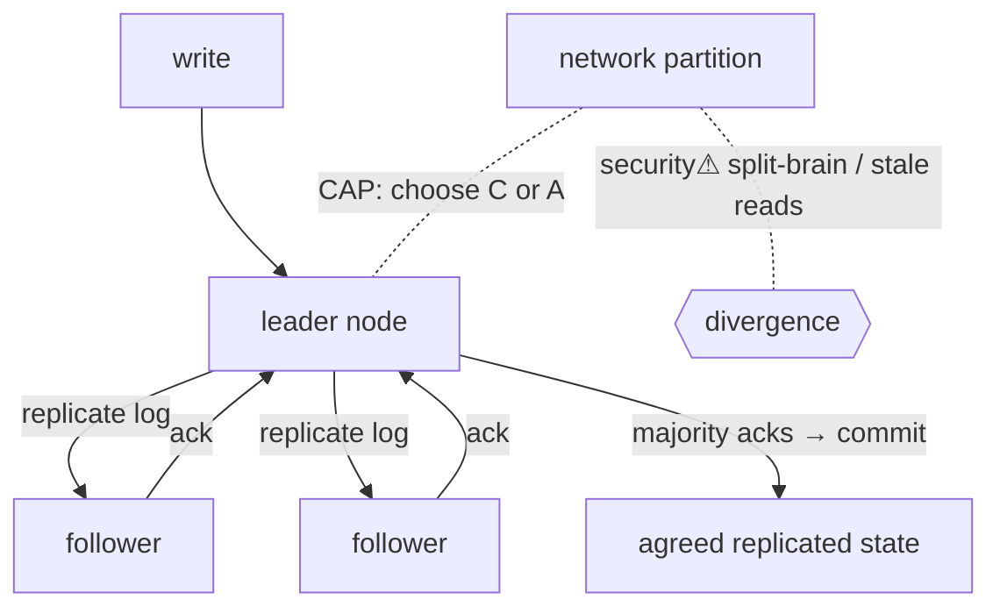

> [!abstract] When state is **replicated across machines** for fault tolerance and scale, keeping the copies in agreement despite failures and network delays is the central problem of [[12 Distributed Systems|distributed systems]]. **Consensus** protocols make independent nodes agree; **consistency models** define how up-to-date a read is; **CAP** says you can't have everything during a network partition. This is the [[Master Index — Technology Vault|cross-cutting "state"]] concept generalized across machines.

## What it is
- **Replication** — keeping copies of data on multiple nodes (survive failures, serve locally).
- **Consistency model** — the contract for what a read may return relative to recent writes (strong/linearizable → eventual).
- **Consensus** — a protocol by which nodes **agree on a single value or ordered log** even if some fail (Paxos, Raft).

## Why it exists
A single machine is a single point of failure and a scaling ceiling. Replicating solves that — but introduces a new problem: the copies can **disagree** (a write reaches one node, not another; the network drops messages; a node crashes mid-update). Consensus and consistency exist to answer *"which copy is right, and what can a client rely on?"* — turning many unreliable machines into one dependable system.

## How it works
- **CAP theorem** — during a network **P**artition you must choose **C**onsistency (reject reads/writes that can't be confirmed) or **A**vailability (answer, risking stale data). No system escapes this trade during partitions.
- **Consistency spectrum** — **strong/linearizable** (reads see the latest write — behaves like one machine, costly) → **causal** → **eventual** (replicas converge *eventually*; cheap, used by DNS, S3, DynamoDB).
- **Consensus (Raft/Paxos)** — nodes elect a **leader**, replicate an **ordered log**, and commit an entry once a **majority (quorum)** acknowledges → tolerates a minority failing. Powers **etcd** (Kubernetes' brain), ZooKeeper, distributed databases.
- **Quorums** — requiring `R + W > N` overlapping reads/writes guarantees a read sees the latest write.

## State — who owns/reads/writes
- No single owner — that's the point. The **replicated log** (agreed by consensus) is the authoritative order of changes.
- The hard question ([[Master Index — Technology Vault]] §7): *if two actors modify state concurrently, who wins, and does everyone agree?* Consensus is the answer.

## Direct dependencies
- [[05 Networking]] — **depends-on** · nodes coordinate over an unreliable network (loss, delay, partition)
- [[Transactions & ACID]] — **prereq** · the single-node integrity idea that distribution generalizes
- clocks / ordering — **prereq** · agreeing on *order* despite no shared clock (logical clocks) is core

## Direct effects
- [[09 Cloud]] — **enables** · every cloud managed database/queue/orchestrator relies on this
- [[Namespaces & Containers|Kubernetes]] — **composes** · cluster state lives in a consensus store (etcd)
- fault tolerance — **causes** · surviving node failures without losing agreed state

## Failure modes
- **Split-brain** — a partition leaves two "leaders" → divergent state (prevented by quorums).
- **Stale reads** — eventual consistency serves old data before convergence.
- **Latency vs consistency** — strong consistency across regions costs round-trips (physics of distance).

## Security implications
- **security⚠ Availability is a CIA pillar** — consensus/replication *is* the availability mechanism; DDoS and partitions attack it.
- **security⚠ Byzantine faults** — classic consensus assumes nodes fail by *crashing*, not lying; a *malicious* node needs **BFT** consensus (blockchains) — a stronger, costlier model.
- **security⚠ Integrity of the log** — if an attacker forges consensus messages, they rewrite agreed state; authenticated channels ([[Cryptography]]) matter.

## Mechanism graph

## Connections
- [[12 Distributed Systems]] — **composes** · its central problem
- [[Transactions & ACID]] — **prereq** · the single-node integrity idea generalized
- [[05 Networking]] — **depends-on** · the unreliable medium nodes coordinate over
- [[09 Cloud]] · [[Namespaces & Containers]] — **enables** · cloud & k8s cluster state
- [[Cryptography]] — **security⚠** · authenticated coordination; BFT
- [[Information Security & Access]] — **security⚠** · the Availability of CIA

## Related
[[Master Index — Technology Vault]] · [[08 Databases]] · [[Network Performance & Resilience]]
