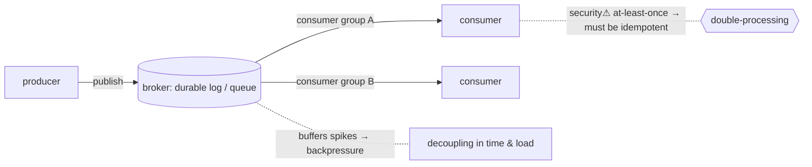

> [!abstract] **Message queues and event streaming** let services communicate **asynchronously** — a producer drops a message and moves on; a consumer picks it up later. This **decouples** systems in time and load, and is the bridge [[07 Programming|Software]] ↔ [[12 Distributed Systems|Distributed Systems]] ↔ [[09 Cloud|Cloud]]. Queues (RabbitMQ/SQS) move *tasks*; streams (Kafka) are a durable, replayable *log of events*.

## What it is
Middleware that carries **messages** between components without requiring them to be up at the same time. Two flavours:
- **Message queue** — a message is delivered to *one* consumer and typically removed (work distribution): RabbitMQ, Amazon SQS.
- **Event stream / log** — an append-only, retained, ordered log that *many* consumers read independently at their own offset, and can **replay**: Apache Kafka, Pulsar.

## Why it exists
Direct (synchronous) service-to-service calls couple systems tightly: if the callee is down or slow, the caller blocks or fails; a traffic spike overwhelms everyone. Asynchronous messaging exists to **decouple** — in *time* (consumer processes later), in *load* (the queue absorbs bursts as a buffer), and in *knowledge* (producers don't know who consumes). It's how you build systems that stay responsive and resilient under variable load, and the backbone of event-driven architectures.

## How it works
- **Pub/sub** — producers publish to a topic; subscribers receive. Decouples producers from consumers entirely.
- **Consumer groups / offsets** (Kafka) — the log is partitioned; each consumer group tracks its own **offset** (position), so replay and parallelism are natural.
- **Delivery semantics** — *at-most-once* (may lose), *at-least-once* (may duplicate — the common default), *exactly-once* (hard, needs idempotency + transactions). This is the central trade-off.
- **Backpressure** — the buffer absorbs spikes; if consumers can't keep up, the queue grows (bounded → shed load).
- **Event sourcing** — store the *stream of changes* as the source of truth; rebuild state by replaying (ties to [[Consensus & Consistency|state]] and [[Transactions & ACID|the log idea]]).

## State — who owns/reads/writes
- The **broker** owns the durable messages/log; producers append, consumers read (and commit offsets).
- A Kafka log is itself a **replicated, ordered** structure ([[Consensus & Consistency|consensus]] for partition leadership, [[Time, Clocks & Ordering|order]] within a partition).

## Direct dependencies
- [[12 Distributed Systems]] — **prereq** · brokers are distributed, replicated systems
- [[API Contracts & Serialization]] — **depends-on** · message payloads are serialized against a (often schema'd) contract
- [[05 Networking]] — **depends-on** · producers/consumers reach the broker over the network

## Direct effects
- [[09 Cloud]] — **enables** · managed queues/streams (SQS, Kinesis, Kafka/MSK) are core cloud building blocks
- decoupled/resilient architecture — **causes** · services survive each other's downtime and load spikes
- [[12 Distributed Systems]] — **composes** · event-driven microservices, CQRS, event sourcing

## Failure modes
- **Duplicate delivery** — at-least-once means consumers must be **idempotent** (processing twice = same result).
- **Poison messages** — a message that always fails processing blocks/loops (→ dead-letter queues).
- **Consumer lag** — consumers fall behind producers → growing backlog, staleness.
- **Ordering pitfalls** — global order isn't guaranteed across partitions, only within one.

## Security implications
- **security⚠ Idempotency = correctness *and* safety** — non-idempotent handlers under at-least-once delivery cause double-spend/double-action bugs (a form of [[Transactions & ACID|race]]).
- **security⚠ The payload is untrusted input** — messages carry serialized data → [[API Contracts & Serialization|deserialization]] attacks apply; validate at the consumer.
- **security⚠ Access control & encryption** — topics need authz (who may publish/subscribe) and encryption in transit/at rest; an open broker leaks or lets an attacker inject events.
- **security⚠ Replay & integrity** — a durable, replayable log is powerful but means leaked data persists; and forged events can poison downstream state.

## Mechanism graph

## Connections
- [[API Contracts & Serialization]] — **depends-on** · the message payload format
- [[Consensus & Consistency]] — **composes** · replicated log & partition leadership
- [[Time, Clocks & Ordering]] — **depends-on** · per-partition ordering
- [[Transactions & ACID]] — **bridges** · exactly-once & the log-as-source-of-truth idea
- [[09 Cloud]] — **enables** · managed messaging services
- [[12 Distributed Systems]] — **prereq** · the distributed substrate

## Related
[[Master Index — Technology Vault]] · [[12 Distributed Systems]] · [[Software Engineering]]
