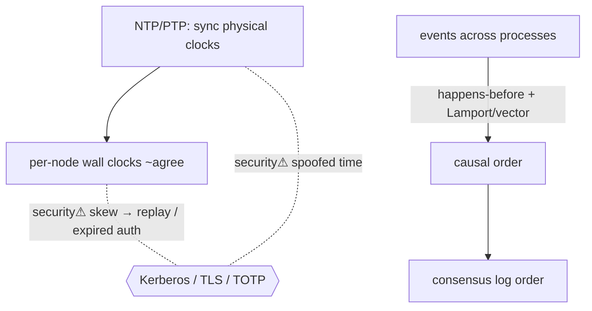

> [!abstract] In a [[12 Distributed Systems|distributed system]] there is **no single global clock** — each machine has its own, and they drift. So "which event happened first?" becomes genuinely hard. This note is the bridge [[05 Networking|Networking]] ↔ [[12 Distributed Systems|Distributed Systems]]: how machines synchronize physical time (NTP) and, more importantly, how they agree on **order** without a shared clock (logical clocks). Ordering is the hidden prerequisite under [[Consensus & Consistency|consensus]], databases, and even [[Kerberos]].

## What it is
Two related problems: **physical time** (making machines' wall clocks roughly agree — NTP/PTP) and **logical order** (agreeing on the *sequence* of events — happens-before, logical/vector clocks). The deep insight: for correctness you usually need **order, not time**.

## Why it exists
Distributed correctness often hinges on "did A happen before B?" — did this write precede that read, is this the latest value, which transaction wins. But clocks drift (quartz oscillators vary with temperature), messages take variable time, and there's no instantaneous global "now." Relying on wall-clock timestamps to order events across machines is **wrong** — two events can get the same or reversed timestamps. Logical clocks exist to capture **causality** (what could have influenced what) independent of unreliable physical time.

## How it works
- **NTP / PTP** — synchronize physical clocks over the network to within milliseconds (NTP) or sub-microsecond (PTP); never perfect, bounded by network asymmetry.
- **Happens-before (Lamport)** — event A → B if same process (A before B) or A is a send and B its receive. Events with no such path are **concurrent** (no defined order).
- **Lamport clocks** — a per-process counter, incremented on events and carried on messages → gives a total order consistent with causality (but can't tell concurrent from causal).
- **Vector clocks** — a vector of per-process counters → can *detect* concurrency (tells you when two events are truly independent).
- **Google TrueTime** — bounds clock uncertainty with atomic clocks/GPS and *waits out* the uncertainty to give real-timestamp ordering (Spanner) — buying global order with hardware.

## State — who owns/reads/writes
- Each node owns its own clock/counter; **causality is encoded in messages** (piggybacked timestamps/vectors) — there is no central authority.
- The order agreed upon becomes the [[Consensus & Consistency|replicated log's]] order.

## Direct dependencies
- [[05 Networking]] — **depends-on** · clocks sync and causality propagate over the (variable-latency) network
- [[12 Distributed Systems]] — **prereq** · the multi-node setting where this problem exists

## Direct effects
- [[Consensus & Consistency]] — **enables** · agreeing on a *log order* is agreeing on event order; linearizability needs real-time order
- [[Transactions & ACID]] — **enables** · serializability is about a consistent order of operations
- [[Kerberos]] — **constrains** · its anti-replay relies on synchronized clocks (>5 min skew breaks auth)

## Failure modes
- **Clock skew/drift** — unsynced clocks → mis-ordered events, expired-too-early/late tokens.
- **Leap seconds / clock jumps** — non-monotonic wall clocks break naive timestamp logic (use monotonic clocks for durations).
- **Assuming timestamps order events** — the classic distributed bug; concurrent events get arbitrary order.

## Security implications
- **security⚠ Time is an auth primitive** — [[Kerberos]] tickets, TLS cert validity, TOTP MFA, and JWT expiry all depend on correct time; skew enables replay or premature/late acceptance.
- **security⚠ Attacking time** — spoofing NTP (unauthenticated by default) can shift a victim's clock → expire/relive certificates and tickets, or bypass time-based controls. Use authenticated NTP (NTS).
- **security⚠ Ordering & audit integrity** — forensic timelines and log correlation across hosts depend on synchronized, tamper-evident time ([[Digital Forensics & Anti-Forensics]]).

## Mechanism graph

## Connections
- [[05 Networking]] — **depends-on** · sync & causality travel the network
- [[Consensus & Consistency]] — **enables** · ordering underpins agreement
- [[Transactions & ACID]] — **enables** · serializable order
- [[Kerberos]] — **constrains** · clock-skew sensitivity
- [[Digital Forensics & Anti-Forensics]] — **security⚠** · timeline integrity
- [[12 Distributed Systems]] — **prereq** · the setting

## Related
[[Master Index — Technology Vault]] · [[Message Queues & Event Streaming]]
