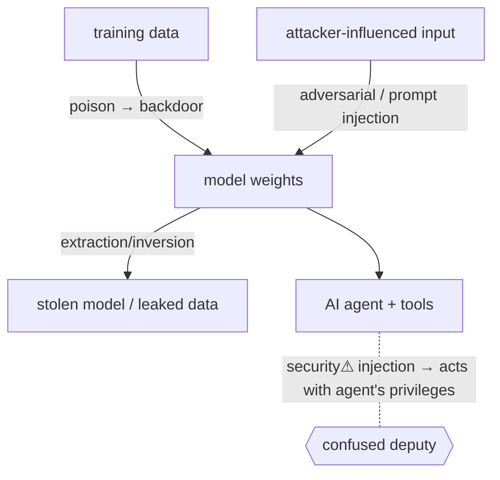

> [!abstract] **AI security** treats a machine-learning model as a **new kind of attackable system** — one whose behaviour is *learned from data* and *driven by untrusted input*, breaking assumptions traditional security never had to handle. It's the intersection of your two strongest domains ([[14 AI|AI]] × [[06 Cybersecurity|cybersecurity]]), the [[AI, Neuroscience, Robotics & the Future of Artificial Humans|frontier]] the [[Master Index — Technology Vault|Master Index §5]] flags as your highest-leverage edge, and a field with almost no established certification — so **published work, not credentials, is the entry ticket**.

## What it is
The study of attacks on, and defences for, ML systems across their lifecycle: **training data → model → deployment → inference**. Unlike classic software, the model has **no source code to audit** — its logic is emergent statistics, and its "input validation problem" is unsolved.

## Why it exists
Two properties break old assumptions. (1) A model's behaviour comes from **data**, so poisoning the data poisons the model. (2) A model *acts on* attacker-controlled input as its core function, and — unlike a parser — it has **no clean separation between instructions and data** (especially [[LLMs & Prompting|LLMs]]). Traditional security (validate input, audit code, patch bugs) doesn't map cleanly, so AI security exists to build the missing threat model.

## How it works — the attack surface
| Attack | Where | Mechanism |
|---|---|---|
| **Adversarial examples** | inference | tiny, crafted perturbations flip a classifier (panda→gibbon) — the decision boundary is exploitable |
| **Data poisoning** | training | corrupt/backdoor the training set → implant hidden triggers |
| **Model extraction** | inference | query the model repeatedly to **clone** it (IP theft, or to craft attacks offline) |
| **Model inversion / membership inference** | inference | recover training data or prove a record was in it → **privacy** breach |
| **Prompt injection** | LLM inference | untrusted text overrides the system's instructions; **indirect** injection hides commands in retrieved content/web pages |
| **Jailbreaks** | LLM inference | bypass safety alignment |
| **Supply chain** | build | poisoned models/datasets from public hubs; malicious pickle files |

## State — who owns/reads/writes
- The **model weights** are the crown-jewel asset (theft, extraction).
- The **training data** determines behaviour — its integrity ([[Trust Boundaries & Privilege|provenance]]) is a security property.
- At inference, **all input is attacker-influenced** and crosses directly into the model's "reasoning."

## Direct dependencies
- [[Machine Learning & Deep Learning]] — **prereq** · you can't attack/defend what you don't understand mechanically
- [[Trust Boundaries & Privilege]] — **prereq** · the model is a trust boundary; input is untrusted, output flows to authority
- [[LLMs & Prompting]] — **depends-on** · the LLM behaviour prompt-injection exploits

## Direct effects
- [[Authorization]] — **security⚠** · an **AI agent** given tools/API access is an authorization nightmare — prompt injection → the agent acts with *its* privileges on the attacker's behalf (a confused deputy at scale)
- [[06 Cybersecurity]] — **composes** · a new branch of the discipline
- secure-RAG / guardrails — **causes** · defensive architectures (input/output filtering, least-privilege agents)

## Failure modes
- **No input validation that works** — you can't fully sanitise natural language against injection; mitigation is defence-in-depth, not a fix.
- **Alignment ≠ security** — safety training reduces but never eliminates jailbreaks.
- **Evaluation gaps** — models fail in ways their benchmarks didn't test.

## Security implications
- **security⚠ Prompt injection is the defining LLM vuln** (OWASP LLM Top 10 #1) — and worsens as models get **tools, memory, and autonomy**: the more authority an agent holds, the worse an injection is.
- **security⚠ Least privilege for agents** — never give an AI agent more authority than the *least-trusted* input it will process. Sandbox tool access, human-in-the-loop for high-impact actions.
- **security⚠ Provenance & supply chain** — verify model/dataset origin; treat downloaded weights like untrusted code.
- **security⚠ Your opportunity** — this field rewards public artifacts: write up an injection finding, build a red-teaming tool, publish adversarial experiments. In a domain with no accepted cert, the publisher becomes the reference ([[IT Certifications and Learning Resources per Domain]] §AI Security).

## Mechanism graph

## Connections
- [[Machine Learning & Deep Learning]] · [[LLMs & Prompting]] — **prereq** · the systems under attack
- [[Trust Boundaries & Privilege]] · [[Authorization]] — **security⚠** · the model/agent as a boundary
- [[Ethical Hacking]] · [[06 Cybersecurity]] — **composes** · AI red-teaming as offensive practice
- [[AI, Neuroscience, Robotics & the Future of Artificial Humans]] — **bridges** · the interdisciplinary frontier
- [[GPUs & Accelerated Computing]] — **depends-on** · the compute the models run on
- [[IT Certifications and Learning Resources per Domain]] — **enables** · the publish-not-certify entry path

## Related
[[Master Index — Technology Vault]] · [[14 AI]] · [[Master Index — Technology Vault]]
