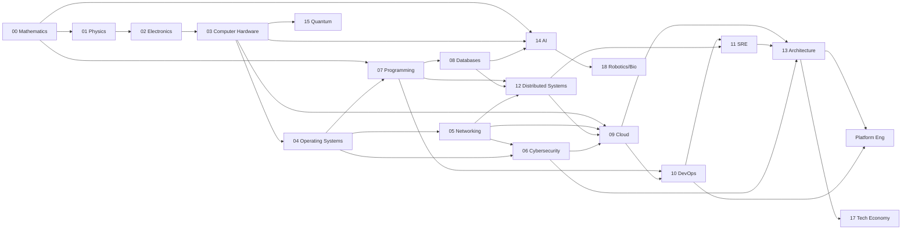
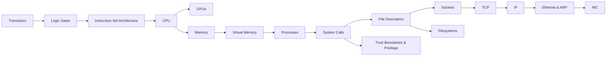

> [!abstract] The one note for the whole Technology vault
>  Raw source lives in [[Foundations (Source Docs)]]; the public repo landing is [[README]].

---

## Domain Dependency Graph

The backbone. An arrow means **"is a prerequisite for / is depended on by."** Reality is a mesh — several topics have multiple parents.

## The causal spine

The vault's mechanistic chain — **every arrow is a named mechanism**, each rung an atomic note. The reasoning path from a transistor switching to a packet crossing a network:

---

## Concept Atlas — every concept, by each domain's own logic

Each domain is organised by its **own natural axis** — the way that field actually carves itself at the joints — not a generic taxonomy. Some domains are *ladders* (rising abstraction), some are *loops* (feedback cycles), some are *mirrors* (two opposing lifecycles), some are *trade-off webs* (a central tension with no single winner). The shape is named next to each domain.

**Legend:** ★ built to causal standard · ✓ note exists · ⛏ gap (worth writing) · 🧩 cross-domain glue · ⚠ security-critical. Every atomic concept follows the [[#Per-note schema (the contract)|schema]]; edges use the typed vocabulary at the bottom. Coverage status and the ranked to-write list live in [[Concept Coverage & Gaps]].

### 00 Mathematics — [[00 Mathematics]] · *fan-out by downstream consumer*
- **→ crypto/security:** number theory & modular arithmetic ⛏ · finite fields ⛏
- **→ AI/graphics:** linear algebra (vectors, matrices, eigenvalues) ⛏ · calculus & gradients ⛏ · optimization & convexity ⛏
- **→ ML/analytics:** probability & statistics ⛏ · information theory ⛏
- **→ CS theory:** discrete math (logic, sets, proof) ⛏ · combinatorics ⛏ · graph theory ⛏

### 01 Physics — [[01 Physics]] · *the physical-limits ladder*
- **Device scale:** semiconductor physics ⛏ · quantum mechanics ⛏
- **Signal scale:** electromagnetism ⛏ · signals & waves ⛏
- **Thermal/limit scale:** thermodynamics & heat ⛏ (Landauer, cooling)
- **Transmission scale:** optics & photonics ⛏ (fiber, submarine cables)

### 02 Electronics — [[02 Electronics]] · *the abstraction lift: analog → digital*
- **Signal (analog):** [[Electrical Engineering & Electricity]] · Ohm's law & circuits ⛏ · [[Passive Components]] · ADC/DAC ⛏ · signal integrity ⛏
- **Device (the switch):** ★[[Transistors]] · [[Active Components & ICs]] · [[Electromechanical Components]]
- **Gate (logic):** ★[[Logic Gates]] · combinational vs sequential ⛏ · [[Digital Logic & Microcontrollers]]
- **Timed block (state):** flip-flops & registers ⛏ · clocks & timing ⛏ · adders/ALU ⛏

### 03 Computer Hardware — [[03 Computer Hardware]] · *follow the data across the speed/size hierarchy*
- **Compute (datapath):** ★[[Instruction Set Architecture]] · [[CPU & Processing Units]] (pipelining ⛏ · branch prediction ⛏ · speculative execution ⚠⛏) · ★[[GPUs & Accelerated Computing]]
- **Fast & near (memory):** [[Memory]] · cache hierarchy ⛏ · memory model ⛏
- **Slow & far (storage):** [[Storage]] (HDD/SSD/NVMe ⛏)
- **Movement (I/O):** [[Motherboard & IO]] (buses/PCIe ⛏ · DMA ⛏ · interrupts ⛏) · [[Hardware Interaction & Data Flow]]
- **Fabric & trust:** [[Hardware Logic & Fabrication]] · [[Boot & Trust Chain]] ⚠ · side-channels ⚠⛏

### 04 Operating Systems — [[04 Operating Systems]] · *the OSTEP triad — virtualization · concurrency · persistence* (mediated by syscalls)
- **Trunk — mediation:** ★[[System Calls]] · ★[[Shells, Terminals & the CLI]]
- **Virtualization (CPU & memory):** ★[[Processes]] (scheduling ⛏ · context switch ⛏ · threads ⛏) · ★[[Virtual Memory]] (paging · TLB ⛏)
- **Concurrency:** IPC ⛏ · signals ⛏ · locks/mutexes/semaphores ⛏ · deadlock ⛏ · races ⚠⛏
- **Persistence (I/O & files):** ★[[File Descriptors]] · ★[[Filesystems]] · ★[[NTFS & the MFT]] · VFS ⛏ · page cache 🧩⛏
- **Isolation:** ★[[Namespaces & Containers]] · cgroups ⛏ · seccomp ⛏
- **Kernels:** [[Linux]] · [[Windows]] · [[Linux_OS_and_Internals]] · [[Windows_OS_and_Internals]] · [[OS Internals: Processes, I-O, Sockets & Networking]]

### 05 Networking — [[05 Networking]] · *the packet's journey up the encapsulation stack* ([[OSI Layers & Protocols]])
- **L2 link (frames/MAC):** ★[[Ethernet & ARP]] · [[Switching & Routing]] (VLANs ⛏ · STP ⛏) · [[Network Media & Links]] · [[Wireless & Cellular]]
- **L3 internet (addressing/routing):** ★[[IP]] (subnetting ⛏ · NAT ⛏ · ICMP ⛏ · IPv6 ⛏) · routing (BGP ⚠ · OSPF ⛏)
- **L4 transport (ports/reliability):** ★[[TCP]] · UDP ⛏ · ★[[Sockets]] · [[Ports, Interfaces & Sockets]] · QUIC ⛏
- **L7 application (naming/services):** [[DNS]] ⚠ · [[HTTP]] · [[TLS & SSL]] ⚠ · ★[[SMB]] · ★[[LDAP]] · [[Protocols by Sector]] · DHCP ⛏ · SSH ⛏
- **Delivery patterns:** CDN ⛏ · load balancing 🧩⛏ · proxies & gateways ⛏
- **Infra & ops:** [[Network Foundations]] · [[Network Devices]] · [[Network Infrastructure]] · [[Network Types & Topologies]] · [[Network Performance & Resilience]] · [[Network Software Engineering]] · [[Network Observability & Monitoring — Tool Catalog]] · [[Space & Satellite Networks]] · [[Submarine Cables]] · [[State-Owned & Government-Linked Carriers]] · Regional Infrastructure ×14

### 06 Cybersecurity — [[06 Cybersecurity]] · *the mirror — attacker kill-chain ⟷ defender lifecycle*
- **Identify (know the terrain):** [[Cybersecurity Foundations]] · ★[[Trust Boundaries & Privilege]] · CIA triad ⛏ · Threat Modeling ⛏(gap)
- **Protect (prevent):** ★[[Authentication]] · ★[[Authorization]] · ★[[PKI]] · ★[[Kerberos]] · ★[[NTLM]] · ★[[Active Directory]] · ★[[LDAP]] · ★[[LSASS & SAM]] · ★[[Linux Capabilities]] · [[Cryptography]] · [[Data Encryption]] · [[System Hardening]] · [[Network Security]] · [[Endpoint Security]] · [[Information Security & Access]] · [[Internet & Application Security]] (OWASP/injection/XSS ⛏)
- **Detect (monitor):** [[Security Operations & IR]] · [[Threats & Malware]] · Detection Engineering ⛏(gap) · telemetry → ★[[Observability]]
- **Respond & recover:** ★[[Digital Forensics & Anti-Forensics]] · incident response ⛏ · [[OpSec & Physical]]
- **⚔️ Offensive (the attacker's mirror):** [[Ethical Hacking]] ([[Credential Playbook]] · [[Technique Catalog]] · [[Shells & Payloads]] · [[Hacking Engagement & Methodology]] · [[Tooling, Forensics & Careers]]) · ★[[BloodHound & AD Attack Paths]] · recon ⛏ → exploitation ⛏ → privesc ⛏ → lateral movement ⛏ → C2 ⛏ → exfil ⛏ · Supply-Chain Security ⚠⛏(gap)
- **Career:** [[Cybersecurity Skills Roadmap]] · [[Cyber Events, CTFs & Community]]

### 07 Programming — [[07 Programming]] · *the ladder of concerns — correctness → efficiency → scale*
- **Express (correctness):** [[Programming Foundations]] (types ⛏ · control flow ⛏) · [[Languages & Applied Programming]] · compilers & interpreters ⛏
- **Structure (data):** [[Data Structures & Algorithms]] (trees/graphs/hashing ⛏)
- **Cost (efficiency):** complexity & Big-O ⛏ · sorting & searching ⛏ · memory management & GC ⛏ · concurrency models ⛏
- **Organize (scale):** [[Software Engineering]] (OOP ⛏ · FP ⛏ · design patterns ⛏ · testing ⛏ · version control ⛏)
- **Interface (boundaries):** ★[[API Contracts & Serialization]] 🧩 · [[Programming Learning Resources]]

### 08 Databases — [[08 Databases]] · *the query→disk path under the consistency / availability / performance triangle*
- **Model:** relational model & SQL ⛏ · normalization ⛏ · NoSQL types ⛏ (KV/document/column/graph)
- **Store & index:** storage engines (B-tree/LSM) ⛏ · indexing ⛏ · caching (Redis) 🧩⛏
- **Query:** query planning & optimization ⛏
- **Transact (consistency):** ★[[Transactions & ACID]] · isolation levels ⛏
- **Distribute (availability/perf):** replication ⛏ · sharding & partitioning ⛏ · CAP-in-practice ⛏

### 09 Cloud — [[09 Cloud]] · *the shared-responsibility abstraction ladder*
- **Physical:** [[Cloud & Datacenters]]
- **Virtualize:** ★[[Virtualization & Hypervisors]] · multi-tenancy & isolation ⚠⛏
- **IaaS (compute/net/storage):** VMs ⛏ · VPC & cloud networking ⛏ · object vs block storage ⛏ · IAM ⚠⛏
- **PaaS:** managed services ⛏ · autoscaling ⛏
- **SaaS / serverless:** functions/FaaS ⛏ · event-driven ⛏
- **Economics:** → [[Cloud, Data & AI Economics]]

### 10 DevOps — [[10 DevOps]] *(scaffold)* · *the CI/CD delivery loop*
code → **build** (compile/package ⛏) → **test** (CI ⛏) → **release** (artifact registries ⛏) → **deploy** (IaC/Terraform ⛏ · Docker & Kubernetes ⛏ · GitOps ⛏) → **operate** (config mgmt ⛏ · secrets ⚠⛏) → **feedback** → back to code. Cross-cut: pipeline & supply-chain security ⚠⛏.

### 11 SRE — [[11 SRE]] · *the reliability control loop around the error budget*
**measure** (SLI ⛏) → **target** (SLO & error budget ⛏) → **observe** (★[[Observability]] 🧩) → **detect & respond** (incident response ⛏) → **prevent** (postmortems ⛏ · toil & automation ⛏ · reliability patterns — retries/circuit breakers 🧩⛏ · chaos engineering ⛏) → back to measure. Cross-cut: capacity planning ⛏.

### 12 Distributed Systems — [[12 Distributed Systems]] · *organized by the impossibility each concept negotiates*
- **No global clock → ordering:** ★[[Time, Clocks & Ordering]]
- **Agreement is hard (FLP) → consensus:** ★[[Consensus & Consistency]] · leader election ⛏ · quorums ⛏
- **CAP → consistency vs availability:** replication ⛏ · partitioning ⛏ · CAP/PACELC ⛏ · CRDTs ⛏
- **Partial failure → resilience:** failure detection ⛏ · idempotency 🧩⛏ · distributed transactions & sagas ⛏ · ★[[Message Queues & Event Streaming]]

### 13 Architecture — [[13 Architecture]] *(scaffold)* · *organized by the quality attribute each pattern buys*
- **Scalability:** monolith vs microservices ⛏ · partitioning ⛏ · statelessness ⛏
- **Availability/resilience:** redundancy ⛏ · circuit breakers 🧩⛏
- **Consistency/latency:** CQRS & event sourcing ⛏ · caching strategies 🧩⛏ · event-driven ⛏
- **Maintainability:** layered/hexagonal ⛏ · domain-driven design ⛏ · API gateway ⛏ · twelve-factor ⛏
- **Cross-cut:** the -ility trade-off space (consistency ↔ availability ↔ latency ↔ cost)

### 14 AI — [[14 AI]] · *the learning pipeline loop × the capability ladder*
- **Capability ladder:** [[AI Foundations]] → [[Machine Learning & Deep Learning]] (neural nets ⛏ · backprop ⛏ · gradient descent ⛏) → [[LLMs & Prompting]] (transformers ⛏ · attention ⛏ · embeddings ⛏ · RAG ⛏) → agents ⛏
- **Pipeline · data:** datasets ⛏ · features ⛏
- **Pipeline · train:** training vs inference ⛏ · fine-tuning ⛏ · optimization ⛏
- **Pipeline · evaluate:** evaluation & benchmarks ⛏
- **Pipeline · serve/operate:** MLOps ⛏ · [[AI Products & Startup Engineering]] · [[AI-assisted Networking]]
- **Security overlay:** ★[[AI Security & Adversarial ML]] ⚠
- **Path:** [[AI Learning Path & Resources]]

### 15 Quantum — [[15 Quantum Computing & Technology]] · *the mirror — each concept vs the classical assumption it breaks*
superposition ⟷ bit determinism ⛏ · entanglement ⟷ locality ⛏ · quantum gates & circuits ⟷ boolean logic ⛏ · Shor ⟷ RSA/ECC ⚠⛏ · Grover ⟷ brute-force bounds ⛏ · decoherence ⟷ reliable state → error correction ⛏ · post-quantum cryptography ⚠🧩⛏.

### 16 Projects — [[16 Home Lab Projects]] · *apply it*
[[Enterprise simulated network ToDo]] · [[Project documentation]].

### 17 Tech Economy & Geopolitics — [[17 Tech Economy & Geopolitics]] · *the value chain — creation ⟷ capture, and the choke points*
- **Create:** [[The Technology Value Chain]] · [[Semiconductor Economics]]
- **Capture:** [[The Platform & Digital Economy]] · [[Cloud, Data & AI Economics]]
- **Contest (choke points):** [[US-China Tech War & Export Controls]] ⚠ · [[Tech Sovereignty & Governance]]

### 18 Robotics & Bio-Convergence — [[18 Robotics & Bio-Convergence]] · *the sense → think → act loop*
- **Sense:** sensors & perception ⛏
- **Think:** control systems 🧩⛏ · planning & SLAM ⛏ · AI → [[AI, Neuroscience, Robotics & the Future of Artificial Humans]]
- **Act:** actuators & motors ⛏ · [[Robotics & Biomechatronics]]
- **Converge (bio):** [[Bio-Convergence Technologies]] · brain–computer interfaces ⛏

### 🧩 Cross-cutting concepts — the glue
Concepts owned by **no single domain**; they wire the others together and are the hubs of the graph — the highest-leverage things to understand deeply.

Computation & information ⛏ · abstraction & interfaces ⛏ · state & consistency → ★[[Consensus & Consistency]] · naming, identity & addressing ⛏ · indirection ⛏ · time & ordering → ★[[Time, Clocks & Ordering]] · concurrency vs parallelism ⛏ · trust & authority → ★[[Trust Boundaries & Privilege]] · serialization & encoding → ★[[API Contracts & Serialization]] · caching & invalidation ⛏ · buffering & batching ⛏ · backpressure & flow control ⛏ · retries, timeouts & circuit breakers ⛏ · rate limiting ⛏ · idempotency ⛏ · resource lifecycle & ownership ⛏ · provenance & integrity ⛏ · error detection (checksum/CRC/ECC) ⛏ · failure & fault handling ⛏ · feedback & control loops ⛏ · observability → ★[[Observability]].

### Per-note schema (the contract)
Every atomic concept answers the same questions in order: *what it is · why it exists · how it works (mechanism) · state it owns · dependencies (typed) · effects (typed) · failure modes · **lenses** (security⚠ · performance · reliability · cost · scalability · maintainability) · mechanism diagram · connections.*

**Typed edges:** `prereq · depends-on · enables · causes · bridges · constrains · transforms · composes · feedback · security⚠` — never a bare "related."

---

## Related
[[Foundations (Source Docs)]] · [[README]] · [[16 Home Lab Projects]] · [[IT Certifications and Learning Resources per Domain]] · [[Tech Information Sources — News, Feeds & Communities]]
